我一直把自己定义成散户，无奈江湖上依然有关于我的各种案例和心法，心法大致还是按照我的思路的，我个人觉得这也是最具价值的东西，比告诉你我明天要买什么更有价值，因为心法领悟的透彻，操作便会事半功倍。或许你们都有听说我从十几万做到几个亿，但是很少有人知道我也一度损失惨重，每天花18小时的学习。经历了而立、不惑之后，对市场看的比较淡了，但是总觉得该做点比操作更有意义的事情。 受儿位朋友态惠 把自已的历程以及观点做简要分享，供有缘者读之。

炒股养家

龙头券商股票开户：股票佣金万一免5（最低0.1元），支持同花顺登录。龙头期货公司开户：手续费为交易所+1分钱。开户加微信：W1K2ABC，QQ：1379979088，免费领投资课程关注微信公众号：蓝桥幻想

## 悟道·成长

《养家心法》  
情绪分周期  
交易分阶梯  
每一次休息就应该是  
一次总结，一次剖析，一次进步，一次取舍，一次扬弃  
每一个周期的成功交易  
需要及时的总结、固化  
同样一个失败的周期，也该有客观的态度  
经常看到有人说，一直亏 一直停不下来 -直不甘心  
没有等待何来机会?  
没有放弃何来得到？  
炒股需要学习， 家法  
学习不是从各种文章中找  
而是学术、学道、最终以道驭术  
道可以是大局观，情绪判断，交易心法  
术可以很具体，细化到每一个买点判断，仓位分布，每一个买卖动作  
但是，除了学习  
炒股，更需要冷静  
很多路需要靠自己走，很多压力需要自己承受  
很多折磨需要自己挺过去，很多伤痛需要自己缝合  
或许有人能理解你的彷徨，但别人代替不了你的成长  
过来人能对你的处境感同身受，但无法帮你分担

龙头券商股票开户：股票佣金万一免5（最低0.1元），支持同花顺登录。龙头期货公司开户：手续费为交易所+1分钱。开户加微信：W1K2ABC，QQ：1379979088，免费领投资课程关注微信公众号：蓝桥幻想

## 悟道·成长

痛苦的经历并不可怕，可怕的是你真的被他打败了  
或者被他打的找不到方向，失了自己的节奏  
或者全是悲观失望的情绪  
一边是不服输的疯狂交易，一边是悲观的情绪蔓延  
而这种悲观的情绪会把你进一步带向深渊  
炒股需要自我进化，自我成长  
如果你觉得节奏不对，不妨停下脚步  
回溯自己的每一笔交易，反思自己每一个操作  
重新揭开伤疤，或许很痛  
但也同样会让你更加刻骨铭  
每一个市场的参与者  
都在市场中踽独行  
谁不曾有一段败家的历史  
谁又不曾在恐惧和希望中轮回  
不同的是，有的人走出来了  
有的人，永远的被打败了  
吃点亏，交点学费不算什么  
找到自己的路  
坚定自己的信念，勇敢的走下去

龙头券商股票开户：股票佣金万一免5（最低0.1元)，支持同花顺登录。龙头期货公司开户：手续费为交易所+1分钱。开户加微信：W1K2ABC，QQ：1379979088，免费领投资课程关注微信公众号：蓝桥幻想

## 悟道·成长

信念是什么？  
是顽强的意志？必胜的信心？神来之笔?  
都不是  
基本靠硬撐  
这里的硬撑，不是说更频繁的交易  
而是不论涨跌，不论心痛，坚持功课，坚持复盘  
坚持做体系内的操作，哪怕体系束缚了你的手脚  
为何硬撑?  
半夜看看沉睡的家人，想想白天输掉的Money  
自然就有了含泪坚持，和血吞牙的勇气  
一个周期的结束，意味着一个新周期即将开始  
从现在做起，从每一天做起，锻炼自己的思维，坚持自己的体系  
种一棵树，最佳时机是在20年年前，如果没有，最好的时机就是现  
在

龙头券商股票开户：股票佣金万一免5（最低0.1元），支持同花顺登录。龙头期货公司开户：手续费为交易所+1分钱。开户加微信：W1K2ABC，QQ：1379979088，免费领投资课程关注微信公众号：蓝桥幻想

## 悟道·成长

## 我的经历：

年少无知的轻狂，就是为了暴富而来，一月没有20%收益绝对不合格，所以仓促出手，赶上好行情，信心膨胀，感觉良好。

当年的我，觉得自己悟道了，辞去工作，遇上熊市，还接了朋友的账户操作，结果是亏成狗，最后那位朋友也觉得我是个骗子。那是一段和血吞牙的日子，其中的境地许多人都知道，关于奶粉，关于学习。

之后，经历市场的打击，倍感交瘁，面对账户的亏损，面对几乎不可能在回去的数字，不敢下手， ，也无出路。

坚定信心，踏实向前，有前辈点拨或有高人指点，沉心静气，脚踏实地，看透浮夸，慢慢走上正轨，学会控仓，学会空仓，学会冷静，学会建立体系

想来，大多数人都要走这样一条路，好学的人很多，但是学成的是少数，主要还是看个人的心性，如果经历过行情的惨烈，现在依然在用配资搏杀，那注定不适合这个市场。

所谓悟道，无不是感叹，山还是山，水还是水，所谓经历和洗礼，也不过是帮助找回最开始的自己，阅尽千帆，洗尽铅华，最终找回自己的初心而已。

初心是什么，留给每个人自己思考！

## 悟道·成长

## 心法：

善于做短线的人，应该清楚自身的特点，寻找出适合自己的方法。股票是一个心理游戏，我们的操作应该尽量让自己避免被动。有这种舒服的感觉就对了，好的策略就应该不管行情怎么变化，让自己始终在应变中处于优势，这也是实现稳定赢利的前提！

对于个股，不应拘泥于自己手中所持品种，而应最大限度的观察各板块走势，要对各个周期的领涨和领跌品种进行重点关注。对于操作，不要一味的追求个别技术指标，或者短期的所谓资金流进流出，主力庄家这些，王

针对不同阶段有不同阶段的操作模式，高抛低吸也对，追涨杀跌也好，都有其道理， 关键取决于对市场的理解每个人都应该有自己的交易风格，而不是赚钱了就是短线，套了就成了股东，没有自己风格的人，很难在市场里长期生存，因为情绪会被市场说带走就带走，如果你的情绪被市场掌握，失败将挥之不去。

所以静下心来，问问自己的性格适合超短、短线、中长线还是长线！针对不同的交易风格，制定不同的作战交易体系！没有形成自己交易体系的人，最终在市场会输多赢少，结果都不是太好！所以在你没有形成体系之前，不做有压力的资金，不要融资与杠杆参与操作，尽量的保住自己的本金！

悟道·成长

## 交易体系

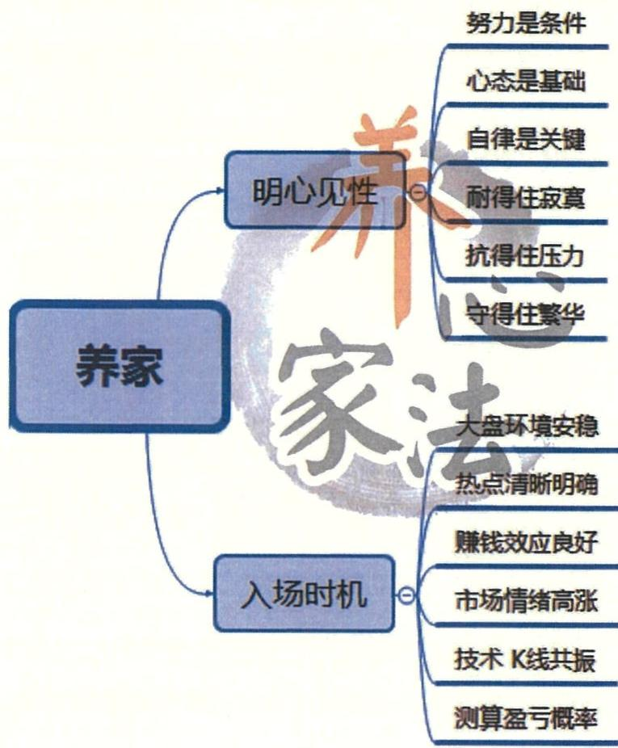

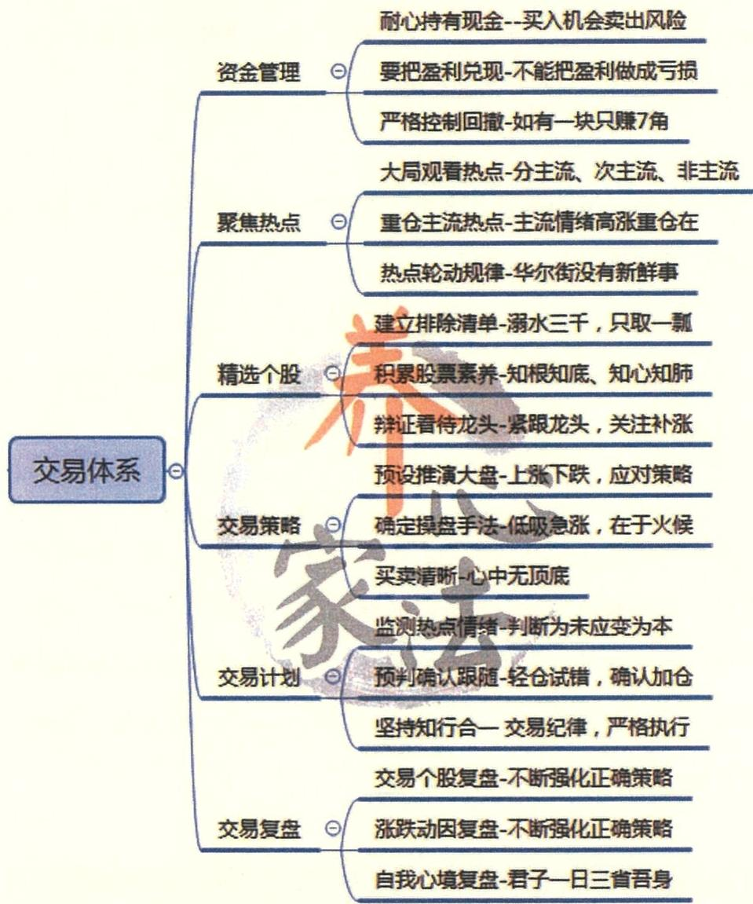

如果你严格的按交易体系来进行操作，那么你成功的概率会不断增加！

龙头券商股票开户：股票佣金万一免5（最低0.1元），支持同花顺登录。龙头期货公司开户：手续费为交易所+1分钱。开户加微信：W1K2ABC，QQ：1379979088，免费领投资课程关注微信公众号：蓝桥幻想

## 悟道·成长

## 心法：

买入倾向的推理，大多来自赚钱效应，卖出倾向的推理，大多来自亏钱效应。然后再结合大盘，主流热点这些，进行瞬间的操作判断，操作是瞬间的，判断是动态的。

关于盈利，我向来不想太多。是赢是亏有时候不重要，重要的是做对，盈亏的事情交给概率。

追涨也好，低吸也好，问题不在模式，而在何种阶段应用，以及火候。

有人知道追涨不适合自己，但是往往管不住手，有人知道重仓不好，无奈赌性太重，知道的和做到的差太多了，所以，知行合一四个字足够很多人修行几年的了。做不到，你的情绪就容易被市场左右，一旦被市场左右，失败将挥之不去。如果你能掌握市场的情绪，胜利将接踵而来！

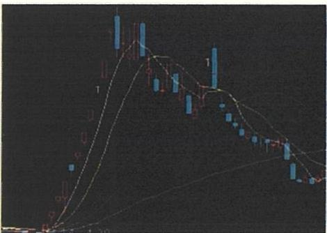

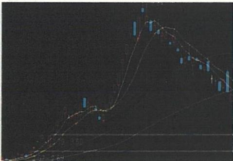

龙头券商股票开户：股票佣金万一免5（最低0.1元），支持同花顺登录。龙头期货公司开户：手续费为交易所+1分钱。开户加微信：W1K2ABC，QQ：1379979088，免费领投资课程关注微信公众号：蓝桥幻想

## 悟道·成长

心法：

知行合一，说起来容易，做起来难，这也是为什么心法一定要由实战来检验，经历过你才会有更深的领悟。

弱水三千只取一瓢，能赚1块的，只赚7毛，留下3毛济世。没错，有人觉得这是自我安慰，但是真正领悟了，也是你对这个市场的认知和感恩。你想把市场当取款机，但是你又满身戾气，如何成器？

越是大家扎堆去的地方，越是要小心谨慎。毕竞市场上赚钱的不是大多数，而是小部分，所以，这么想你就明白为什么有时候需要反向思考了，要区分是大主流还是次主流了，格局与素养都很重要！ 家土

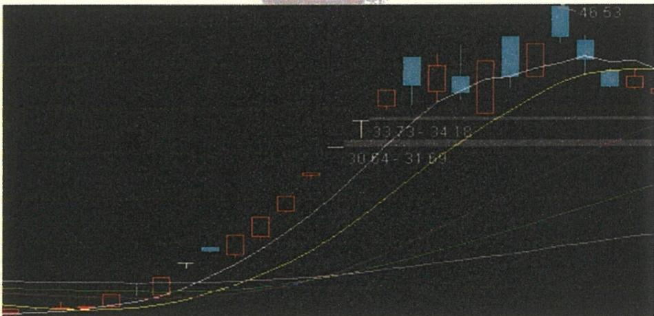  
300748

龙头券商股票开户：股票佣金万一免5（最低0.1元），支持同花顺登录。龙头期货公司开户：手续费为交易所+1分钱。开户加微信：W1K2ABC，QQ：1379979088，免费领投资课程关注微信公众号：蓝桥幻想

悟道·成长  
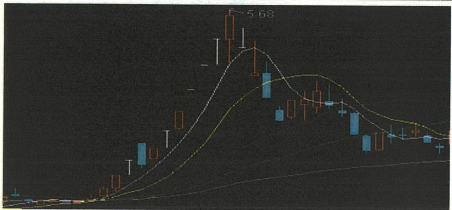  
002503

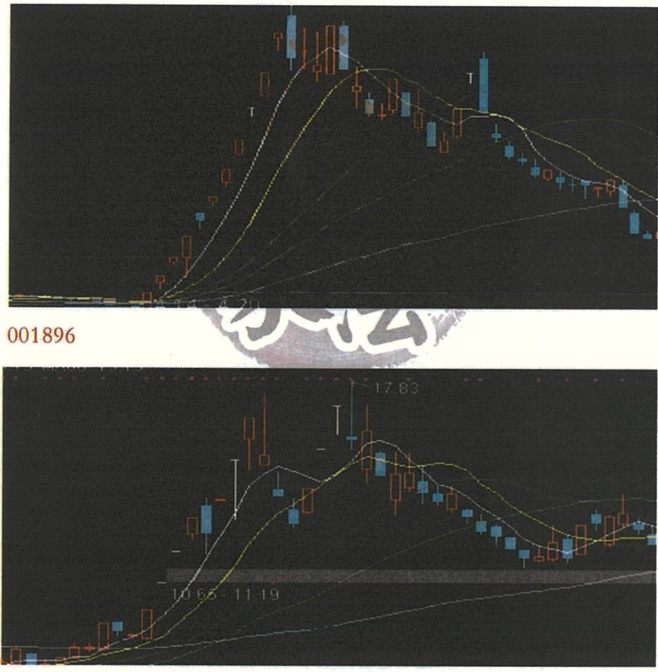  
600956  
以上图，找到共性，用心悟！

## 悟道·成长

## 心法：

定好仓位，耐心选股，做对的操作，盈亏的事情交给概率。做了功课，不代表立马出手，耐心等待市场点火的机会！

对于大盘，不要过多依赖于预测什么点数顶底这些，而应多关注哪些在涨，哪些在跌，那些先前涨的或者跌的后来又怎么走了。如果判断是熊市又另当别论

我们得清楚此前一波走势中，各家的涨幅，成交量对比，换手率情况，有曾参与过的资金。接下来回踩的日子，我们要观察每一个热点板块的回踩力度，回踩后的技术形态，要通过几天的观察，确定下一波的目标。一直有说现在是可操作空间，那么既然是可操作空间，我们要做的事就更多了，选股、选板块，选热度，推演大盘。

如果认真的做上一遍，哪怕还做不到胸有成竹，至少也是胸有成笋了。

股票走势本质是持币者与持筹者的博弈产生，应该多揣摩两者之心，让自己站在主动的这一方即可。

看的是长线，做的是短线，如果判断错了，应变就是了。根据盘面的变化，市场的赚钱和亏钱效应的变化，推测市场心理的演变。熊市经历很重要，经历过，不断思考如果后市再度面临这样的局面，怎么样的策略才是最好的。判断为末，应变为本。

龙头券商股票开户：股票佣金万一免5（最低0.1元），支持同花顺登录。龙头期货公司开户：手续费为交易所+1分钱。开户加微信：W1K2ABC，QQ：1379979088，免费领投资课程关注微信公众号：蓝桥幻想

悟道·成长

## 心法：

大局观是一种感觉，或许有时候不明白，但是尽量多尝试让自己站在更高的高度来看待整个市场，一旦明白了，将受益无穷。大局观，这是道的范畴，尽量培养自己站在更高的高度看整个市场。

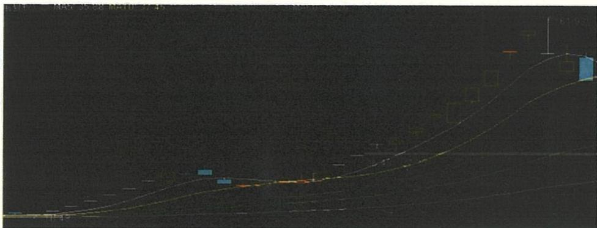

疫情下的002838表现

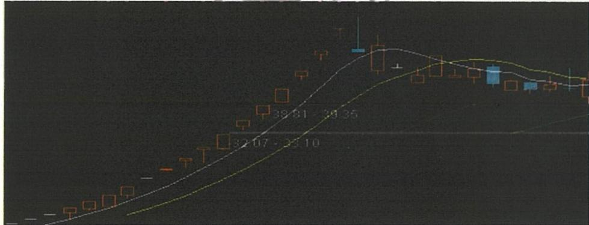  
碳中和概念003039表现

龙头券商股票开户：股票佣金万一免5（最低0.1元），支持同花顺登录。龙头期货公司开户：手续费为交易所+1分钱。开户加微信：W1K2ABC，QQ：1379979088，免费领投资课程关注微信公众号：蓝桥幻想

悟道·成长  
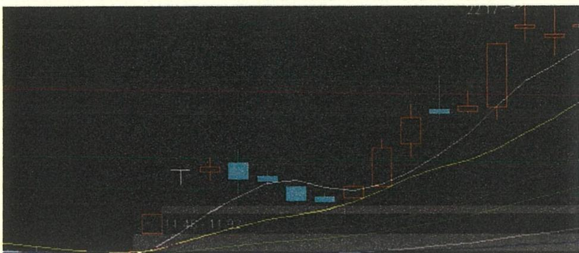

鸿蒙概念300339的表现，不排除还有更大的空间！

大局观是一种综合因素，参与机会大于风险的操作，当政策、资金、技术、信息等各方面都较好的时候，便是重仓出击博取利润的时机，如此往复不断复利。

我们是市场的跟随者 短线投资者必须时刻关注市场的动态，对于信息的解读必须有自己的判断，这种判断不是来源于读书，而是来源于日积月累的总结。就是我们通常所说的大局观。

信息公告如同技术一样，本身是决策的考量因素之一，如果你对市场理解的不够深刻，光钻研这些也是徒劳。大局观就是政策面、技术面、资金面、基本面的综合，相辅相成。

火候的问题，我也没法做到精确，大方向把握对了，赚钱还是大概率，多少的问题。

龙头券商股票开户：股票佣金万一免5（最低0.1元），支持同花顺登录。龙头期货公司开户：手续费为交易所+1分钱。开户加微信：W1K2ABC，QQ：1379979088，免费领投资课程关注微信公众号：蓝桥幻想

## 悟道·成长

## 仓位管理心法：

关于仓位，有好机会就重点搞，没有好机会就拿着钱耐心等待或者轻仓练盘感，总之让自己觉得舒服就可以了。经常有人问止损、止盈，目前我的操作中不考虑这两件事情，买入机会，卖出风险，何必用止损止盈来束缚自己。

只有学会了仓位的控制，才能做到收放自如，否则即使你判断能力超强，也容易大起大落。

但作为短线选手，《养家心法》认为短期的市场情绪是有规律可循的，长期是无法预料的，于是就演变出不同的操作。方法说出来都很简单，搞清楚现在是什么阶段，然后选用该用的方法。

完善自己的交易体系，输赢交给概率，看不准的时候割肉就可以了，不必拘泥！

当然，这句话的前提是短线操作，最大的前提还是自己的交易系统，少了这两个前提，就有失偏颇了。

## 悟道·成长

心法：

知行合一：第一条就是关于赚1块还是赚7毛的合一，其次是风险收益比与仓位控制的合一。

很多人告诉我，知道要控制，但就是管不住手，要么感觉随便哪只拉起都是机会。要么就是开始的时候仓位挺小，跌了补点，再跌再补，直到动弹不得。这其实是没建立自己的体系，导致了被动。

关于补仓以及止损这样的问题，如果你还有补仓或者止损的想法，就说明你的心理还有成本这个障碍，好的操作，应该是最简单的，只有买入或者卖出。不用刻意追求所谓的资金管理，风险收益比，量化决定仓位，市场缺之确定性机会时自然小仓出击，有好机会才重仓。确定的主流反复做，但是也不放弃盘中非主流机会，有机会都可以。

仓位的控制，绝对不是因为我的几句话就能改变的，但是至少有这个意识，买之前问问自己这股的胜率如何？能否上涨 30%？心法就是个循序渐进的过程，只有不断的修炼，才能成正果。

关于热点的把握

龙头券商股票开户：股票佣金万一免5（最低0.1元），支持同花顺登录。龙头期货公司开户：手续费为交易所+1分钱。开户加微信：W1K2ABC，QQ：1379979088，免费领投资课程关注微信公众号：蓝桥幻想

## 悟道·成长

心法：

所有身家全部压在一个股票上时，通常我要求极高的赢面，那时会有一种哪怕少买了100股都觉得遗憾的感觉，当然这种情况较少，通常一年也就是4-5次。

赢面60%以下，观望，赢面60%-70%，小仓出击赢面70%-80%，中仓出击，赢面80%以上时，大仓出击，赢面90%以上，满仓。这个赢面包括胜率和涨跌空间，比如满仓出击时，对我来说，必须满足以下两个条件才会做这样的决策，一方面是胜率要求90%以上，另一方面是上涨的空间和下跌的空间比率，上涨的空间至少要看到30%-50%以上，而下跌的空间应该在3%-5%以内。尽力把握好操作，胜负的事情交给概率 不管结果如何坦然面对，冷静处理。

关于热点，有长期的主流，也有短期的支流，长期的主流能持续，可以反复做，短期的支流，爆发力强，都有可操作性。具体技术的东西，个人不怎么注重，虽然做的是短线，但是看的是更大的局。

碳中和，是上层的顶层设计之一，是立足长远，也是未来世纪性大题材，所以新事物的诞生，我们格外重视，因为他的新，预示着从未有过的机会。而这些机会只会留给极少数人。任何板块的发酵，如果是盘中消息，考验素养和手速！

## 悟道·成长

## 心法：

对于主流热点的把握一定要做到：进行瞬间的操作判断，操作是瞬间的，判断是动态的。其中也离不开追涨，追涨的核心是火候的把握。

一年下来，这种机会不多见，但是如果遇上一定要把握住，把握的前提，是与你的日日夜夜的复牌、年复一年的总结所带来的素养是息息相关的，耐得住这种寂寞，才能有机会享受繁华。

复盘与素养，这是一个初入者的必修课。

符合主流热点的强势股是赚大钱的机会。既然准备赚大钱，何必着急卖出。即使行情弱于预期，宁愿回落卖出，少赚些无妨，但是提早卖出，错失的可能一年中为数不多的绝佳机会，两者权衡，先持有观望是上策。

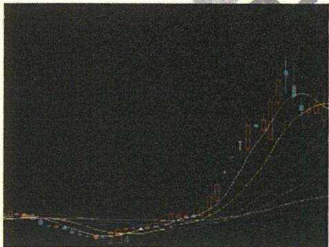  
华银电力第一波

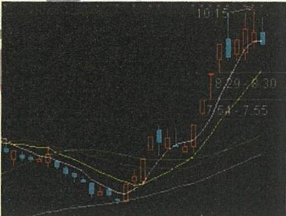  
第二波

长源电力第一波

龙头券商股票开户：股票佣金万一免5（最低0.1元），支持同花顺登录。龙头期货公司开户：手续费为交易所+1分钱。开户加微信：W1K2ABC，QQ：1379979088，免费领投资课程关注微信公众号：蓝桥幻想

## 悟道·成长

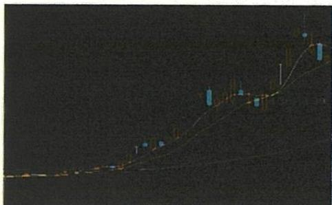

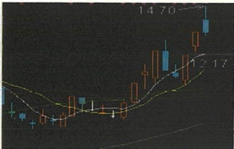  
第二波

当然总龙头是顺控发展，但华银电力与长源电力的联动效应是比较好参与的

市场热点很多，每天都有不同的消息推送，如何在第一时间把握热点？这个热点是主流还是支流？其中核心便是大方向，或者说大局观，也就是我们要站在更高的高度看问题。

如2021年走的比较长，比较久的医美

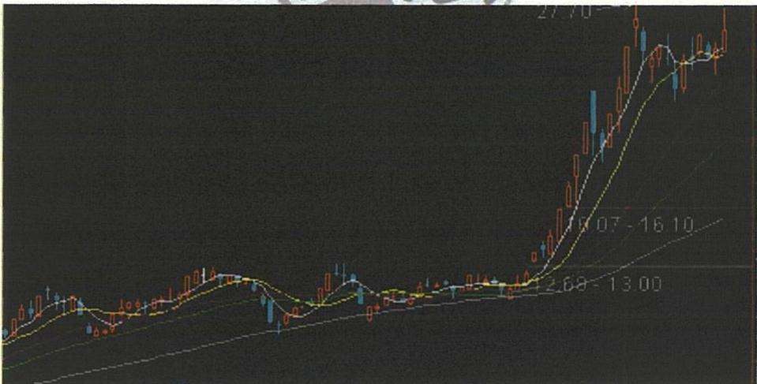

奥园美谷

龙头券商股票开户：股票佣金万一免5（最低0.1元)，支持同花顺登录。龙头期货公司开户：手续费为交易所+1分钱。开户加微信：W1K2ABC，QQ：1379979088，免费领投资课程关注微信公众号：蓝桥幻想

悟道·成长  
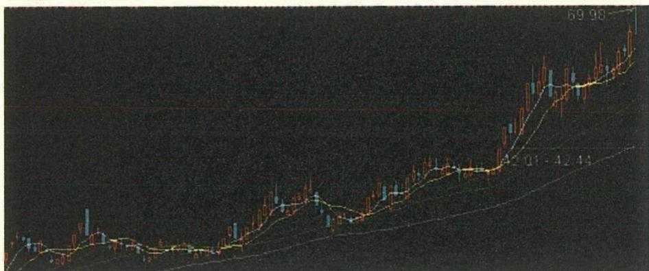

## 朗姿股份

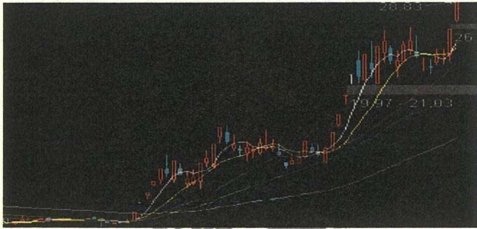

## 哈三联

大方向的问题，或许就是asking说的一张纸的意思，懂了就懂了，不懂的多说也无用，用我的话说，就是做的是短线，但是看的是更大的局。

所以，所谓的局，是个综合因素，政策面、技术面、基本面、资金面、人气面，等集合与一身、形成的共振！如此共振，20%的空间会有吗？如果有，为啥不敢买呢？

龙头券商股票开户：股票佣金万一免5（最低0.1元），支持同花顺登录。龙头期货公司开户：手续费为交易所+1分钱。开户加微信：W1K2ABC，QQ：1379979088，免费领投资课程关注微信公众号：蓝桥幻想

## 悟道·成长

## 心法：

## 热点来自题材，持续性来自赚钱效应！

## 热点的处理：

1、先预判热点性质，是主流热点，还是次主流热点，还是非主流热点？

2、预判可以先试错轻仓买入，确认后再追涨加仓。

3、对于主流热点，实盘操作中可以直接买相对确定的龙头也可以买后发品种，仓位稍重些也无妨：以碳中和为例：华银电力2021年5月18迎来第二波升，如果建立了股票素养应第一时间进入，如果来不及吃点龙二长源电力肉

4、若是次主流，有绝佳机会也可以重仓搏杀，若是非主流，轻仓参与，隔日卖出。

## 2021年的概念题材层出不穷

先是碳中和：顺控发展长源电力、华银电力

医美：朗姿股份、奥园美谷、哈三联

疫苗检测：热景生物、复星医药、未名医药

数字货币：天旗科技

新能源汽车：长安汽车、小康股份、北汽蓝谷

华为鸿蒙：润和软件、常山北明

降解塑料：丹化科技、银禧科技

森林碳汇：福建金森、岳阳林纸

## 悟道·成长

还有食品饮料、白酒、换电概念、锂电、盐湖提锂、芯片光刻胶、光伏都是未来的方向！

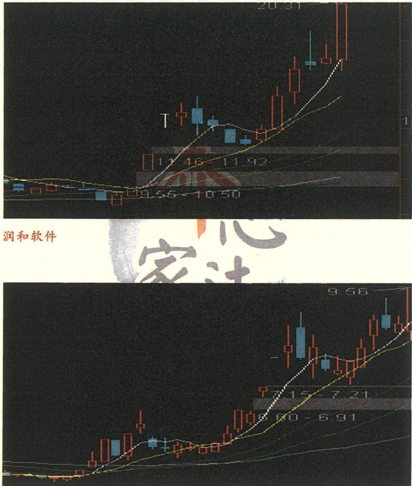  
常山北明

龙头券商股票开户：股票佣金万一免5（最低0.1元），支持同花顺登录。龙头期货公司开户：手续费为交易所+1分钱。开户加微信：W1K2ABC，QQ：1379979088，免费领投资课程关注微信公众号：蓝桥幻想

悟道·成长  
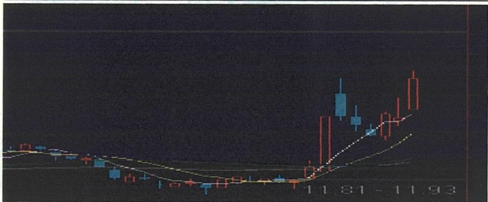  
再如换电概念龙：英飞特

## 心法：

##

如果你没能及时把握第 那就建立板块，跟踪买入第二波

关键是每天的跟踪与素养，要第一时间知道何为龙头，如何切入还要火候！

市场赚钱效应爆棚，对于我们来说，耐心做好自己的事，做对的操作，盈亏的事情交给概率。

先是赚钱效应极好，是今年以来少有的好时机。

对于这样的市场，是我们乐于见到的，养家不会去过多的参与大盘的判断，只看市场的情绪。情绪在，重.仓一直在。

## 关于如何做T

至于做t，我会做，但是我不是为了做而做，当中的加仓和减仓，是依据我对市场变化后，收益风险重新衡量后的决策。也许为此错失了很多大牛股，但也规避很多风险。很多人是为了做T而做T，完全是为了手痒，觉得有买卖，感觉跌了就买，涨了就卖，听起来容易，做起来很难。

对于做T，我觉得不是为了做T而做T，只有当机会偏大的时候加仓，风险偏大的时候减仓， 如果有更好的标的就换仓，当板块个股大幅波动的走势，这些操作会在一天之内进行，于是形成了做T的形式。

所以即使是做T，其实也是源于对盘中的判断，说来说去，还作越简单越好。

所以做T依然还是操盘手法的范畴，不要上升到策略的高度。比如券商板块，湘财股份2021年5月14第一时间拉停了，势必带动整个板块会有一个拉升，而你的手上持有证券的底仓，那么反应迅速的人，会至少看好接下来一段小时间内的机会

所以，T，不为T而T。

龙头券商股票开户：股票佣金万一免5（最低0.1元），支持同花顺登录。龙头期货公司开户：手续费为交易所+1分钱。开户加微信：W1K2ABC，QQ：1379979088，免费领投资课程关注微信公众号：蓝桥幻想

## 悟道·成长

## 心法：

高质量的复盘是好的操作的基础，特别是对于短线来说，有时间的话一定要多看，如果是实在时间有限，也要选择重要板块，重要个股做复盘。因为对于短线选手来说，热点和情绪的判断是最重要的，关键的是有没有赚钱效应。

还有一点就是：当一只股赚的比较多的时候，会收敛的比较多。以此来表达对市场的敬畏，同时也是告诫自己：戒骄戒躁，放空大脑再出发。因为赚了比较多之后，往往容易头脑发热，决策自然会失准。

复盘，是被问的最多的问题。因为，复盘也是操盘的关键所在，经常有人问我，花了很多时间不见成效，那么看看你的复盘方式对吗？个股的走势，日积月累，观察主力如何操盘，如何洗盘，如何把你洗出去后拉板，以后见到这样的图形你就会淡定很多，不要觉得分时图是完全随机的，其实是有规律可循的，因为这些都会体现在走势上。养家说技术不重要，但是技术也会反应情绪。根据复盘，选定可以考虑介入的个股，或者说完全不考虑介入的个股，让自己的第二天操作有个基本的目标。

关于复盘其实还有很多，比如强势股的联动，强势股图形的一致性等！

## 悟道·成长

## 心法：

大局定仓位：大盘所处的阶段必须搞清楚，这个最大的大局，就是日常所说的是否是可操作区间，如果是，那么定下来仓位50-80%，一年中100%的时机比较少，要达到这个仓位一般都是，当我觉得少买100股，我都觉得可惜的时候，一年也就不超过6次。

如果当大盘在不可操作区间的时候，那么仓位策略就是0-30%，以尽可能的规避风险。 王

热点情绪定板块：搞清楚了大方向：参与还是不参与，接下来就是把范围缩小，4000多只个股，几百个板块，我们不可能都看一遍，否则，别说18重要的板块上。

如何选取板块：1、市场热点板块，诸如当下的碳中和、医美、森林碳汇、华为鸿蒙、降解塑料、还有食品饮料、白酒、换电概念、锂电、盐湖提锂、碳硅芯光刻胶、光伏产业链都是未来的方向2、自己比较熟悉的板块，每个人都有自己相对比较熟悉的板块，比如做医药的，就知道各家医药公司的质地，这是别人无可比拟的优势。

龙头券商股票开户：股票佣金万一免5（最低0.1元），支持同花顺登录。龙头期货公司开户：手续费为交易所+1分钱。开户加微信：W1K2ABC，QQ：1379979088，免费领投资课程关注微信公众号：蓝桥幻想

## 悟道·成长

上述的板块，还有个股选择标准就是市场的情绪，无论是哪个板块，要激活板块的人气，是必须有个股去拉板的，这是激活人气的必要条件，所以留意板块的情绪。一般建议选取3-5个板块做复盘。（盐湖提锂概念示范)

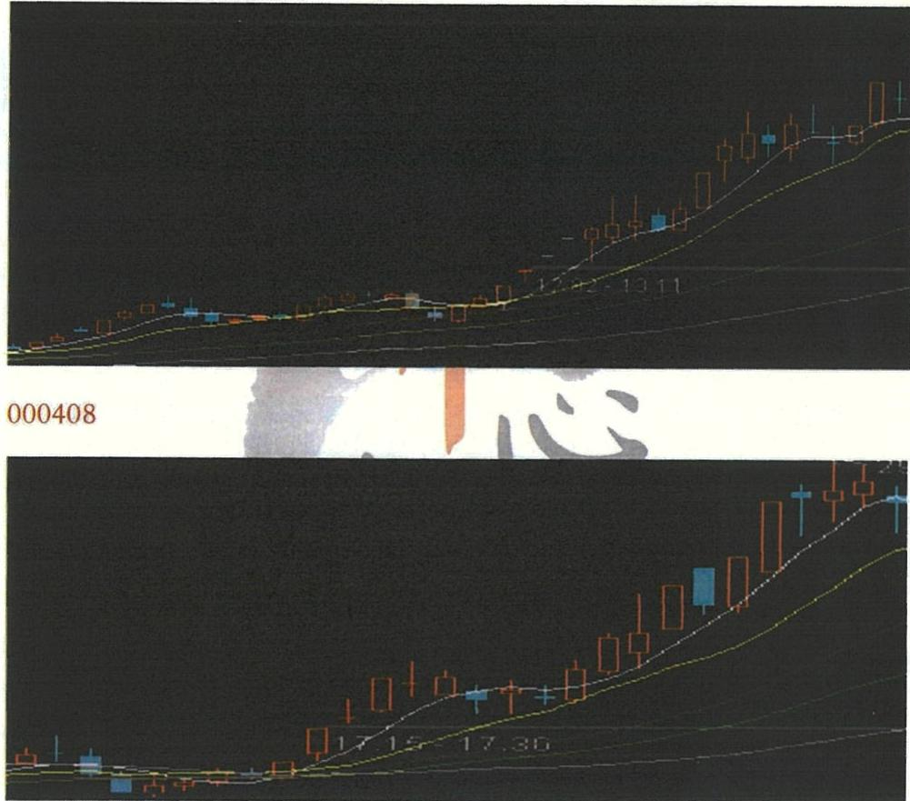

000762

根据板块定个股：根据上述选定的板块，按照涨停先后顺序，把个股的技术图，分时图，量能全都认真的看一遍，谁是龙头，分几段拉升，拉升之前是什么状态，根据龙虎榜看看是谁拉的。其实股票也是有熟悉和陌生之分，赚自己认知的钱！

## 悟道·成长

## 建立自己的交易体系

建议每个人都有自己的一套交易体系，所谓体系，听起来复杂，我认为体系的第一步就是：你的买和卖的逻辑。你如果定义短线，那就要有短线买入的逻辑，也得有卖出的逻辑。如果定义长线，做法完全不同。所以，首先要搞清楚的是：你计划风格是什么，而不是市场给你短线就短线（赚钱就出了），给你长线就长线（被套就做长期股东了）。

在残酷的市场上，但天赋比你高的人都在努力的时候，你还能指望不努力就能胜过人家吗？如果努力和赚钱之间让你做个选择，我想大部分人应该选择努力吧。

人都会有这个问题，包括以前的我也是一样，但是想想，盘中的那些干扰，那些直线拉升给你带来的冲动，几次是让你赚钱的。既然知道问题所在，就得下决心去解决，知行合一！！！

买和卖的逻辑，一定要对应。

我这个思路不少人都知道，因为之前的文章中有提过，永不止盈、永不止损、看好买入，不看好卖出，操作就应该是简单的。

当然，因为我做的是短线，所以对自己有这样的要求，而日常中，估计很多人都有这样的经历：本想做个短线，结果一套成了股东。这样的话，就很被动了。

龙头券商股票开户：股票佣金万一免5（最低0.1元），支持同花顺登录。龙头期货公司开户：手续费为交易所+1分钱。开户加微信：W1K2ABC，QQ：1379979088，免费领投资课程关注微信公众号：蓝桥幻想

## 悟道·成长

## 心法：

买的逻辑是什么？短线的驱动因素无非是：大局所定（大盘安稳），消息驱动（要看大小）、情绪所在（赚钱效应）、技术判断（k线和分时），以此测算盈亏概率，决定采用的仓位和策略。

以上做出的算是一个比较体系的买入策略，至于什么时候卖出，就看上面的因素还是否存在，好的操作应该是心中无顶底，心中无成本，心中无持股。只要：是否继续看好，看好则持股，不看好则卖出。

如果能够做到这样，那么也就验证了我们之前说的那句话：只做对的操作，盈利的概率交给市场。

有人说，我就是这么干的，但还是一塌糊涂，那就不是交易的事情，是你的选股系统的问题了。

高质量的复盘选股是好的操作的基础，特别是对于短线来说，有时间的话一定要多看，至少自己有持股或者准备介入的板块，是要十分熟悉才行的，对于强势个股做到心中有数，才能对目标股有的放矢。

## 悟道·成长

## 心法：

当一个板块疯狂之后，必然迎来分化，所以对于我们而言，对可能出现大行情板块的第一反应以及操作至关重要。当消息出现在盘中，没有时间给你查看资料，那么平时的积累，也就是养家说的“素养”就变得至关重要了。

市场情绪不好的时候，更要关注板块里哪些个股的股性，在下跌行情中的表现，是我们日后选释标的的一个重要标准。

我们提到复盘的框架：人局定仓位，热点情绪定板块，根据板块定个股，详细讲解下操作策略的几个逻辑。

## 逻辑一：坚决打有准备之战

想必很多人都会有这样的体验，前一天做好的计划，由于盘中出现了许多的直线拉升，于是，计划就打乱了，原计划的5成，变成满仓，原计划的个股一个都没买，都买了别的。

这就是典型的情绪化操作，这里强调的是：我们要尽量利用市场的情绪来赚钱，也要避免自己陷入情绪的漩涡。

制定的策略，目标股，越详细越好，甚至精确到介入区间，然后坚定的去执行。否则，你的情绪化就是别人用来赚钱的工具。

龙头券商股票开户：股票佣金万一免5（最低0.1元），支持同花顺登录。龙头期货公司开户：手续费为交易所+1分钱。开户加微信：W1K2ABC，QQ：1379979088，免费领投资课程关注微信公众号：蓝桥幻想

## 悟道·成长

## 逻辑二：好的策略应该有预案

大盘的判断并不是那么重要的，重要的是操作，炒手和just这样的高手在股指期货亏损严重，对大盘的判断一塌糊涂，然而，股市依然是他们的提款机。

好的策略应该是，如果大盘涨，我的组合会大幅涨，如果大盘跌，我能做到小跌，或者不跌，换句话，对大盘的走势，我们在不判断的前提下，需要有基本的预案，理由很简单：大脑在盘中的判断，绝对没有在盘后那么清醒。

## 逻辑三：好的策略应该有事后评估

《养家心法》一般称这一块为事后检讨，在我很困难的那个阶段，熟悉我的人应该都懂，我明天承受着巨大的压力，心情也很糟糕，但是我每天依然选择将每天的操作做个总结。

具体的说就是，今天哪个操作是失败的，在什么情况下失败，预案当中需要做什么改正？人都是短记忆的，特别是情绪上来之后，所以，我会用本子来记录每天的操作情况。

不断的强化正确的策略，每天排除错误的、情绪化的操作，久而久之，自然能够让自己的操作体系有本质的进步，避免陷入情绪的漩涡，真正做到知行合一。

## 悟道·成长

## 写给新手

新入市场者或者有经历过市场，但依然没有找到自己的模式的人，都称之为新手，简言之，新手就是用无章法来应对市场的人。新手如何成长：没有捷径、经历是最好的事情，就像：醉过方知酒浓，爱过方知情重。

我们把用懵懂的眼光看世界的人，称之为孩子。

我们把没有自己成熟交易模式的人，称之为新手。

新手不可怕，可怕的是在新手的路上一直在走弯路，走弯路也不可怕，可怕的是，走在弯路上越走越远。

新手的成长，没有捷径，唯有经历加总结才能成就你自己，才能对市场有更深的理解。

我的建议是没有建立完整的交易体系之前，没有足够资金解决后顾之忧之前，没有详细深入了解职业炒手之前，没有取得家人完全支持之前，不要轻言去专职炒股，很多人只是看到炒股轻松的表象，而最终成功的人付出何止十倍百倍的努力以及无数失眠的夜晚，这是一个付出不一定有回报的行业，这是一个努力不一定有结果的行业，这也是一个成功者极少而失败者满街都是的行业，没有准备好，贸然进入，有可能是深渊！

龙头券商股票开户：股票佣金万一免5（最低0.1元），支持同花顺登录。龙头期货公司开户：手续费为交易所+1分钱。开户加微信：W1K2ABC，QQ：1379979088，免费领投资课程关注微信公众号：蓝桥幻想

## 悟道·成长

## 心法：

对于个股，其实更多的精力应该花在个股所在的板块，板块里的其他活跃股，板块所处的阶段，不应该拘泥于自己关注的个股，或者持仓的个股，要对各个周期内的领涨板块和领跌品种进行重点关注。

操作上，不要过多的拘泥于技术形态，或者各类软件上的神奇密码，买入、卖出信号这些。技术要懂一些，这样能便于我们更好的读懂资金的运作状态，主力的意图，回避一些明显的问题。但是，我们更关心的应该是过去的表现，当下的板块情绪，个股在板块中的位置，从而衡量个股是否有操作价值。

对于大盘的判断，其实难度蛮大的，不用过多在乎大盘的点位，顶底，更需要关注的是大盘的情绪，赚钱的情绪，以及主力资金的情绪，关注下此前领涨的品种，如今怎么样了，下一波的时候能否用上。前期领跌的品种，现在怎么样了，时刻关注品种的情绪转化。

大局观，也是我一直建议的，听起来很难，但是一定要去做，只有站在更高的地方，才能看到不一样的风景，这是道的范畴，方法只是术的层面，一旦有所领悟，将会受益无穷。

## 悟道·成长

## 心法：

市场情绪不佳的时候，我们就多看看，多做做功课，机会每天都有，所以不必急于一时。

经历是宝贵的财富，在资本市场里更加，但是，不要荒废你的经历，你的经历只有归纳总结才会真正变成你的。通过总结强化你正确的思考方式，操作模式，摈弃你冲动的心态，胡乱的操作。如果每天能做正确的操作，盈亏留给市场，除了不亏，剩下的就只有盈利。

兵法云：攻心为上。股市如战场，你的操作反应你的心态，你的心态影响你的决策， 你的决策决定是否在做对的操作，对的操作影响你盈利或亏损 的心态是实现稳步盈利的前提，平稳的心态是短线操作的根本

市场就像一面镜子，你拿什么心态看待市场，市场就拿什么结果回应你。

有人整天怨声载道，觉得市场无良。你若真觉得如此，建议趁早撤离为好。其实资本市场都是很残酷的，少数人赚钱的原则是不会变的，成熟的美国市场也是一样，更多的人，还是被收割的命运，即使是遇上牛市，但终会因为贪念失去自我。

龙头券商股票开户：股票佣金万一免5（最低0.1元），支持同花顺登录。龙头期货公司开户：手续费为交易所+1分钱。开户加微信：W1K2ABC，QQ：1379979088，免费领投资课程关注微信公众号：蓝桥幻想

## 悟道·成长

正是因为市场的残酷，所以才要表现出你与他人的不同。别人在抱怨，你在感恩，别人浮躁，你的心态平稳，别人追涨杀跌，你对涨跌应对自如。

就像我们心中的佛，有人信他，有人不信，最终结果差别并非是佛的问题，而是你的心的问题。

心态直接反映在操作上，有人赌性十足，动不动满仓，明知不可为而为之，所以，前面重点讲了《知行合一》，但是依然不够。有人满身戾气，一旦股票被套，边埋怨市场如何、主力如何，监管如何，而从没想过自己的因素。这样的人是注定要失败的。

市场都是同一个市场，大资金有优势，也有想不到的压力，比如私募界一哥王某某，其名下所有基金全部清盘。你若做不好你的30万，又何谈3个亿的梦想。

之前有人问，炒股养家需要多少本金，我的回答是：和你的本金大小关系不大，重要的是你的收益率和回撤率。

真心希望，熟读《养家心法》的人，心态和别人是不一样的，操作和别人也是不一样的，特别是遇到逆境、风险的时候，能够更加理性的面对风险，当市场上升时，我们都能跑赢市场的收益，更能控制手上的回撤。

## 悟道·成长

很喜欢朱熹老前辈的一句话：事理通达心气和平！我是个风险的极度厌恶者，追求稳定的盈利，不确定时，采取偏保守的策略，尽量规避大的回撤，所以平时以小阴小阳为主。控制回撤，最重要的就是回避大跌风险，事实上绝大部分大跌都有前兆，从赚钱和亏钱效应的演变过程可以进行推断，当然也会因此错过一些机会。

经常有人这样感叹：赚的时候赚了3个点，一套就是10%。明明是一只盈利的票，最终拿成亏损的。这是什么的问题呢？

本质上是回撤机制不够，或者完全就是没有。

控制回撤第一条就是，能赚1块时，只赚7毛，留3毛济世。知道并不是目的，做到才是，把认同的东西刻进自己的交易系统，那就离稳定盈利不远了。

控制回撤第二条：决不能把盈利的做成亏损的。

这是一条《养家心法》遵从的铁律，什么意思，我想不用我过多的解释。从大幅盈利到中等盈利，很多人心里不平衡，从中等盈利到小幅盈利更是无法接受，但是市场永远是对的，拉高出货也是常用招数，大盘高开低走也是常事。

龙头券商股票开户：股票佣金万一免5（最低0.1元），支持同花顺登录。龙头期货公司开户：手续费为交易所+1分钱。开户加微信：W1K2ABC，QQ：1379979088，免费领投资课程关注微信公众号：蓝桥幻想

## 悟道·成长

对我们而言，如果能够把握好这一条，那就是时刻做到：心中无顶底，手中无持仓，以一名场外的身份来看。说起来容易，做起来挺难，没别的办法，一靠悟性，二靠痛处。痛的多了，自然也就成长了。

控制回撤第三条：仓位提前计划，知行合一。

盘中受大盘起落的影响，但凡是人，情绪都会波动的，情绪波动的时候，必然影响到我们的操作。有人说，我实在做不到知行合一，做好的计划 一到盘中就完全打乱。

很多人估计是计划不够细致，看似有计划，其实没计划，仓位配比是多少？出现什么情况下有策略，如能应对自如，我想不合一的情况就会少些。

控制回撤，说起来简单，做起来也是难题，但是牢记以上三条，我想你的回撤应该不会大。

控制回撤，有时也会错失牛股，其实这都不重要，对于短线选手而言，缺的永远不是机会，而是看到机会时的资金。所以，赚我们该赚的钱，如果真的因为济世的那个3毛，丢了1块，无妨，多留点给市场，市场迟早会回报你的。

## 悟道·成长

## 心法：

我们操作的目的：应该是尽量让自己避免被动。好的策略就应该不管行情怎么变化，让自己始终在应变中处于优势，这也是实现稳定盈利的根本。

所以，短线选手，必须时刻判断生态的热度，消息面的初期、还是发酵期、还是退缩期，从而决定我们的是否操作，如何操作。

如果你总是觉得自己能够逆势上涨，那么市场总会给你教训。

计划第二位

凡事预则立，不预则废，短线选手更是如此。

每天我都会有认真的复盘，关注哪些板块在涨，哪些在跌，之前上涨的板块现在怎么样了 之前下跌的跌到了什么位置？代表性的个股挖出来，认真翻看一遍。华尔街没有新鲜事，我们对现在个股的计划，源于我们对他一贯的了解。

操作前，必须心中有底气，某个板块，情绪标的是谁，集合竞价表现如何，是强势还是弱势，还是弱转强，强转弱？集合竞价的判断比大盘的判断更为重要。由于这块内容比较多，没有细写，所以只能给个大概

计划还有一层意思，就是得推演市场可能出现的情况，比如：大幅反弹该如何，大幅下杀该如何，没有定论，就是得有章可循。就是不管行情怎么变化，让自己始终在应变中处于优势。

龙头券商股票开户：股票佣金万一免5（最低0.1元），支持同花顺登录。龙头期货公司开户：手续费为交易所+1分钱。开户加微信：W1K2ABC，QQ：1379979088，免费领投资课程关注微信公众号：蓝桥幻想

## 悟道·成长

## 执行

专业的短线选手，有着严格的操作纪律，比如知行合一。因为没有执行，计划就是无本之末。

对于新手而言，只有经历过更重要的事情，只有犯过错，总结过，改进过，提高过，才能成长，几乎无一例外。

## 曾经犯过的错（1）：

仓位：动不动满仓

盘中总是觉得到处是机会，看着看着就成了满仓，然而，无论你的资金体量，满仓意味着被动，因为你的路子，除了上涨，无路可走。而这种操作往往会让我们自己陷于被动。

原因：场内不能控制自己的情绪，有时是因为之前的盈利头脑发热，忽略了风险，有时是因为前面的亏损，导致想扳回一局，一旦有了这个心态，操作自然就乱了。

## 曾经犯过的错（2）：

吃着碗里的看着锅里的，

手持有的股票不涨，一看到别的股快速拉升，慌不择路的冲进去，一个错误的结束，另一个错误的开始，如此往反，本金越来越少，最要命的，不是去追自己已研究的股票，而是看涨速榜！

## 悟道·成长

## 心法：

关于情绪，一直建议大家要根据市场的情绪来赚钱，反过来我们自己也要避免陷入情绪的漩涡。所以前面提到，情绪是短线操作的基础。如果，你无法控制自己的场内情绪，至少短线操作不适合你。

关于仓位，有好机会就重点参与，没有好机会就拿着钱耐心等待，或者轻仓练盘感，配比也没有特别的规定，只要让自己觉得舒服，能让自己主动就可以了。

行情好的时候，不注重资金管理或许没什么，当行情转入震荡，或者退潮的时候，依然还在满仓搏杀，自然就不是那么明智了。

对于短线选手而言， 从来不是缺乏机会， 因为短线的机会一直抓住下一个便是。所以大可不必，因为仓位少了涨停而懊恼。

盘中的走势总会对我们的情绪带来冲击，遇上这种，就是我们之前说的，你做的计划的重要性了，计划是否到位，是否可执行。

还有人问我：老师，我的缺点就是知行不合一，该怎么办？看到这样的表示很无语，既然知道自己的缺点，还要问吗？只能说：还不够痛。

龙头券商股票开户：股票佣金万一免5（最低0.1元），支持同花顺登录。龙头期货公司开户：手续费为交易所+1分钱。开户加微信：W1K2ABC，QQ：1379979088，免费领投资课程关注微信公众号：蓝桥幻想

## 悟道·成长

## 心法：

涨停所在，情绪所在，情绪所在，人气所在。涨停总能聚集大家的注意，也能打开板块的高度，散户就是最大的主力，主力所在的地方，自然是我们必须重点关注的地方

## 关注涨停板的数据和个股

知道不代表做到，知道而没做到，才是最大的问题。经历过错，不可怕，可怕的是，错过了还没长进，市场是残酷的，当别人都在学习，而你在放任，结果可想而知。

要对涨停的个股有记忆

其实，细心的人会发现，每个板块的活跃分子大多都不发生变化，特别是品种比较多的板块，用一句话来说就是“华尔街没有新鲜事” 家土

这个并不难，也有很多专门的数据帮你整理，可以参考东方财富的涨停板数据，因为他们家的数据使用的人是最多的。当然还有很多更加细致的涨停板数据和小工具，需要自已用心去发现！

2021年碳中和的热度，你马上就会想到顺控，华银、长源电力等，和前期的涨停板去比较下，发现重合的概率是很大的，那是因为资金都有记忆性，每个人都会优先选择自己比较熟悉的、了解的品种。你的思路是这样，大资金的思路也是这样。

## 心法：

散户就是最大的主力，散户情绪所在，就是人气所在，所以，我当然乐意这么干。

## 涨停板的强度分析

涨停根据涨停的时间和换手率排序，识别涨停的强度。越早涨停的，换手率越好（一般是20-40%），则是后期重点关注的标的。历史上涨停次数最多的，涨停时间靠前的，就是越有价值的品种。标杆包括两块：盘子较大的核心股，一般称之为中军，还有就是活跃的小盘股，一般是板块的情绪或者高度股。尽量只做龙头个股，没有机会参与做龙二或第二天打板龙1，但要认清是否为最有强度的主流！

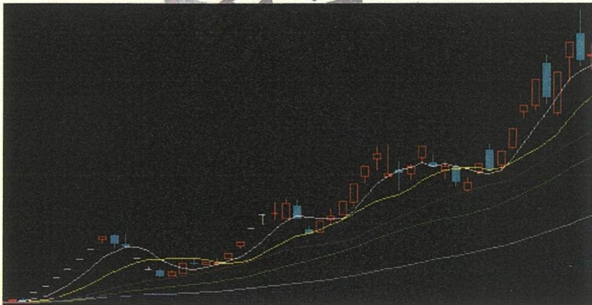  
002565工业大麻概念起

龙头券商股票开户：股票佣金万一免5（最低0.1元），支持同花顺登录。龙头期货公司开户：手续费为交易所+1分钱。开户加微信：W1K2ABC，QQ：1379979088，免费领投资课程关注微信公众号：蓝桥幻想

悟道·成长  
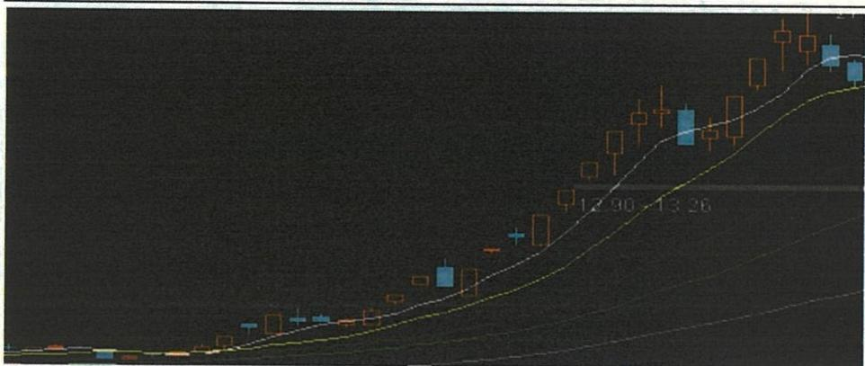  
000723燃料电池概念起

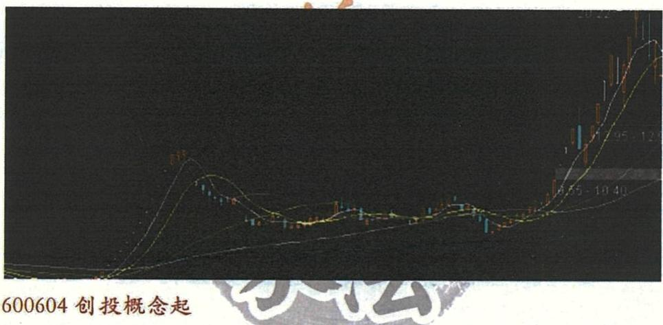

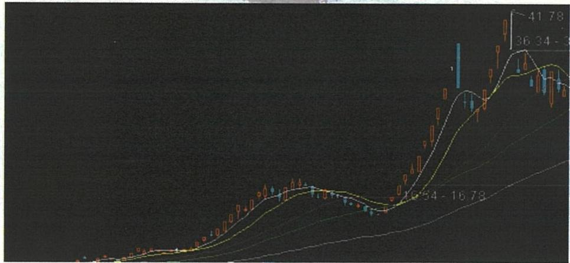  
6007765G概念起

龙头券商股票开户：股票佣金万一免5（最低0.1元），支持同花顺登录。龙头期货公司开户：手续费为交易所+1分钱。开户加微信：W1K2ABC，QQ：1379979088，免费领投资课程关注微信公众号：蓝桥幻想

悟道·成长  
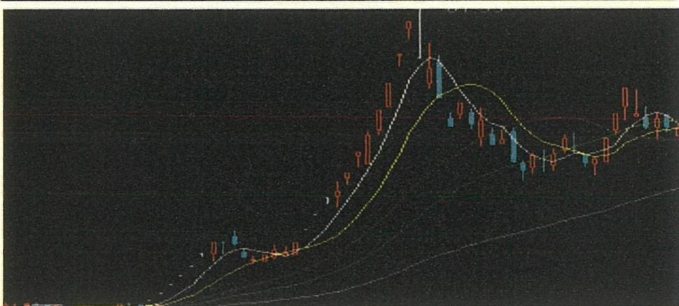  
002838疫情概念起

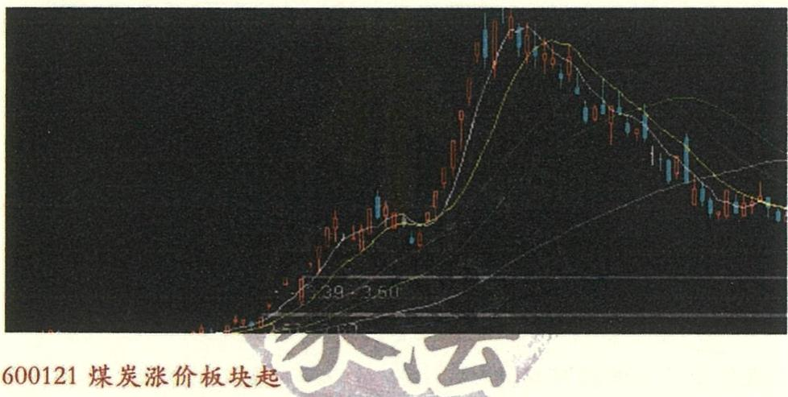

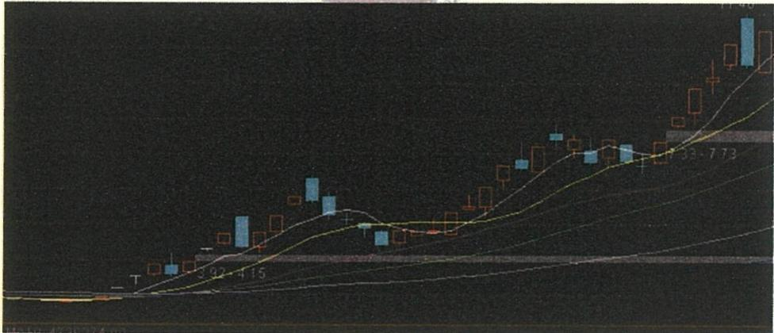  
002400字节RCS起

龙头与情绪的完美演义！

龙头券商股票开户：股票佣金万一免5（最低0.1元），支持同花顺登录。龙头期货公司开户：手续费为交易所+1分钱。开户加微信：W1K2ABC，QQ：1379979088，免费领投资课程关注微信公众号：蓝桥幻想

## 悟道·成长

## 心法：

顺风顺水的行情，让我们对市场充满期望，逆流的行情，总能勾起我们的情绪，有人选择失落、有人选择怀疑，有人失去耐心，更有人质疑自己的是否继续。但，越是这样的时候，越是需要总结的时候，越是能找出问题的时候。我选择在这样的时候，做更多的功课！

下跌行情，对参与者的情绪影响会蛮大，特别是冲高回落的行情，很多人会懊恼自己的操作，产生负面的情绪也是可以理解的。

但，与很多人的失落、怀疑相比， 我倒是觉得这是个最好的总结的机会，哪怕你今天的操作一塌糊涂。

我们要学会掌控市场的情绪，如果能掌控市场的情绪，盈利会接踵而来，如果我们的情绪一直被市场左右，那么失败终将挥之不去。

此前说这话，估计很多人不在乎，但今天想必可以有更深的感悟和理解。因为操作是我们情绪的反应。

说完情绪，我们再说操作。

一直提醒大家，我们要做的是根据我们自己的计划执行，那么计划当中有没有做今天上攻的打算？上攻后，什么情况下得离场，什么情况下持股？相信这会对细致有了理解。

如果有这个计划，相信你今天的操作不会太遭。即使你不记得这一条，或者忘记了，那么还有我们的控制回撤的标准：

第一：能赚一块的，只赚7毛，留3毛济世。有的时候，单位可能不是毛，可能是分，但道理是一样的。

第二：决不能把盈利的做成亏损的。上次说这条的时候重点说这是一条铁律，也就是需要无脑执行的，今天有做到吗？失败并不可怕，可怕的是连续的失败，每一次经历，都要让自己有所成长和进步，让自己的交易体系能否更完善一些。

自然地，每经历一次，我们都要及时的总结，在你最痛的时候。

天下武功唯快不破，天下股市唯心法不破。

当年鲁迅先生先是留洋学医，后来他发现，学医是术，只能救身体，更重要的是道，于是，他改学文学，志在唤醒国人内心深处的东西。我与别人不同，希望心法能对大家有所帮助，在这里，能让大家的心静下来。

龙头券商股票开户：股票佣金万一免5（最低0.1元），支持同花顺登录。龙头期货公司开户：手续费为交易所+1分钱。开户加微信：W1K2ABC，QQ：1379979088，免费领投资课程关注微信公众号：蓝桥幻想

## 悟道·成长

毕竞：平稳的心态是做短线的根本。

短线选手，自然会有强势热点追击，因为这是市场的情绪所在，也是资金最容易引起共鸣的地方，在市场情绪比较稳定的时候，这个方法几乎占据我们的交易的一半以上。而热点的追击，最重要的一环就是强度的识别，这是决定成功与否的关键。

## 1、热点的级别

顾名思义，热点在什么环境下提出，影响几何？

不同级别的参与者，决定热点的高度。比如碳中和，顶层设计，各部门积级响应。这就给市场想象的空间，这样的热点就是一点就着的。

如果是更高级别的喊话，比如老大，这事估计能持续好一阵子！任何热点，我们的理解并不够，而要体现在市场的情绪和选择上，所以我们要用市场来判断是否需要参与，是否需要第一时间参与。比如的森林碳汇概念一起：福建金森一飞冲天  
再比如鸿蒙系统相关个股，我们的理解会史无前列的强，因为这是变革！

强度确认，接下来就是靠大家平时的“素养”了。

当然，强度的判断并非绝对，但是大致依靠板块的强度，个股的强度来做判断和后面的分时走势，技术面等。

## 悟道·成长

我们的交易是一个体系，热点的追逐也好，低吸也好，都需要我们的交易体系做护航，所以，这是一个“术”的范畴。

短线选手，从来不缺乏机会，也谈不上诱惑，因为要说诱惑每天都会有。成功之处不是抓住了多少诱惑，而是挡住了多少诱惑。但行情出现不利，或者不顺的时候，我们要做的更多的是放弃和耐心等待，等待一个新的春天！

当行情不好，没有好机会的时候，就拿着钱耐心等待或者轻仓练盘感。因为，等待是比操作难度更高的一种状态。

炒股注定是一场等待的修行，也是一场清苦的修行，因为太多的压力与懊恼需要自己一个人扛 太多的诱惑和利好，需要自己去识别判断。

如果你把所有的时间都花在操作上，成功率其实可想而知。更多的时候，我们要做的其实是等待。

想想你曾经的操作，有多少次慌乱的卖出自己持有的个股，机不择时的追涨正在拉的升的个股，更糟糕的是不在计划内的个股，而是受不住拉升的诱惑！

当市场情绪不对的时候，或者重大不确定的时候，我得把资金拿在手上，不必去赌，因为十赌九输。

当某个板块撑高跳高，个股分时直线而上的时候，我们顶不住这种诱惑，追的时候感觉很爽，但有没有仔细算过，追高的日子盈利的概率是多少？

龙头券商股票开户：股票佣金万一免5（最低0.1元），支持同花顺登录。龙头期货公司开户：手续费为交易所+1分钱。开户加微信：W1K2ABC，QQ：1379979088，免费领投资课程关注微信公众号：蓝桥幻想

## 悟道·成长

管住手是一项重要的纪律，总有人买着买着就满仓了，那是因为没有理解“短线选手而言，从来不缺机会，”这句话的真正含义。

学会等待，简单四个字，相信很多人依然做不到，其实，静下来好好想想，追高的成功率，低吸的成功率，我想你应该有自己的方向。有感悟，有总结，自然就有成长！

改变做事的方法，首先得改变自己的思维模式，改变自己的赌徒心态，把问题看得更透彻，而不是什么都没有思考，告诉我：我做不到知行合一怎么办？

做不到，很多时候不是能力问题，而是意愿不够深，伤的不够痛，我之所以经常提及大家的痛处，是因为这些痛处能帮你成长。

耐得住寂寞，才能守得住繁华，能经历等待的煎熬，能管住自己的手，情绪逆转的时候，也能果敢出击的人，在市场上至少是上层。

复盘是一个选手成长的重要因素，因为大多数人可能并不像我这样，白天能够实时盯着屏幕，即使是这样，复盘依然是关键一环，因为，盘中是一个心境，盘后又会是另一个心境。

复盘，我的建议是，一定要认真做，这是基本的态度，有了态度才有后面的方法，态度不一致，方法自然也没有成效。

有时间的话，一定要多看，无论是盘中的，盘后的，有条件的可以对比下盘中的感受和盘后的感受，盘中的冲动和盘后的平静，这是领会市场情绪对你大脑情绪的冲击，清楚了，自然也就没那么冲动了。

盘中也好，盘后也好，都建议用电脑看，因为手机虽然方便，用来交易还可以，用来看走势和分析，差的太远了。

复盘，建议从大到小，先从大盘开始，目前的点位、走势，再到板块，领涨板块，领跌板块，再到个股，领涨个股和领跌个股是一定要看的。

复盘，得清楚每个板块上涨的动因，虽然有随机的成分，但是板块的上涨绝非随机可以解释，很大程度上是市场情绪的合力，包括领跌板块也是一样，并不是所有的下跌都有原因，但至少要了解明面上的。

复盘，消息源还是满重要的，即使消息的推送并不是让你去追热点，而是养成收集信息，分析信息，结合板块的走势加深对板块和个股的理解。久而久之，会很大程度上提升自身的“素养”。

## 悟道·成长

消息的来源有很多渠道，一些常用的APP 都有消息的推送功能，至少我的手机首页上都是推送消息，这就要需要自己去判断强弱了。

对于没有时间接收盘中消息的朋友，盘后也建议去多挖掘一下今天什么样的消息与股市的关联！这样你会对今天的市场有个大概的了解。然后，跳出别人的思维，用自己的思路重新分析下这个市场。

## 王

比如，今年领涨板块碳中和、医美，软件、上涨原因是什么？领涨的为什么是它，今天拉板的都是哪些个股？这些个股在此前板块中的位置如何？其实，历史总是惊人的相似，这块不展开，留给各自去思考。 家土

如此循环往复，一段时间下来，自身的“素养”必然会大幅提高，当市场再次出现类似的情形中，你的心中就会很有底了，我也把他称之为复制功能，这也是短线能力的重要组成之一。

## “素养”的标准是什么？

至少能清楚知道板块的“逻辑”，这是最基本的，逻辑决定我们的操作；其次，板块有哪些个股构成，至少能立马说出10%的目标吧；板块中有哪些典型的个股？比如上涨最积极的，市盈率最低的，叠加其他题材的，次新的，盘子较大的，较小的；每一波的走势，领涨个股是哪几个？今天的行情是由谁发动的，跟风的是哪几个？哪几个技术形态（换手率）是最好的？

如果能顺利回答上述问题，那么复盘基本就到位了，当然，素养并不是一日之功，靠的也是日积月累。

多看，多写，多思考，多总结，加上实战经验，复盘就慢慢有感觉了。

[锂电池]新能源汽车高景气，锂电产业链需求腾飞[利好][鸿蒙概念]多家银行保险机构入场，预计年底搭载鸿蒙设备超3[钛白粉]钛白粉产销两旺，行业进出口规模扩大[利好] 浏[区块链]·明确阶段发展目标及重点任务，区块链应用有里提速[上海自贸]上海市长龚正对浦东进行调研，本地股彻底火了[利[炭黑]炭黑市场价格稳中有涨，预计今年行情延续[中程]刘[要童概念]央行工作论文称应全面放开和鼓励生育母婴产品迎来[口腔]口腔医疗消费为黄金赛道，隐形正畸方兴未艾[利好][光刻机]海外大厂断供，国内多家企业加速导入本土光刻胶[利[降解塑料]政策推动供给落地，可降解塑料行业有望快速增长[证券]行业高质量发展可期，证券板块异动]刘览1897[钠离子电池]宁德时代将发布钠离子电池，有望在储能和中低能[碳交易]碳交易市场启动渐近，行业有望迎来政策倾斜[利好][白酒]行业淡季却集中提价，白酒进入“控量提价”阶段[好[石油开采]油价节节攀升，石油开采板块闻“风”而动[性][钻金属]产销两旺，钴板块增仓明显[利好]浏览103978次

## 悟道·成长

## 心法：

我向来强调市场情绪，情绪通过如何来传递，自然是盘口和走势，优秀的短线选手能在15分钟的竞价时间里，判断出情绪的强弱与导向，从而引导自己的决策。通过对标杆股和热点股的走势，决定选择的策略。

## 关于集合竞价：

集合竞价的判断是一个短线选手的必备技能，因为这里能够看出竞价强弱，情绪变化，持币者和持筹者的博弈。专业的短线投资者要在这10分钟的时间内做出决策，甚至是完成交易。所以，这10分钟至关重要，也是最紧张、最忙碌的交易时间。

集合竞价能看出板块、个股的强弱，以及市场的情绪。

好的集合竞价模式应该是筹码均匀，甚至是越到集合竞价后期，有抢筹的动作，在分时图上表现为竞价的分时图是向上走的。当然，也有主力会故意压低价格，不绝对，只要你手上的个股是盈利的，早些走又有何妨，短线交易者最不缺的就是机会。而最担心的则是不按体系操作之后的被动。

因为一次操作上的被动，会有连锁反应，打乱你的整个心态与体系。

龙头券商股票开户：股票佣金万一免5（最低0.1元），支持同花顺登录。龙头期货公司开户：手续费为交易所+1分钱。开户加微信：W1K2ABC，QQ：1379979088，免费领投资课程关注微信公众号：蓝桥幻想

悟道·成长  
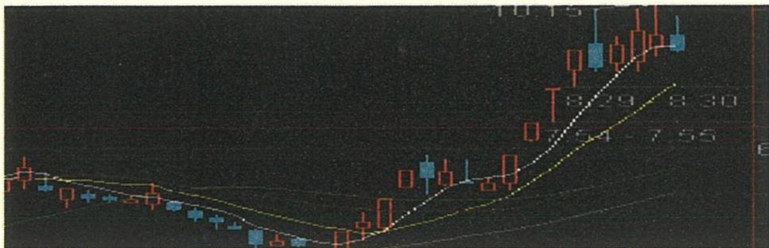

如华银电力在2021年5月24日早晨集合况价已显颓的势，那如果你没有在里面而是在别的碳中和个股内，要第一时间止损或止赢！

市场的高度板，集合竞价出现了这样的走势，基本宣布今天的本板块继续冲高计划泡汤了，因为短线是最需要情绪的支撑的，而标杆的情绪最容易蔓延。

市场情绪不好的时候，我们选择休息，小仓位开仓试错，便于在第一时间感受到市场的情绪，从而判断收益和风险，决定加仓在哪个方向。

市场的短期情绪是有规律可循的，长期的是无法预料的。

短线的情绪的把控，一部分来源于前一日市场的热度，很显然，前一天市场的热度也是很低的，技术派理解为市场在等回补之前的缺口。

另一部分来源于当日集合竞价的判断，这里之前有过介绍，短线选手对集合竞价的判断是要求极高的，至少能判断整体情绪导向，热门板块情绪，从而决定选择何种策略。

## 悟道·成长

短线选手而言，很多时候就是在考验对市场的理解与判断，你想胜人一筹，自然得有过人之处。

当然，再强调一遍，虽然参与打板的人不少，但是据我观察真正适合打板的人并不多，你只要拿到4个跌停板就能让你的本金腰斩。

所谓的龙头理论实际并不一定科学，但是依然很多做短线对此笃信不疑，因为赚钱的效应最强，这也是导致长期迷茫和不能稳定获利的本源。

每个人根据自己的经验和对市场的理解，进行市场的操作，有人喜欢满仓，他们用满仓换股的方式，将资金失踪放在更有利的筹码上。而我大部分时间空仓，因为我习惯放弃不确定的和看不懂的，选择赢面较大的机会进行操作。反应在市值曲线上，始终满仓的可能是波段上扬，我的方法则更平滑，不断复利新高。里面比较多的写了如何控制回撒的方法，我估计很多人不见得真正有仔细领会。

比如：有人会有疑问，是盈利重要还是回撤重要？

最好的回答当然是两者都重要，但是在现实中，我们明显做不到，因为追求盈利势必会有冒险的成分，控制回撤，势必要求操作上要保守一些，如何平衡呢？

龙头券商股票开户：股票佣金万一免5（最低0.1元），支持同花顺登录。龙头期货公司开户：手续费为交易所+1分钱。开户加微信：W1K2ABC，QQ：1379979088，免费领投资课程关注微信公众号：蓝桥幻想

## 悟道·成长

首先，你是否真的了解复利？

每月5%的收益，一年后你的账户净值180%，每周2%的收益，一年后你的账户净值280%，每月10%的收益，一年后你的账户净值314%。

比如像我，给自己的目标就是每月5%-10%，达到了就很知足。

说这个，是希望各位能够对自己的目标有清醒的认识，不要动不动每天去重仓追逐涨停，其实，我们要做的和能做的并不多。有了这个目标的认识，你也就不会上那些所谓“股神”“专家”的当了。

为什么说这些？因为目标决定我们的心态，心态决定我们的操作，当你每天奔着涨停去追涨的时候，想想自己的目标，哪有如此简单的事？

从事后来看，确实任何时候都有上涨的股票，这也是技术派痴迷的原因。往往忽略了整个市场的情绪，追求自己股票的“逆势”。但是，一旦发生风险，出现10%以上的回撤，吞噬的可能是你3个月的利润。所谓的“一夜回到解放前”

龙头券商股票开户：股票佣金万一免5（最低0.1元），支持同花顺登录。龙头期货公司开户：手续费为交易所+1分钱。开户加微信：W1K2ABC，QQ：1379979088，免费领投资课程关注微信公众号：蓝桥幻想

## 悟道·成长

所以，希望我们的朋友们，特别是资金体量比较大的朋友们，耐心的静下来做好功课再出手，别急，机会有很多。

而不是去重仓博风险，一旦发生大的回撤，可能就是万丈深渊。

定出清晰的目标，坚定的执行：知行合一！

## 《孙子兵法·形篇》

古之所谓善战者，胜于易胜者也。故善战者之胜也，无智名，无勇功，故其战胜不忒。不忒者，其所措胜，胜已败者也。故善战者，立于不败之地，而不失敌之败也。

炒股本是一场清苦的修行，面对冰冷的数字代码，面对不属于你的市场机会，面对盘后巨大工作量的总结，还要很多时候能够寂寞的守住仓位，更要有面对市场无奈之时的强颜欢笑。但是没有寂寞哪来的后面的繁华，光鲜的背后都是努力和汗水的痕迹。

对于走上这条路，或者即将走上这条路的人，我一般都是泼冷水，所以，有人会觉得我可能比较傲气，但是从我自身的角度来说，确实希望大家能够谨慎些，有个预期总比盲目乐观要好。

炒股是一条清苦之路，一方面每天面对账户的浮动，这便有巨大的精神压力，有些还是融资的甚至是借贷的。问题这个浮动很多时候还不能示人，只能自己一个人扛。

另一方面，当行情不好的时候，怕面对股票，怕复盘，怕总结，怕制定计划。然而，如果你有这些，有问题不去面对，这将是更大的问题。

## 几点建议：

1、人是群体性动物，特别是给你带来巨大压力的东西，不与人沟通，全要靠自己排解，确实很多时候会钻进牛角尖。所以，需要找一个人进行倾述， 如果没有合适的，可以找股友，也当是一种交流吧。

好的交流能够带给你信心与勇气。你自己不缺勇气，缺的是有人帮你找出来。

2、操作上，严格执行知行合一，如果能够做到，不敢说赚多少，至少哪怕是亏损，亏损的概率也是比较小的。

龙头券商股票开户：股票佣金万一免5（最低0.1元），支持同花顺登录。龙头期货公司开户：手续费为交易所+1分钱。开户加微信：W1K2ABC，QQ：1379979088，免费领投资课程关注微信公众号：蓝桥幻想

## 悟道·成长

3、我不反对行情好的时候加杠杆（融资），但是坚决反对负债、贷款、因为这会搞乱你本身不怎么样的心态，乱更容易出错，财不入急门！

4、提醒自己认真的做好一件事情，如果发现一本书很好，那你就每天认真的去读一遍，如果有文章写的很好，那就定期去看一遍，如果有自媒体写的不错，那就每天坚持报道一次。

有时候，我们到处找方法 其实方法可能就在你的身边，只是你没用好而已，这样的习惯也有助于你养成自律。

认真持续的去做一件自己觉得有意义的事情，久而久之，你会带来改变，三天打鱼两天晒网，一时的感触倒是挺深，但没什么作用，就像很多人接触的培训，不是吗？

炒股是一场清苦的修行，心态是基础，自律是关键，努力是条件，就像我们做股票，只做对的操作，盈亏交给概率！

对于个股，不应拘泥于自己手中所持品种，对于当下或者历史上出现过的重要板块都要心中有数，要对各个周期的领涨和领跌品种进行重点关注。不应该过多关注点位，更多的要关注板块里的哪些在涨，涨了之后又怎么样了。

龙头券商股票开户：股票佣金万一免5（最低0.1元），支持同花顺登录。龙头期货公司开户：手续费为交易所+1分钱。开户加微信：W1K2ABC，QQ：1379979088，免费领投资课程关注微信公众号：蓝桥幻想

## 悟道·成长

## 心法：

股票操作是个系统工程，这也是之前强调的操作体系的重要性。有人仅靠个股图形波段之类作为买卖依据，是难以形成较为稳定且较高效率的盈利模式的。需要的是一个更加完整的判断、筛选、操作、回撤控制体系。

炒股的初期，总觉得技术派很神秘，红红绿绿的K线，以及漂亮的均线，或是其他各种技术指标。当年，我也一度沉迷于研究技术形态。

技术派有个陷阱是：从后往前看，都是对的。比如最简单的均线，强势上涨的票，肯定有一个5日线上穿10日线的过程。

但是，反过来并不一定对，所以这个有很大的欺骗性，很多人会觉得掌握了技术分析，就能掌握走势，其实不然。

时间久了，就会发现，同样的技术形态，居然会有完全不同的走势，甚至是完全随机的，就好比放量上涨，在上涨开始的阶段貌似好事，到了后期很容易成为拉高出货的配合。

技术分析，要学吗？必须学，这能够很大程度上协助你筛选目标，识破主力资金的意图，规避一些明显的问题。

龙头券商股票开户：股票佣金万一免5（最低0.1元），支持同花顺登录。龙头期货公司开户：手续费为交易所+1分钱。开户加微信：W1K2ABC，QQ：1379979088，免费领投资课程关注微信公众号：蓝桥幻想

## 悟道·成长

在技术分析的基础上，结合对盘面的大局观，对场内外情绪的把握，完善的控制回撤系统，这才是你真正该有交易体系，这才能使技术分析插上翅膀。

因为，技术分析不是全都靠谱，而是要为稳定盈利保驾护航。

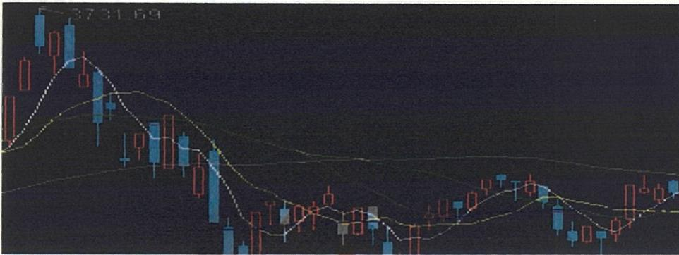

就如近期的这波下跌，其实跌幅蛮大，但市场的情绪已经比之前要暖很多，投资者也比之前要淡定很多，指数虽然下跌，但是盘面的活跃度和情绪还是在的，相同的《线组合出来不一样的意义。技术分析固然重要，如果加上对大盘的大局观，判断就能更加精准。如果你能对市场情绪有个大致的把握，再来看技术，许多问题就迎刃而解。

炒股是一场清苦的修行，上涨时群情激愤，下跌时无人问津，甚至连账户都不愿意去看，股票都不愿提及，别说去研究了。都说炒股的人内心都很寂寞，其实是一种压力，一种消沉，是一种无与人说的姿态，觉得只有自己一人懂的顾影自怜。

龙头券商股票开户：股票佣金万一免5（最低0.1元），支持同花顺登录。龙头期货公司开户：手续费为交易所+1分钱。开户加微信：W1K2ABC，QQ：1379979088，免费领投资课程关注微信公众号：蓝桥幻想

## 悟道·成长

寂寞的内心来自行情的传导，来自账户的压力，来自自己管不住手的操作，来自不能知行合一的懊恼，有时也来自二选一出错的一点怨气。

人非圣贤，真正能把内心掩饰的很好的人并不多，于是这些内心会体现在你的工作上，学习上，以及和别人的相处上。

炒股必然清苦，内心自然寂寞，因为你走的本身是一条与众不同的路。中国14亿人，股民约1亿， 在熊市的背景下，数字还要再打折扣，所以，志同道合的人并不多

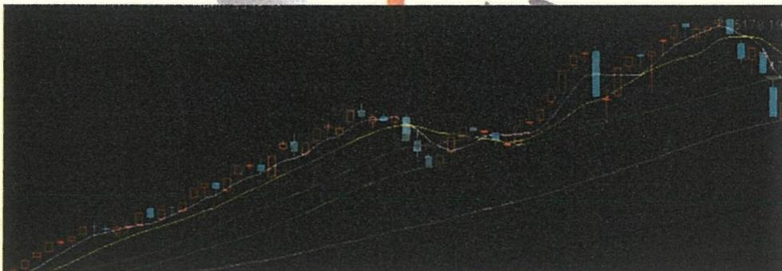  
2015年指数

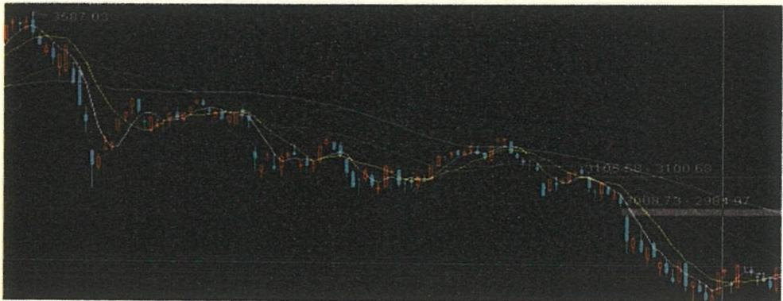  
2018年指数

龙头券商股票开户：股票佣金万一免5（最低0.1元），支持同花顺登录。龙头期货公司开户：手续费为交易所+1分钱。开户加微信：W1K2ABC，QQ：1379979088，免费领投资课程关注微信公众号：蓝桥幻想

## 悟道·成长

## 心法：

市场单个个股走势本身有不确定性，把整个板块一起看就更容易理解。有些强势票是个股行为，往往有较大的不确定性，对于板块性的行为，大体上有个规律，如果你有心人，耐心总结，你会发现这样的规律，以后自然知道要怎么做。

题材的思路是有龙头、有驱动、有资金参与，那么这样的机会对于短线选手来说，不可错过，因为套利的成功率非常之高。

有很多人会问：题材中，我该直接上龙头呢，还是上跟风的个股呢？龙头溢价比较高，但是当前的高度也会比较高，上龙头得有足够的胆。

其实要解决的，不是有没有胆做龙头的问题，而应观察龙头和跟风品种间的套利关系

受华为鸿蒙国产软件的影响，润和软件与常山北明的联动效应非常强，还有前面提到的华银电力与长源电力！建议花时间去仔细复盘加深理解！

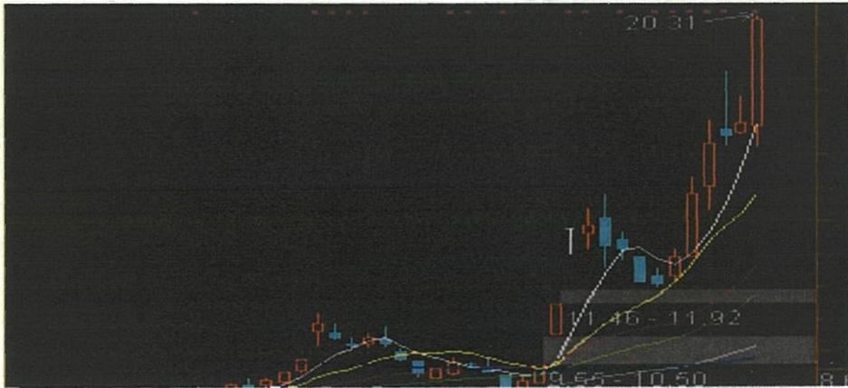  
常山北明

龙头券商股票开户：股票佣金万一免5（最低0.1元），支持同花顺登录。龙头期货公司开户：手续费为交易所+1分钱。开户加微信：W1K2ABC，QQ：1379979088，免费领投资课程关注微信公众号：蓝桥幻想

悟道·成长  
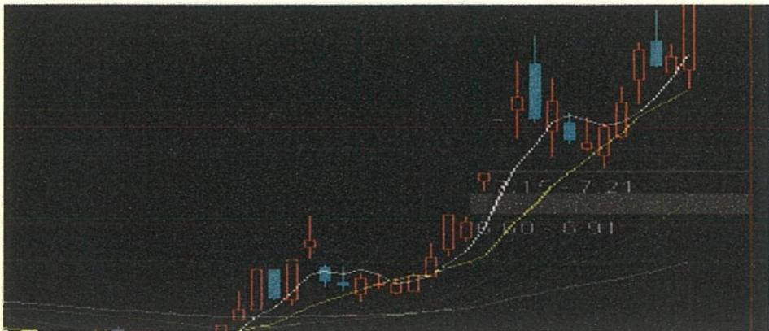  
润和软件

所以，是否买龙头，因人，因时，因事而异：

买龙头不是因为胆子大，而是根据板块整体动能，龙头有更高的溢价，而股价尚未反应溢价时介入（龙头像十足，但并没有大涨）；有时买跟风 是因为龙头赚钱效应十足，而部分跟风品种尚处低位，可以随时受龙头激发而具备向上潜力，而又承担相对较小的风险。

市场的单个个股走势都有随机性，但是放到一个相对较大的框框里，你或许能找到一些规律，这也是为什么一直建议大家提高素养，提高对个股的理解，提升自己的大局观。

龙头券商股票开户：股票佣金万一免5（最低0.1元），支持同花顺登录。龙头期货公司开户：手续费为交易所+1分钱。开户加微信：W1K2ABC，QQ：1379979088，免费领投资课程关注微信公众号：蓝桥幻想

## 悟道·成长

## 心法：

市场的情绪每时每刻都在发生着变化，而这些变化中蕴含着机会与风险的博弈。我们所要做的就是用自己平稳的心态，去感受市场的情绪的变化，就像一个狙击手。当风险大于机会时，匍匐原地继续等待，当机会大于风险时，果断出击。

市场情绪弱转强的走势，如果把握的好，赚钱比平时来的更容易一些，当然这些都要以平时的素养为前提。

大盘的分时在一路往下，个股更是有许多的“加速下跌”，但是分时有的个股却是走的横盘，围绕均线做回踩运动。这样的走势，大概率只缺一个引爆者。

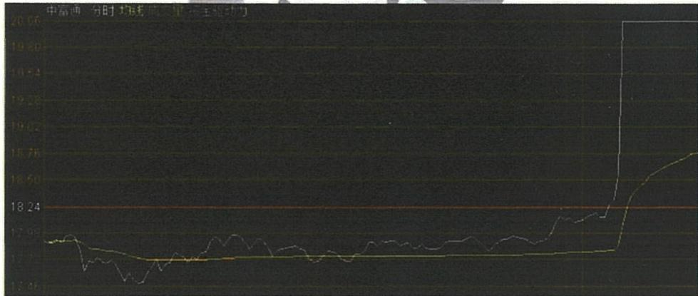  
借用当年做过的股来做一个讲解，理解的更明白一些

正是由于中富通的上板，带动了通信板块的集体飙升，这时候，我们要选择的就是之前分时图在横盘贴着均线走的个股，机会蛮多。当时的东方通信成妖！

## 悟道·成长

通信板块的活跃带动了其它板块的拉升，市场的情绪就慢慢的活了，体现为指数缓慢开始回升，主力监控里出现大批的红盘预警。

这时候，对于你手上的个股来说，做差价就是好机会，做过功课的个股也有了介入的机会，这时候的拉起，在水下的抛压是很小的，所以当天有很多从水下-5%，拉到 5%的品种，而这个比赚一个涨停板容易的多。

## 总结下：

这里的核心是恐慌杀跌之后的情绪变化，重点可以观察指数的跌幅与主力监控里的红绿提醒来判断盘面的情绪。

是否存在一个或者几个比较强势的板块，最好是近期活跃的板块，表现出异于其他的承接能力，分时能够走平或者踩着均线走。

下杀过程中有恐慌盘，大概率有反抽，不是今天也是明天，所以观察成交量的变化以及盘面恐慌程度，一旦这种迹象从开始-蔓延-加速-到逐步减少，这时候可能就是变盘的时候了。

一旦出现盘面情绪变化，我们的机会就来了，短线选手是不可能错过这种机会的。

龙头券商股票开户：股票佣金万一免5（最低0.1元），支持同花顺登录。龙头期货公司开户：手续费为交易所+1分钱。开户加微信：W1K2ABC，QQ：1379979088，免费领投资课程关注微信公众号：蓝桥幻想

## 悟道·成长

## 心法：

做人要经得起诱惑、耐得住寂寞、才能守得住繁华。股市又何尝不是如此呢，虽然对于短线选手而言，本没有什么诱惑可言，只要市场不倒，机会总会很多。我们缺的永远不是机会太少，而是自己能力太小。而很多人，却终是本末倒置过来，容易出错。短线选手而言，从来不缺机会，缺少的是把握机会的能力，抓住机会的水平。

比较成熟的选手，只要看一眼你的持仓，就能大致知道你的问题，因为你的问题反映在你的买卖上，最终体现在你的操作上。

人都是有情绪的动物，不可能像机器人一样六亲不认，不用调查也知道，如果说什么是亏损的原因，我想大部分都会选择：追涨杀跌。 家土

行情的走势带来的对大脑的冲击，使得肾上腺素直线上升，这对于我们来说就是诱惑，懂得管理情绪的专业的投资者知道如何抵制这些诱惑，而有些未领悟情绪的人，容易冲动出手，以至于造成自己的被动。

这就是我们所说的：如果你能掌控市场的情绪，胜利将会接踵而至，如果你被市场的情绪所掌控，失败终将挥之不去。而我们也要避免陷入情绪的漩涡。

## 悟道·成长

从一个冲动，到另一个冲动，到操作的被动，其实有很强的关联性，只有认知到这些，才能管控好自己的情绪。

有些人不是没法做到知行合一，而是没有搞明白知有多重要，自然也就不知道行有何好处。

甚至有时候，一些错位的行偶尔也会给到一些正反馈，这就进一步麻痹了操作者的思维。比如某一天追高一只个股，事后也有反思，这么干不妥，然而， 第二天，板块情绪高昂，直接再次封板。于是他完全忘了当初的操作那回事。

我们追求的第一位不是盈利，而是做对的操作，至于结果，交给概率！

单次的盈利并不代表什么，我们要做的是持续的、稳定的盈利，这是能够在这个市场生存的前提。这就是我所说的体系的重要性，用自己的一套体系来避免出现盈利的随机性否则，随意买卖，与扔硬币又有何区别。

管理自己的情绪，从认真的自我反省开始，从彻底的自我剖析开始，认识到知的重要性，才知道知行合一的重要，认识到计划的重要性，才有可能坚定的去执行。

市场永远不缺少机会，我们缺的是抓住一次机会，就有85%成功率的能力，而不是，广撒网，收获50%的胜率，还在为 50%的成功沾沾自喜，结果依然是亏损。

龙头券商股票开户：股票佣金万一免5（最低0.1元），支持同花顺登录。龙头期货公司开户：手续费为交易所+1分钱。开户加微信：W1K2ABC，QQ：1379979088，免费领投资课程关注微信公众号：蓝桥幻想

## 悟道·成长

今天的市场挺残忍的，但是还是希望在大家的伤口上撒盐，这样才会对伤口有更深的认知。

直面伤口，直视问题，改进、提高、都刻不容缓，毕竞这关乎我们的每个人的口袋和在这个市场的生存。

我只做市场的跟随者，而不是发动者。只做市场情绪热门的板块，只做资金认可的板块，得市场情绪者得天下，人气所向，牛股所在！

一直有很多人在问这句话 一直没有等到好的机会，今天正好结合盘面做个基本的介绍

题材大小最直观的来说，就是从提出者的高度看，或者从这个题材的定位看。 家土

2021年5月（华为鸿蒙软件概念）已集体走出高度，6月2号的发布会，所以先知先觉者已吃肉！

这是典型的情绪+技术的个股，技术来自量能，情绪来自市场对它的狂热。单有散户自然难成气候，单有庄家也做不了大事，单有游资也不会有太高的涨幅，因为游资犀利往往留下隐患。只有当三者结合，才是最高境界。

当一只股票出现大幅上涨，而没有明显的游资扫单，成交量又成持续的放大，个股的分时走势是平缓向上，而不是直线拉升，加上是板块的龙头，那么这类股多半是市场情绪所致。当然这类股一般还有一个特征，盘子一般是中盘股，因为太小的话不利于资金进出。

市场情绪不倒，板块就有机会，于是就会有各种的底部的、小盘的机会，有情绪在的情况下，再去看技术形态，那成功率自然会高的多了。

所以，相比预测大盘的点位，我们更需要关注的是哪些在涨，哪些在跌，而之前涨的后面又怎么样了，之前跌的后面又怎么样了。这就是最直观的市场情绪所在。

鸿蒙：这条线的情绪标的就是润和软件，常山北明，（5-21书）如果你是持有中的，依然可以给自己设置一个安全垫持股，目前的位置也容易卖飞， 也容易被洗，都不重要，平和的心态往往会让你拿的更多。溺水三 只取一瓢，你这次剩下的部分，市场下次会加倍还给你。

情绪不倒，其他的低位的、形态上突出的个股就会有机会，重点关注下底部有量能配合的个股。

你的浮盈为何会飞走？多半是贪婪之心以及心存侥幸作怪。而每一次飞走的浮盈，不单单是浮盈本身，还有你自己体系、计划被打乱，所以操作体系里应该有这块内容。对于大题材要有足够的坚守！

经常有人问，如何判断市场情绪，如何根据情绪决定自己的仓位?

龙头券商股票开户：股票佣金万一免5（最低0.1元），支持同花顺登录。龙头期货公司开户：手续费为交易所+1分钱。开户加微信：W1K2ABC，QQ：1379979088，免费领投资课程关注微信公众号：蓝桥幻想

## 悟道·成长

## 如何不让浮盈飞走

不少人有过这样的经历：原本一只个股，盈利10%，但最终硬生生的变成浮亏几个点走掉，或是一路被套没有操作。

或者：根据计划尾盘买了一只股，计划盈利1-2%，明天早盘走掉，看着早盘上攻，2%的时候又想5%，5%的时候又想 8%，之后又想涨停，即使回落到2%，你还是舍不得走，因为，你的账户浮盈从5万变成了1万，心理不乎衡了，之后几天草草收场。浮盈，即账户的浮动盈亏，有浮盈而守不住浮盈，两大问题：

## 1、心态问题

每个人的心理都有一些心灵的弱点”，贪婪、不满足，都是正常的反应，只是有人把控的好，有人把控不好。有人原本把控的挺好，但是由于之前的交易不顺利，导致心态变差，心态越差，操作更乱，浮盈留不住，恶性又循环。

## 2、制度问题

制度，这个说法比较大了，儒家崇尚“人之初、性本善”，法家崇尚“人之初、性本恶”，欣赏下法家的观点：

## 心法：

我们的心灵的弱点，就可以理解为“恶”，当自己不足以掌控的时候，就得有“制度”，或者说我们自己的“交易体系”来掌控。

## 两种方法：

1、心态上，严格遵循自己的初衷，炒股需要“不忘初心”，严格执行自己的交易策略和交易计划，交易逻辑。

何为策略：是套利还是长期持股，交易计划：这股是否要走要服从仓位和资金的需求。交易逻辑：买它的逻辑还在不在。

如果了解了这个，才能更好的理解“心中无顶底、心中无成本”，“看好买入、不看好卖出 “弱水三千只取一瓢，能赚一块，只赚7毛”

2、严格执行自己的交易体系，做好账户回撤的控制，不断地日积月累，利润与思维的复利是很可观的！

复利的前提是，你的单子要正盈利，一旦产生巨额负盈利，复利大打折扣，甚至对折，改天用数学论证下。

## 悟道·成长

知道了这个前提，我们追求的第一位就是盈利，哪怕是较小的盈利，也无妨，我们要规避的就是大的回撤，这对复利的影响实在太大。

一旦股票出现了浮盈，首先要抛去的是，浮盈上涨带来的激动，设想这票就能回本，这票就能翻倍，这样的票会有，但大概率不会在你需要的时候出现。所以，常用的是浮盈之后止损位上移法，具体多少根据自己的偏好。但是绝对不能把盈利的做成亏损，这是我们的底线。

心态和体系，缺一不可，两者相互促进，共同发挥作用，没有解释很详细，希望每个人可以多多体会。

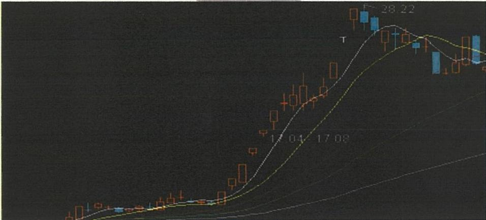  
300643胎压监测新概念起

## 悟道·成长

## 心法：

只有自己的强大，才能面对任何市场，自己弱小，即使牛市也和你没有关系。都说，站在风口上，猪都能飞起来，都没说后半句，万一风突然停了呢？

## 炒股、多关心自己！

不是有人调侃，炒股的是全能的，既要关心全球局势，也要关心国内经济，于是，炒股的很多人看起来像经济学家。因为说到中美局势，贸易谈判，当下疫情的影响，国内经济总能侃侃而谈。

诚然，这些资讯还是非常必要的，也是我们日常都要了解的，问题是，在经历了糟糕2018的一年后，大家都在反思的时候，发现不少人把自己的收益怪罪于别国总统，把问题交给形势，因为指数跌了20%多。 小云

大局势谁都懂，但是更多的还是要回到我们自己本身，想想自己的小逻辑、小道理。

## 悟道·成长

2018年，资本市场很艰难，艰难的路走过，自然要有成长和进步，否则这路就白走了，更何况这路还是我们真金白银铺的，2019年的价值投资年，很多人收获丰厚，也有很多人亏本，因为大部分的股都跌，如果不能买个明白，看个透彻，你能保证当行情转好，你会有好的收益吗？

如果走了艰难的路，花了不少钱，还买不来一个教训，一个平和的这逝本不個自了的條系，年在美心奧送会在日本能否如期

我也有过这样的经历，曾经，我们执迷于研究技术分析，研究技术形态的有效性，甚至怀疑书上讲的技术分析方法是不对的，需要改进的。也曾关心股的下一个牛市会在什么时候出现，当我把每天的复盘，变成了券商分析师的工作：涨了，找今天大涨的7个原因；跌了，找今天大跌的8个原因，发现自己越做越差。

很多人，白天上班，晚上很多文章，各种评论，看的时候非常起劲，但是看完有什么收获，没有。大多是在文章里找自己持仓的个股的信息，张三说要要涨，李四说要跌，结果只是找到了一些心理的安慰。

## 悟道·成长

我们应该真正把时间花在自己身上，总结自己的思路、操作，即使参考别人，也是为了自己的思维服务，把别人的东西转化成自己的东西，而不是走马观花，今天看到一篇文章很有感触，结果3天之后又犯了同样的错误，这种问题就要避免。

股市的行情，不会是天天疯涨的节奏，哪怕有，那也是离顶部套人不远了。当一个菜场里所有的大妈都在疯狂进入市场的时候，你觉得这是机会还是风险？都说，站在风口上，猪都能飞起来，都没说后半句，问题是，万一风突然停了呢？猪是要摔死的。

我们自己成长的慢一点不可怕，有进步就不是坏事，可怕的是，每天乏善可陈还心安理得，这是致命的，迟早要被市场所淘汰！只有有的强大，才 小云所以，炒股，更该关心自己，要适当的懂得放松自己！

龙头券商股票开户：股票佣金万一免5（最低0.1元），支持同花顺登录。龙头期货公司开户：手续费为交易所+1分钱。开户加微信：W1K2ABC，QQ：1379979088，免费领投资课程关注微信公众号：蓝桥幻想

## 悟道·成长

## 心法：

减少外界不良信息的干扰，一直是个重要素养，做交易的我们，得有我们自己的定力。这个定力来源于我们的素养，来源于我的功课，来源于日积月累完善的交易体系。

不同阶段，市场情绪不同，出现同一个事情，市场会有完全不同的理解。就像同一个技术形态，有的时候能够大涨，有的时候出现大跌，因为背后更重要的因素是情绪。

每当市场上涨，各大媒体争相以“暴涨” “涨停”来吸引眼球，更有不少财经软件，盘中不停的给你推送 “\*\*\*\*\*\*快速涨停”你看看这些资讯，看看自己涨幅只有一个点的股，心里就动摇了，心态就差了。 家土

其实，外部资讯也好，公众媒体也罢，无非是在吸引你的眼球，希望你能多一份关注，然而，到了你这里，不要把它当成是你的心理负担，因为我们一直强调，平稳的心态是短线操作的基础。所以，面对行情，我们更多的是需要有我们自己的判断！

做交易的我们，得有我们自己的定力。这个定力来源于我们的素养，来源于我的功课，来源于日积月累完善的交易体系。

## 悟道·成长

当行情一路下跌的时候，身边总是不缺各种极端悲观的声音，2018 年有人看到上证2000点，毫无疑问，这种只是博眼球的媒体，因为这类文章由于极端，很容易吸引眼球，容易引起转发，但是，你看过之后，心理的负担更重了，操作难免出现偏差。

但市场出现大阳，立马会有文章说开启牛市之旅，这两类文章都完全不用在意，因为，对你的心态和操作不会有半点帮助。

当市场连续下跌，哪怕破位，我们也得密切关注市场本身的情绪变化，因为，任何的大机会都是跌出来的，任何的大风险也是涨出来的，这是我们该有的定力

冷静观察，仔细思考，沉着应对！

我们所有要做的就是耐心做好自己的策略，成功的策略应该是大盘下跌我小跌或者不跌，而当大盘上涨，我的出现大涨！其实回忆自己的操作历程，赚钱的方式可能有多种，有抄底的、有追涨的、有赌运气的。但是亏钱的方式，大概只有一种：情绪崩溃带来胡乱操作！

所以，炒股，你得有自己的定力！

龙头券商股票开户：股票佣金万一免5（最低0.1元），支持同花顺登录。龙头期货公司开户：手续费为交易所+1分钱。开户加微信：W1K2ABC，QQ：1379979088，免费领投资课程关注微信公众号：蓝桥幻想

## 悟道·成长

## 心法：

深刻的总结有助于帮助我们找到缺点，和问题，认真的分析能让我们找到问题的根源，计划是对问题的改善和对总结的提升。

失败乃成功之母，总结乃成功之父，要把一件事情做好，总结必不可少，看似简单的一句话，听起来也是非常熟悉，但是，在快节奏中的生活中，在现实压力之下，你已经多久没有静下来，好好总结自己的过去了？而只股埋头苦干！

记得当年杰克韦尔奇到北京演讲，下面坐满了高级企业家，当韦尔奇讲到一半的时候，有人坐不住了 站起来说“你讲的我们都懂，我们花这么多钱不是来听你讲书上的那些东西的”，此时，杰克韦尔奇告诉他 你们都知道了 但是都做到了吗？，课堂顿时很安静。

知道和做到，熟悉和深刻，是完全两码事。

我不希望我们的同学思考问题只停留表面，同样是总结，但每个人的反应却是大不一样。

## 悟道·成长

比如支付宝和移动的账单，很多人估计是停留在谁花了多少钱，谁去了几个国家，谁有几次出国的机会，谁的手机信号覆盖的地方最多。

而可能没有人会去认真看，哪些群体在夜间依然在上网，上网的内容主要是社交，还是财经？手机上网的时间集中的时间段，这些的背后是他们可能的行为。有多次出国的机会，那么必然是有其他看不到的努力在里面。

包括我们的账单也是一样，无论如何，希望每个人都要去认真总结自己的表现，不仅仅是盈亏比例，还有操作的频率，选股的正确率，以及给你带来大赚的个股，以及带来大回撤的个股，现在再去看看自己操作的个股，可能比当时更加透彻。

所以，查找自己的问题，不是停留在“不能知行合一”“容易冲动”这些泛泛的问题，而要有更深入的认知，这才是我们做事、做人应有的态度。事情看得透彻，做到入木三分，自然做起事情更加有的放矢。

龙头券商股票开户：股票佣金万一免5（最低0.1元），支持同花顺登录。龙头期货公司开户：手续费为交易所+1分钱。开户加微信：W1K2ABC，QQ：1379979088，免费领投资课程关注微信公众号：蓝桥幻想

## 悟道·成长

心法：

有了深刻的总结，方能有深刻的问题，有深刻的问题，才有深刻的计划，一步一个脚印，谁都不是生来就会，我们时刻要记得的就是我们要做得比别人好一点。

不要被生活的琐事所缠绕，而乱了自己的计划。不忘初心，并不只是一个口号，每年年中年末的时候，是该花点时间静下来思考。

因为不仅要埋头做事，更要抬头看路！

不仅要做总结，更要做计划！

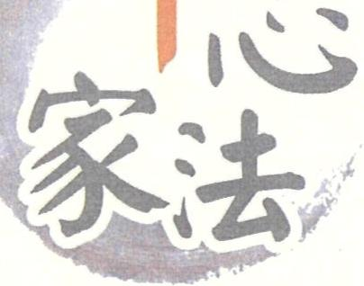

把反省自己  
当成每日的功课，  
因为你不是完美的，  
会说错话  
也会做错事。

\~海涛法师

龙头券商股票开户：股票佣金万一免5（最低0.1元），支持同花顺登录。龙头期货公司开户：手续费为交易所+1分钱。开户加微信：W1K2ABC，QQ：1379979088，免费领投资课程关注微信公众号：蓝桥幻想

## 悟道·成长

## 心法：

做正确的操作，盈亏交给市场！只有保证操作上的“正确”，才有后面的盈亏的胜率，如果没有前面的“正确”，后面的盈亏就是“赌”。

做正确的操作，盈亏交给市场！

这是我们短线交易的原则之 只有保证“正确”，才有后面的盈亏，如果没有前面的 后面的盈亏就是“赌”。

十赌九输，一点不为过，所以我们说稳定的心态是短线操作的前提。为什么不说中线的前提，因为，既然是中线，你还可以有犯错的机会。 家土

而短线的犯错，很可能就是致命的，导致自己的十分被动。当然，“正确”并不是一定盈利，而是逻辑上支持，技术上看好，仓位分配上合理，风控上有自己的原则。

总而言之，要做到“正确”，其实也需要我们的交易体系的支撑，因为他其实细化到我们的方方面面。

龙头券商股票开户：股票佣金万一免5（最低0.1元），支持同花顺登录。龙头期货公司开户：手续费为交易所+1分钱。开户加微信：W1K2ABC，QQ：1379979088，免费领投资课程关注微信公众号：蓝桥幻想

## 悟道·成长

进场遇到有人说，很懊恼自己的操作，“买入了就后悔了”“前面一个亏损了，这只想博回来”，在头脑不冷静的时候操作，往往是越陷越深，非但无法解决问题，而使问题更加严重。

一边是不服输的疯狂交易，一边是悲观的情绪蔓延而这种悲观的情绪会把你进一步带向深渊，这时候，要做的是先停下来！反思！

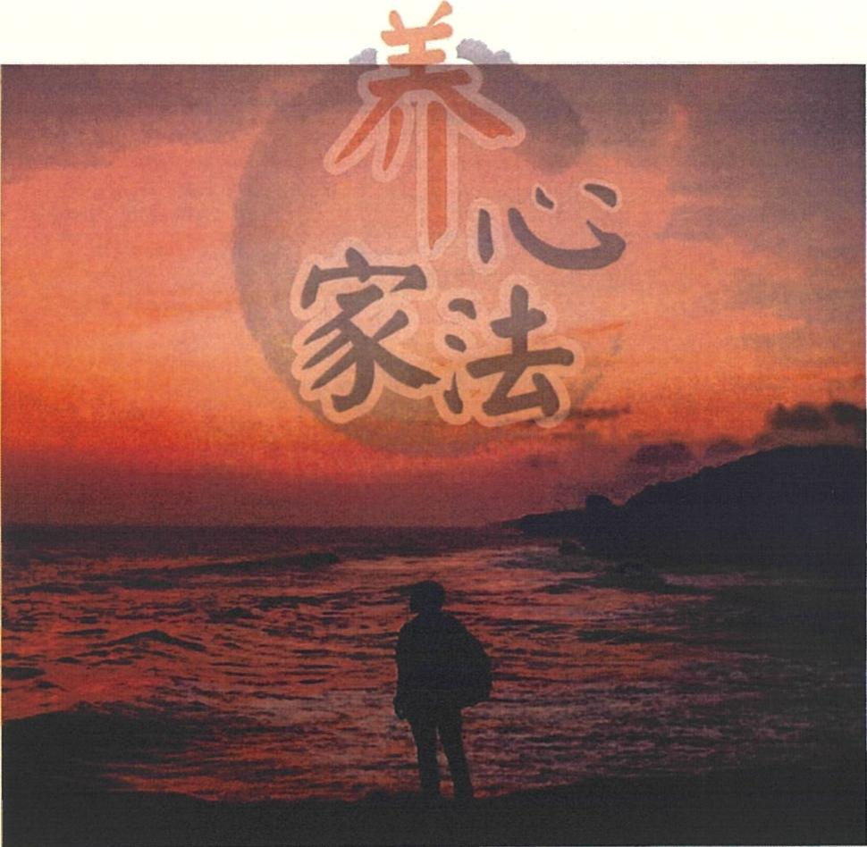  
日出之美便在于它脱胎于最深的黑暗

心法：

情绪是我们操作的基础，也好比汽车的发动机，发动机出了问题，我想大家都知道该怎么办吧，自然是先停车检查，一切正常再上路。

我们的每一次操作都应当是慎之又慎，因为每一次都是现场直播，没有给你改过的机会。节奏这事就是这样，一步踩对，步步踩对，一步踩错，后面容易连环出错。

所以学习技术分析也好，牛股龙头战法也罢，更为重要的是，交易之前调整好自己的心态，交易之前问一问自己，是否符合交易的标准。

市场很残酷，总是一班冷静的收割一班发热的，一班踩对节奏的，收割踩错的。市场也很公平，给了每个人相同的交易机会。所以，有人说，养家就是在你头脑要发热的时候给你泼一盆冷水，在你灰心失望的时候给你一份信心，能做到这样，这也是我的“初心”

  
做“正确”的操作不易，但我们至少要在通往“正确”的路上！

龙头券商股票开户：股票佣金万一免5（最低0.1元），支持同花顺登录。龙头期货公司开户：手续费为交易所+1分钱。开户加微信：W1K2ABC，QQ：1379979088，免费领投资课程关注微信公众号：蓝桥幻想

## 悟道·成长

## 心法：

如果问种树的最好的时机，那是20年前，如果错过了，还有个机会就是现在。有些事情只要开始，什么时候都不晚，努力也是一样！

很多人有这样的感慨，后悔自己领悟的晚了，或者学习的晚了，或者遇到良师晚了，其实，这都不算啥，只要开始，只要进步了就不会晚。

一位42岁蹬三轮车卖冰棒的总裁：

有位国内知名企业家，集团总裁，在初中毕业之后，就没有再读书。他卖过番薯，烫过炒米，修过汽车，四处打工。42岁的时候，还是个沉默的中年男子。

同年，他带领两名退休老师靠着14万元借款，靠代销人家的汽水、棒冰及文具纸张起家，开始了创业历程。戴着草帽、蹬着

谁能想到若干年后，他的企业成为中国最大的饮料企业，他就是娃哈哈的创始人宗庆后。

虽然之前就已熟悉他的故事，但还是很有感触，可能是有类似的经历吧，当年也曾是茫然的一个中年男子，估计不亚于粉丝中的大多数。

生活总会有各种的无奈，股民更是有更深的痛处，特别是熊市的大背景下，亏损是常态，经济上的损失，精神上的压力，残酷的现实，有时让人不知所措，甚至病急乱投医，各种学说、理论、都想用上。内心的急躁往往都是更加坏事！

越是想盈利，越难盈利，越是想翻本，越容易出错。因为，古语说：财不入急门！

每个人都在试图寻找适合自己的方式、方法，其实，早晚都没关系，只要遇上真正适合自己的，对自己有用的就好。

无论你已经在这是市场里生存了多久，有过辉煌的经历、或是惨痛的代价，只要你还想在市场中继续生存，那么从现在做起，不再急功好利，不再三天打鱼两天晒网，坚持做好该做的事情。活在当下，从现在做起，从你能改变的事情做起！

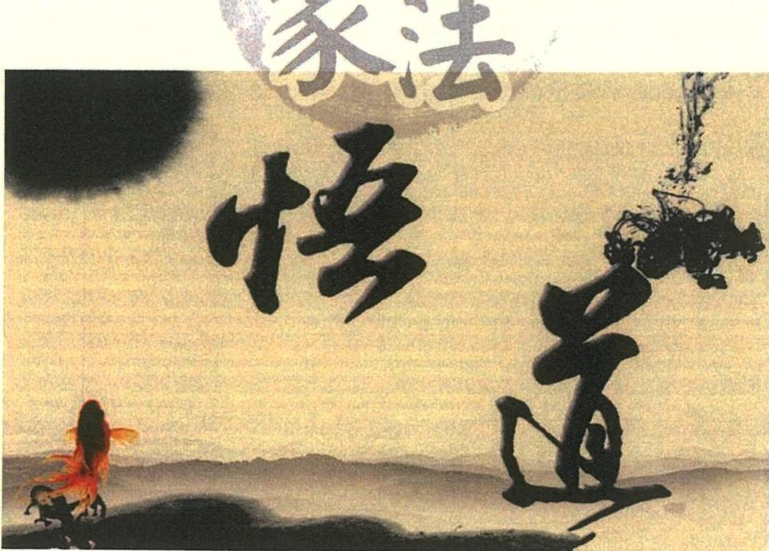  
持之以恒，天道终会酬勤！炒股如是，人生如是！

龙头券商股票开户：股票佣金万一免5（最低0.1元），支持同花顺登录。龙头期货公司开户：手续费为交易所+1分钱。开户加微信：W1K2ABC，QQ：1379979088，免费领投资课程关注微信公众号：蓝桥幻想

## 悟道·成长

心法：

追涨也好，低吸也好，问题不在模式，而在何种阶段应用，以及火候！

以前就说过这句话，但大家问的时候，大多也是一笔带过，那是因为没有给到合适的时机来解释这个问题，近期的盘面能比较好的解释。

追涨，意味着承担更大的风险， 因为，如果追涨不成很容易被诱多，买入当天就是亏损。但是更多的强势股，如果没有追涨又没有进场的机会。

追涨的极端模式是打板，又称打板确认，《养家心法》一般不建议一般人去参与打板，因为 “看起来爽， 做起来难”，没有特殊训练基本就是给主力接盘。那今天为什么还要说这个，因为这里情绪的判断对于短线操作都有巨大的作用。

追涨也好、低吸也罢，首先要了解市场所处的周期。

所谓的周期，指的是短线的周期，或者是市场上高度板的周期，一般来说，市场上的短线情绪都经历一个起势-发酵-疯狂-衰退的周期。

所谓物极必反，从大家绝望的情绪中开启一个新的周期历程。

## 悟道·成长

当然，这里还有一个判断标准，就是高位股崩了之后，对其他股的带动，如果市场很明显，说明整个市场情绪就往下了。这个时候，再去做追涨，难度就会比较大。

另外，我还有一个观察指标，就是柏拉爱空指标，他是以前一天涨幅前20名的个股第二天的表现为基准，类似这样的统计指标就是市场情绪的一部分。我还在其中加入领跌品种，包括各个周期阶段的领涨领跌板块，用来观察整个市场情绪。

柏拉爱空的指标，反应的是这个市场上最激进的那些人的盈亏状况，一般来说，追涨能赚钱，他们会倾向于再次重复追涨的动作，但如果多次重复赚钱之后，便会影响到周围人群，以至于提高整个群体的风偏，逐步将短线情绪推向高潮。如果追涨的人开始亏钱，那么他们就会变得谨慎，减少或者不去追涨，这时就是情绪的退潮期了。

市场情绪并非一个指标就能概括，借助指标的同时，更多的需要自己的经验判断，而有了情绪判断之后，反过来指导自己的仓位和操作，这对短线选手而言有十分重要的意义。

## 悟道·成长

一只个股、一个板块、也是一样，当情绪上升的时候，适当的追涨也能实现盈利，退潮的时候，追涨风险就加大了很多。

在市场处于弱势的时候，板块弱势的时候，那么我们宁愿去做些低吸，逻辑是连续下跌释放的恐慌盘，使得在低位的时候筹码较轻，容易被情绪所带动大幅拉高。

在情绪的上升期可以相对激进，在退潮期则是更多的管住自己的手，“见风使舵”是短线选手必须学会的生存之道。

火候的把握，并不能说的很精确，因为本不是一个严格的科学的问题，但是希望大家知道的是，操作中至少有情绪判断这一环。

如果你不能做到情绪判断的自如，那么不要轻易参与打板，任何打板的技术，离开情绪都是假大空，耐心、踏实的做好我们的功课，坚定自己的选股体系，严格做好回撤控制，走自己的路，不用去羡慕别人的操作，很多时候，慢一点就是快一点。

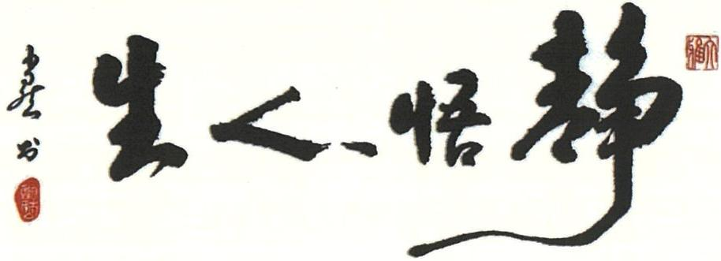

## 悟道·成长

## 心法：

短线选手而言，错过的机会会有很多，这里谈不上抵制诱惑的问题，重要的是得有我们自己的定力和预案。快速的反应，更是考验你的素养的时候。

我们关心的只是场内的情绪，有几个明显的异动和方向，是需要关注的，这比哪个涨停，猜哪里会回落更为重要！

行情不会完全如人意，比如我们的判断，我们的持仓个股，每一个操作的背后都会有机会

所谓机会成本就是你做出这项选择时，所放弃的其他选择的机会，如果这还不懂，好比，你娶了 个老婆，自然是放弃了选择其他人的机会，而你不知道你选的这个是否是最好的。有人非要说，这也可以换，那是另外的问题，不在这里叙说。

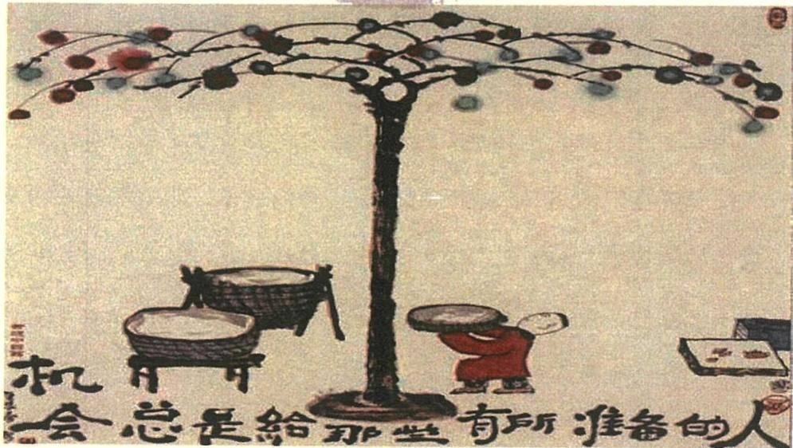

## 悟道·成长

## 柏拉图式的爱情和婚姻

古希腊哲学家苏格拉底，有个学生叫柏拉图，有一天，柏拉图问苏格拉底，什么是爱情？

苏格拉底没有直接回答，却带柏拉图来到一片麦田，让他在麦田行进过程中，选择一支最大的麦穗，不能走回头路，且只能摘一支。

柏拉图于是按照老师说的去做了。结果他两手空空的走出了田地。老师问他为什么摘不到？

他说：因为只能摘一次，又不能走回头路，期间即使见到最大最金黄的，因为不知前面是否有更好的，所以没有摘；走到前面时，又发决总不及之前见到的好， 原来最大最金黄的麦穗早已错过了；于是我什么也没摘。

后又有一天，柏拉图问苏格拉底什么是婚姻，他的老师就叫他先到树林里，砍下一棵全树林最大最茂盛、最适合放在家作圣诞树的树。其间同样只能砍一次，以及同样只可以向前走，不能回头。

柏拉图于是照着老师的说话做。今次，他带了一棵普普通通，不是很茂盛，亦不算太差的树回来。老师问他，怎么带这棵普普通通的树回来，他说：“有了上一次经验，当我走到大半路程还两手空空时，看到这棵树也不太差，便砍下来，免得错过了后，最后又什么也带不出来。

## 悟道·成长

其实，我们的市场也是柏拉图的麦田，不同的是，我们的麦田里有真的麦穗也有假的麦穗，有大的有小的，我们任何时候都无法不知道自己选择的麦穗真假以及大小如何，唯一能做的，练就一副火眼金睛，这就是平时说的我们的素养。

我们还有个不同，苏格拉底规定了只有一次机会，我们有多次机会，但是每次的选择都要付出代价，或大或小。所以，选择该是慎之又慎，选自己熟悉的品种，因为麦田里麦穗太多了。

我们的目标：第一是找到一颗真实的麦穗（盈利），第二才，自然是越专业越好，而不是拿着手里的，看着田里的，三心二意多半不会太好。

市场内的短线机会很多，而我们要做的只是一小部分。错过不是什么大事，因为更好的机会在等着你。

弱水三千只取一瓢，能赚1块只赚7毛。

龙头券商股票开户：股票佣金万一免5（最低0.1元），支持同花顺登录。龙头期货公司开户：手续费为交易所+1分钱。开户加微信：W1K2ABC，QQ：1379979088，免费领投资课程关注微信公众号：蓝桥幻想

## 悟道·成长

记住一个规则：场外的深思熟虑胜过场内的临时起意，自己的计划胜过大脑的情绪。

所以在躁动的行情中，保持自己的定力，也是短线选手情绪控制的第一步。

错过不是什么事，卖飞也从来不是问题，盈利才是我们的目标！

龙头券商股票开户：股票佣金万一免5（最低0.1元），支持同花顺登录。龙头期货公司开户：手续费为交易所+1分钱。开户加微信：W1K2ABC，QQ：1379979088，免费领投资课程关注微信公众号：蓝桥幻想

## 悟道·成长

## 心法：

正如优秀是一种习惯，好的操作节奏也应当是一种习惯，而不是凭借自己的情绪和喜好，好的节奏，能够带来更好的节奏感，反过来也促进我们的胜率提升。

节奏的问题，做交易的人都无法逃避，不少人应该有这样的感觉，有一段时间，自己的节奏会特别顺，无论是仓位配置还是选股，胜率都蛮高，这是盈利的机会。

想必每个人都有那么一段，节奏感特别差，往往是买了个股往 下跌，卖了个股立马就涨，甚至还涨停，继续买，继续都是这样 的结果，每逢出手结果总是不

如果你有这样的经历，应该认真静下来，好好反思自己的心态和情绪了。

节奏的问题，首先是心态的问题，所谓一步错，步步错，人在头脑发热的时候总是容易犯错。当我们买的个股下跌，我们内心急躁，当卖了上涨，内心无比郁闷，于是一个想法产生了：调仓换股，扳回亏损！

## 悟道·成长

当你急于想捞回你的亏损的时候，你的大脑往往是不理智的，但你还深信不疑那是个机会。此时，你要清楚的知道，其实前面这个坑，也是你坚定认为那是机会造成的。如果能想到这一层，我想你会冷静些。

更有甚者，自己的股票被套牢了，本没打算割肉或者换股，但是，但看到盘中熟悉的个股普遍被拉起，情绪就上来了，为了追另一只票而去割现有的票，这种事情就是最不理智的时候，往往容易内外打脸。

财不入急门，为什么我们强调体系的重要性，以为体系能帮我们的选择把关，能尽可能让我们的决策在冷静的情况下执行。当你足够冷静时，下一次的节奏往往不会差，而那些整天全仓，频繁割肉换股的人，结果都不太好。

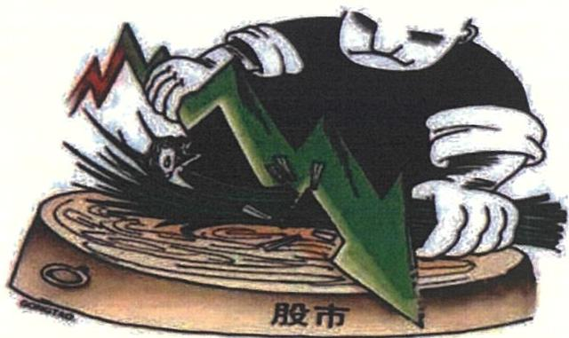

所以，我的团队里有一条纪律：当某个操作导致了损失之后，禁止在当天做任何的操作，不管大盘如何的上涨。

有人说，如果大盘上涨那不是亏了？就是我们太认为这是个机会，所以导致我们之前的亏损。赌场不会关门，机会有很多，想抓住每一个机会的人，往往会被机会所羁绊。而那些弱水三千只取一瓢的人往往是节奏踩得最好的人。

因为在场外的时候，看的足够透彻，心态平稳，自然胜率提升。看到盘中拉直线就要冲进去的人，不适合炒股，管不住自己手的人，不适合炒股，没有自己体系的人，要尽快建立自己的体系，用体系帮我们自己的操作把关，让我们的决策运行在平稳的情绪之下。

我不喜欢动不动把亏损归咎于市场的人，因为不从自己身上找原因的人，认识不到自己的弱点，也就没有改进的空间。这类人也是心态极差的人。

有时候市场就是一面镜子，你以什么样的心态面对这个市场，市场就会以什么方式回馈给你。

要把握自己的节奏，先从自己的情绪管控和知行合一做起，从找到自身原因做起，如果这些都能改善，你的节奏不会差！

龙头券商股票开户：股票佣金万一免5（最低0.1元），支持同花顺登录。龙头期货公司开户：手续费为交易所+1分钱。开户加微信：W1K2ABC，QQ：1379979088，免费领投资课程关注微信公众号：蓝桥幻想

## 悟道·成长

## 心法：

关于热点持续性的判断，或者热点的强度的判断，一般依赖于前排个股的竞价情绪，因为竞价直接体现资金的方向，而竞价的方向判断大致是有迹可循的。

关于对市场情绪的把握，长线的情绪很难判断，因为影响因素很多，短线情绪，我认为是有迹可循的。

判断一个热点、一个板块的强度，首先看前排个股的表现，为了获取第一时间的信息，竞合竞价也是很好的选择。

一般板块的情绪，在前排个股的集合竞价上就可以体现出来家土

我通常说要判断一个个股的情绪，板块的情绪，这就是其中方法之一，同样的，在掌握竞价情绪的基础上，站在更高的层次，看到主流板块，主流热点的情绪，就能大致判断板块的运行环境。

我们很多时候，做这样的情绪判断并不是为了去追涨每个弱转强的个股，而是用以观察市场的资金情绪，判断某个方向的风险和收益，决定是否参与到板块的操作中。

如果对主流板块、主流个股都有了自己的情绪判断，那么大盘的预测也就不那么重要了，因为主流板块反应和引导大盘的方向。即使，我们之前对大盘有预测，也为应变做了更为充足的准备。

当然，股票市场并不是一门科学，没有唯一的标准答案，也没有放之四海而皆准的判断方法，所以，这里的情绪判断同样只是一个概率的问题，而我们要做的，并不是去追问在某只个股上为什么不灵，而是根据情绪的判断将筹码放在更为明朗的时段和主流板块上。

放弃一些不确定性的和看不懂的，选择赢面较大的机会操作，踏空不算什么，卖飞也不算什么，我们只追求弱水三千中，属于我们的那一瓢。

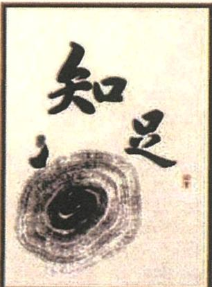

龙头券商股票开户：股票佣金万一免5（最低0.1元），支持同花顺登录。龙头期货公司开户：手续费为交易所+1分钱。开户加微信：W1K2ABC，QQ：1379979088，免费领投资课程关注微信公众号：蓝桥幻想

## 悟道·成长

## 心法：

交易体系其实有个前提条件：知行合一。这个前提条件都没有，那么你的体系也不过是摆设，就像无本之木，无源之水！

看不懂的、看不明白的，不看好的行情，我们就直接放弃，短线选手从来不缺乏机会，而是缺乏等待。

## 知行不合一怎么办？

这是个老问题，大问题，很多人的问题。

知一套，行另一套，根本原因：心存侥幸，情绪超越了理性！市场很残酷，总是一班理性的收割一班情绪的，也很公平，任何人都可以选择理性一些，但很多人不这么干，因为你觉得不这么干“将会失去大机会”

作为主力或者庄家，拉抬股价太简单了 资金足够都能上去，问题是上去之后谁给你接盘的问题，这时就需要大量的情绪化的散户，用直线或者利好加直线，或者“围魏救赵”拉个很小的盘子，来带动你的情绪。

理性的操作，应当是有计划的，有仓位分配的，有应对预案的。而不是全仓的、梭哈的、追涨的、买了又后悔的。

知行不合一，有人说是性格的问题，我倒不这么看，更多的是，你自身的心态、素养、以及平日的“选择性记忆”

如果我们会对一次错误的操作盈利而沾沾自喜；会对一次错误操作产生的亏损懊恼，觉得今天一定要翻本；或者觉得今天就是要让资产大幅增长；这样的心态，知行不合一就不足为奇了。

性格左右命运、气度影响格局、态度决定成败。气度表现为对市场的气度，对他人的气度，对不同观点的接受度，这些都没问题，格局就出来了。我们的态度，我们的心态，决定我们头脑发热的程度，决定我们理性和情绪哪一个占据上峰。

一个流行的词叫“膨胀” ，另一个词叫“火了”，如果这两个占据上峰，知行合一大多是个空话，所以说：稳定的心态是短线操作的根本。

同样是这句话，有人觉得是废话，有人觉得是经典，有人觉得文章里啥都没写，有人却觉得写了很多干货，这就是格局与心态的不同，结果自然也是不一样的。

知行合一，从不断强化自身的心态开始，从不断累积心法开始，从每天坚持学习、坚持总结开始，从自身找问题，从自身改进开始，这是良好心态的第一步。

「努力就是旺季不努力就是淡季」

龙头券商股票开户：股票佣金万一免5（最低0.1元），支持同花顺登录。龙头期货公司开户：手续费为交易所+1分钱。开户加微信：W1K2ABC，QQ：1379979088，免费领投资课程关注微信公众号：蓝桥幻想

## 悟道·成长

## 心法：

看好买入，不看好卖出，绝非一句空话，而是一个短线交易者该有的操作体系。卖出没有对错之分，不要因为一只个股的卖错而怀疑自己的体系。

前提：短线操作者，如果你不是短线操作，那么这句话对你没有什么意义。

其次，这里的看好买入，指的是介入的时机，或者是加仓的时机，只要我们抛开自己的持仓 抛开锚定效应，觉得还有买入价值，那么可以考虑买入，或者考虑持有，反之不买。

我从不会为买入而买入，因为被套而加仓买入，我的所有的买入只有一个逻辑：看好短线趋势。

不看好卖出：是指如果你已持有一只个股，当初的判断与后来的走势发生了背离，使得后期的走势不再看好，那么，不再有继续持有的理由，也不会有侥幸说是否拉回来，甚至侥幸是否会出个利好。

因为短线操作的被动，往往就是我们的锚定心理、我们的侥幸心理、不愿意及时的卖出而导致的。就是传说中的短线做成长期股东。

## 悟道·成长

我认为短线交易的买卖就应该是简单的：看好则买入，不看好则卖出，越简单越好。所以我的体系里面，不存在止损的问题。

短线交易者该回避的就是“被动”，因为被套而导致的动不了，因为等待而失去的机会，我追求的是任何时候可以抓住时机，或者可以放弃买入的“舒服”感觉。

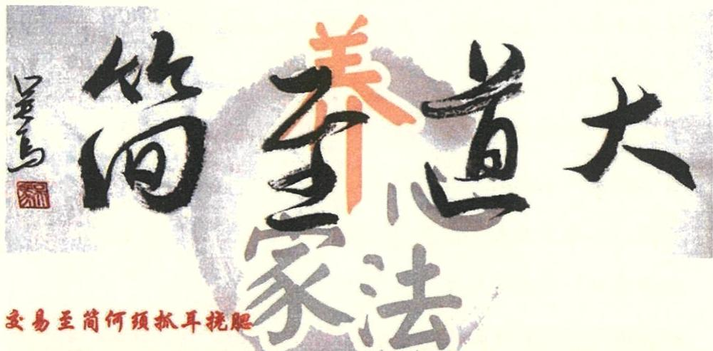

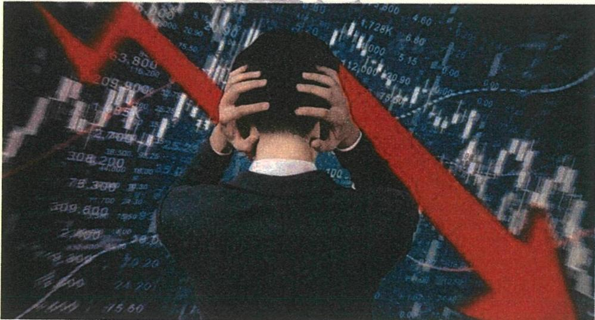

龙头券商股票开户：股票佣金万一免5（最低0.1元），支持同花顺登录。龙头期货公司开户：手续费为交易所+1分钱。开户加微信：W1K2ABC，QQ：1379979088，免费领投资课程关注微信公众号：蓝桥幻想

## 悟道·成长

## 心法：

弱水三千只取一瓢，市场是考验人性的地方，有人什么都想要，任何波段都不想放过，任何消息刺激，任何的板块异动都要上，最终大致是不理想的。

## 有舍才有得

弱水三千只取一瓢！

记得这是我们经常放在文章里的一句话，粗略的看起来是提示大家不要太贪，做好风控，更深层次的是提醒各位保持一个良好的心态来操作。

## 因为：良好的心态是短线操作的前提！

有人盯着资讯上的所有的板块，自选股里一大堆，买的股票五花八门，但是收益却不怎么样，甚至亏损。资本市场并不是多劳多得的地方，这里是比谁更加专业的地方。

精力不足，还要面面俱到，结果自然是不如人意，就像带兵打仗，兵力已经不足，还要多处开花，最终腹背受敌，导致被动。

毛主席的游击战的精髓就是：集中优势兵力，重点突击，敌进我退，敌退我进。这才是弱势一方的该有策略。我们的市场也是一样，4500多家公司，谁都不可能面面俱到，越是想得到，越得不到。

舍得舍得，有舍才有得。

我们空仓，或者小仓位试错的意义，在于能够更加客观的感知市场，有人一直不理解手中无持仓的意义，其实就是即使有持仓，但是要跳出市场，更客观的来看待这个市场。

短线交易者不缺乏机会，缺乏的是精准出击的能力，把握机会的能力。

尝试放弃一段时间的操作，放弃某些盘中认为是机会的操作，放空自己的心态，看行情自然更加透彻。

就像，出去旅游一段时间，对大盘的看法自然是最透彻的，因为空仓了。 王

市场并不是多劳多得，勤奋也要花在刀刃上，提升自己的心态、素养，集中自己的注意力，才能提升“打赢”能力。

  
洗尽铅华返璞归真

龙头券商股票开户：股票佣金万一免5（最低0.1元），支持同花顺登录。龙头期货公司开户：手续费为交易所+1分钱。开户加微信：W1K2ABC，QQ：1379979088，免费领投资课程关注微信公众号：蓝桥幻想

## 悟道·成长

## 心法：

我们应该更加客观的、全局的角度来判断机会与风险，而不是因为你已经有持仓，或者是你之前买过和操作。这样容易受制于心中的那份执念，而使得操作出现偏差。

## 不和股票谈恋爱

人是情感动物，日久生情，人之常情。但是这个市场更多的是需要理性和全局，而不是感性，更不是“我不甘心”

这个逻辑其实从我的“看好买入，不看好卖出”延伸而来，也是和“心中无顶底，手中无持仓，持仓无成本”相对应，告诫的是，我们时刻当保持思考的独立性，而不是受账户的拖累。

如果你是把自己定义成短线，那么不应该存在深套一说，因为当行情不对劲，你的持仓应该不存在了。

如果你定义成中线，那么你的仓位不可能是重仓甚至满仓，因为，除非一种可能，未来只会上涨，不会下跌，而这种判断是荒谬的。

所以，以前所说的买卖的逻辑和操作相对应就是指的这些。

我们要时刻跳出自己的持仓，时时审视自己持股的逻辑是否一直存在，而不是，这股我已经买了，套了就等解套，逻辑和操作的不一致，很容易造成自己操作上的被动。

所以，我说建议大家有一套自己的体系，也是基于这个原因，理顺逻辑与操作的关系，真正做到“只做对的操作，胜率交给市场”

我们所需要的不是和股票谈恋爱，短线更多的是短期的操作，一旦有了感情，有了“不甘心” 你的判断、你的逻辑自然而然就偏差了。这样子即使盈利，那也不是你自身的能力，而是市场给的。

如果能理解这些，也就能理解“永不止盈、永不止损，看好买入、不看好卖出”。这是使自己时刻保持舒服状态的方法。对于，短线投资者来说，没有什么比舒服和主动更加重要了。

交流是一种提高方式，分享是一种美德，互动提高是我们的共同目标！

  
决战股海，知行合一，满腔热血，坚定前行！

龙头券商股票开户：股票佣金万一免5（最低0.1元），支持同花顺登录。龙头期货公司开户：手续费为交易所+1分钱。开户加微信：W1K2ABC，QQ：1379979088，免费领投资课程关注微信公众号：蓝桥幻想

## 悟道·成长

## 心法：

符合主流热点的主线是赚大钱的机会，新的主线来自突发事件的发酵，持续性来自赚钱效应，新主线出现的时候，应当在第一时间进行全面的细致的分析，但主线明确的时候，一个字：干！

曾经参与过的：上海自贸区、免税概念、新能源汽车、工业大麻、创投概念、科创板新上市、疫情概念、碳中和、鸿蒙概念，每一个新概念的产生，都会伴随牛股的爆走，以上对应的概念你都能找到相应的龙头吗？这也是股票素养的一部分！

所以说：你所做过的功课，每天台灯下的夜读，每天雷打不动的坚持，都有一天会体现在你买的股票里，体现在你账户的盈利上。 家土

这其实也是应该成为我们每天坚持的理由，你现在看似没用的夜读，说不定哪天就帮你抓住了一个大机会！

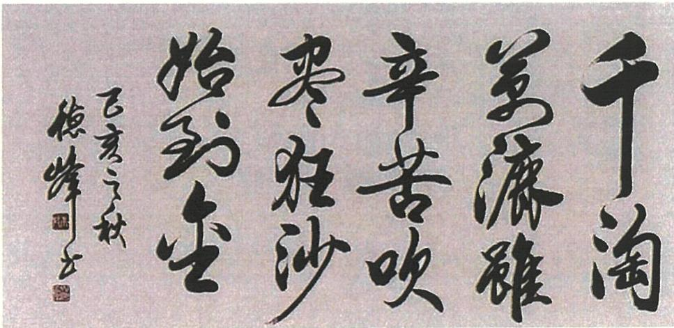

## 悟道·成长

心法是关于理念，判断，计划、策略、选股、风控、卖出、总结等环节的一系列的相对稳定的方法集合。用以对抗人脑的头脑发热，和行情的不确定性带来的冲击，进而实现持续、稳定的盈利。

热点来自题材，持续性来自赚钱效应，当一个热点的发生，恰逢市场情绪的上升，这往往是要重视的，牛股是市场情绪的产物，市场情绪的上升也必然需要龙头板块和牛股来打造。不断重复的说，希望你能悟到这其中的重要性，曾经的我也不知道悟过多少回才最终明白！

有很多人后知后觉，一般等底部至少上来30%才反应过来，这是个不错的机会，这时候盈亏平衡比已经改变了很多。

也有人喜欢刻舟求剑，摆脱不了自己持仓的影响，说直接点就是踏空的一直觉得会调整，即使情绪很高，买了股票的，即使市场情绪变差，也坚信自己的票能够逆势。

其实，我并不追求过多的逆势，我追求的是顺势而为，赚市场趋势的钱，这也是我经常说的：我不做情绪的发动者，我只做跟随者，市场节奏的坚定跟随者。

龙头券商股票开户：股票佣金万一免5（最低0.1元），支持同花顺登录。龙头期货公司开户：手续费为交易所+1分钱。开户加微信：W1K2ABC，QQ：1379979088，免费领投资课程关注微信公众号：蓝桥幻想

## 悟道·成长

## 心法：

市场走势很多时候是“反人性的”，我们要做的尽量以客观的体系来做决策，而不是单靠我们发热的大脑，每当你的大脑越是想冲动的时候，往往是危机降临的时候。

情绪的推演并不难，但是难的是能够在市场情绪中稳住自己的阵脚，难的是顶住最后一毛钱的诱惑。

做操作的人，要学会舍弃一些机会，无论是你觉得看得懂与看不懂，因为并不是你所认为的“看得懂”并非都是对的。每次你的买入，都是你在盘中认为是“大机会”才买入，但是回头细想，这些“大机会”给你带来了多大的收益

这是我们需要反思的地方，这也是我强调交易体系的原因，交易体系里面必须有一块是关于市场情绪的判断，这个作为仓位配置的重要参考。

我们要学会舍弃那些看起来像是大机会的“逆势拉升”，多做点顺势而为的事情。我们只操作在我们交易体系内事情，如果不符合体系，那么，与我们无关。

## 悟道·成长

即使我们真遇上了被诱多，那么严格执行：控制回撤！这是我们最后的一道防线，也是你在这个市场中该有的底线，这是我们实现稳定盈利的保障。

埋头苦干之前，不妨先抬头看路，脚踏实地和努力固然重要，但是方向更重要，炒股如是，工作如是，人生如是！

他山之石，可以攻玉，学人所长，变成自己的体系的一部分，这是一位职业交易者非常重要的环节，对别人的方法加以消化吸收，加上自己的实践，自然会逐步完善自己的交易体系。

交易体系是我们关于方法的集合，是一个相对稳定的系统，之前提到交易体系的最大作用是改善我们交易的随意性，冲动性，管住我们的手，让我们在操作中做对的事。

我总是喜欢在受伤的伤口上撒盐，我不喜欢把亏钱归咎给市场，而不从自身找原因的人。因为只有从自身找到原因，你才会进步，因为你受伤，所以痛，才会让你记得更深刻。

## 悟道·成长

## 如何解套？

我本不擅长这个问题，因为我做的更多的是短线，虽然现在也会有中线的布局。

## 第一，要判断你手上个股的属性

为什么在这波行情中，你的个股没有表现？如果是不符合主流，或者可能不是发酵的主流方向，那解套的机会就会少很多。

当下行情主线：科技股、新能源碳中和、鸿蒙与国产软件、那么接下来行情上涨可能发酵的行情方向：锂电、军工、光伏、智人工智能、华为相关科技，大消费、盈利大增改善股，以及符合社会发展方向的板块

如果在这个框内，那么可以考虑持有为主，因为行情轮动还会继续，随着指数的上涨，势必要求更多的板块参与进来。手痒的可以做些差价，增加盈利，行情走暖是不争的事实。

## 第二，除了关心你的个股，更要关心大盘

有些人，被套后，自选股就是几个持仓股，只关心自己的股涨了多少，而不关心大盘涨的如何，哪些板块在涨，哪些个股在涨。如果这样，牛市和你也没有关系，大盘涨，不代表你的股涨。

不能把眼光局限在自己的持仓上，无论是在场内还是场外，都要对大盘对情绪有个整体的判断，对板块的轮动有个清楚的印象，有利于自己的换股或者是做T。

## 第三，垃圾股分批换股

比如你手上的股，不在上述方向之列，也不属于发展方向，加上业绩下降甚至亏损，股价迟迟不动，那么要考虑换股。

当然，换股标的的选择也要讲究，但是符合以上方向的，大概率不会差。

换股建议分批换股，这样也能减轻一次性换股的压力，带来操作的信心。

## 第四：操作上，以稳为全

很多人被套的个股还能拿的住，但是旦解套就蠢蠢欲动，换股之后由于没有成本障碍，使得操作上会比较激进，追涨杀跌，这是要不得的。

个股的好坏是一方面，操作是另一方面，一夜暴富的心态，几天回本的执念，都会将我们带向更深的深渊，这里必须清楚我们该有的目标。

当行情的趋势向好的时候，一般人最盈利的方式应该是选好目标+坚定持有。前提是你的个股也要趋势向好。

龙头券商股票开户：股票佣金万一免5（最低0.1元），支持同花顺登录。龙头期货公司开户：手续费为交易所+1分钱。开户加微信：W1K2ABC，QQ：1379979088，免费领投资课程关注微信公众号：蓝桥幻想

## 悟道·成长

## 短线交易的几个注意点：

1、有足够的时间，并不一定要求全职，但是至少有充足的时间做功课与交易，因为短线的情绪往往会有比较大变化。

2、对于市场的方向，情绪演进方向有基本的把握，这个是对短线交易者的要求，如果市场情绪不知道在哪里，也谈不上是短线交易，因为单靠技术分析，而不考虑市场情绪，结果往往不如人意。

3、做的是短线，但看的依然是更大的局。短线并不否认中长线，相反用中长线来指导短线操作，有时候看的是中线，做的是短线。比如预计有30%的涨幅，那么我就很可能下重仓去做个短线。

## 短线交易的禁忌：

1、下雨还要出门，市场情绪主要是指市场的赚钱效应，为何一直强调“心中有顶底，手中无持仓，持仓无成本”，是指要以一个旁观者的角度来看待市场的赚钱效应，判断市场情绪。

如遇大盘情绪不良，高位股大量炸板，跌停家数增多，龙头品种强势回调，这时候出手显然是不合适的，我们尽量少追求“逆势”，虽然风格转换在逆势中完成，但是大多数人把握不好这个标准。

2、不按策略加仓，短线交易应该是简单的，“看好买入，不看好卖出”，这是指买卖的逻辑。不按策略的加仓往往导致自己的被动。

3、大幅的回撤，短线水平的高低在胜率，最大的敌人是大幅回撤，所以我把控制回撤放在第一位，而不是盈利。一切可能导致大回撤的动作都要避免，比如满仓持有单票，追求瞬间拉起的快感，而不顾市场的情绪。

整体来说，短线的基本要求的是出手成功率，尽可能减少回撤，哪怕我们放弃一些看不懂的行情，赚属于我们该赚的钱，卖飞从来不会导致自己很大的被动，相反，被套和回撤才是我们自己的操作的大忌。

好的短线操作，情绪高的时候重仓也无妨，如果恰逢情绪退潮龙头券商股票开户：股票佣金万一免5（最低0.1元），支持同花顺登录。龙头期货公司开户：手续费为交易所+1分钱。开户加微信：W1K2ABC，QQ：1379979088，免费领投资课程关注微信公众号：蓝桥幻想

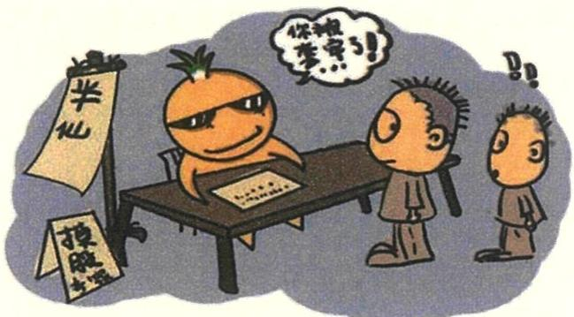

## 悟道·成长

## 打板的几个注意点

本人不建议一般选手去参与打板，写的目的，正是因为看到很多不专业的人，在无脑的排一字，在无计划的打板，加上行情的因素，反而还刺激了他打板的热情，而这种收益是不长远的！

打板是一个很专业的事情，要求对盘面情绪的理解很高，对板块的理解、对分时的把握都有很高的要求。

打板是个高风险的事情，并不是表面上看起来那么容易，把握不几个注意点：

1、只做市场情绪上升期的打板操作，这里有个简单的判断，龙 头稳，短线情绪才会稳，如果龙头崩，短线情绪不会好哪里去。

2、打板的板块提前做好计划，对于可能发酵的板块有个简单的梳理，只做打板体系内的事。

3、打板两个操作，一个是分时拉直线的时候，强度很高，不带回头，加上集合降价弱转强的判断下可以考虑半路杀部分，更多的还是扫板操作，也称之为板上确认，这样能够避免大部分拉高诱多。

悟道·成长

打板的操作的主要出发点，不是今天赚几个点，而是今天要封住！享受明天的高溢价，如果想明白这个，就不会轻易被骗进去了。

4、市场情绪退潮的时候，比如龙头大跌，坚决不打板。虽然有种叫转势板，但能理解的人可能并不多。

以上供各位激进的朋友参考，还是建议各位安稳的做好自己的每一笔操作，不要轻易打板，打板盈利的人， 虽然这时候很多，但长期看，很少。

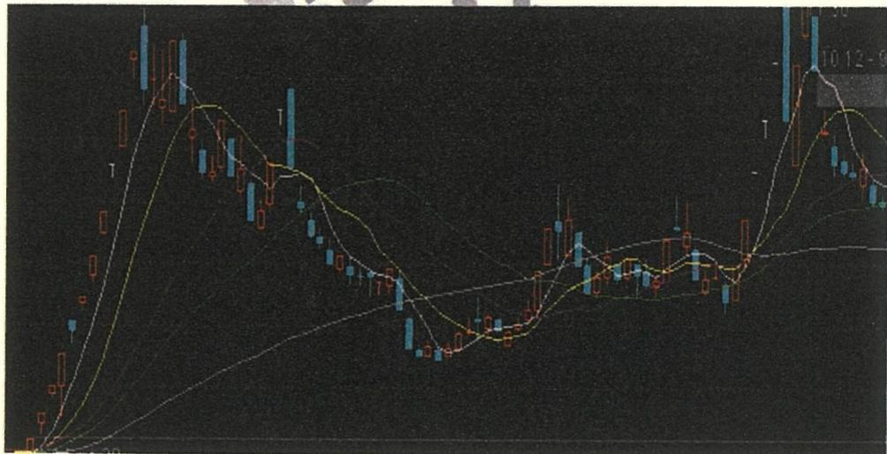  
001896第一波与第二波，第一波是因为国家要大力发展光伏风能第二波是因为碳中和（军中）

龙头券商股票开户：股票佣金万一免5（最低0.1元），支持同花顺登录。龙头期货公司开户：手续费为交易所+1分钱。开户加微信：W1K2ABC，QQ：1379979088，免费领投资课程关注微信公众号：蓝桥幻想

## 悟道·成长

## 何为牛市：

首先，牛市的定义是什么？技术派认为指数反弹超过20%，即进入技术性牛市，抽象派认为一段时间内的长期的，趋势向上的走势是牛市。

## 牛市的几个特征：

1、成交量成倍的上涨，资金跑步进场。

2、券商板块快速的上涨，一般是牛市的开端。

3、各大板块轮番上涨，鸡毛也能飞上天。

4、低价股往往受到资金青睐，因为感觉上更容易翻倍。

5、指数持续的，稳定的上涨，均线多头发散。

牛市从来不是一个名词，更是一个动词，从来不是开始就称之为牛市，多半是事后才发现是牛市，牛市总是在一班人的怀疑中，一班人的呐喊中，悄悄的前行，如果当所有人都认为是牛市的时候，行情估计也差不多到头了。

想多赚一分，就得多一份风险承担，你想安全，就得经受住剩下看似疯狂行情的考验，历来如此。

熊市多长阳，牛市多长阴，我们要做的是循着自己的体系，知进退，知人暖，知行合一。

牛市并不是只涨不跌，在情绪发酵以后，需要用回调来洗掉浮筹，洗掉狂热，洗掉稚嫩，市场才能走的更远，志存高远，要从脚下的每一步做起。

龙头券商股票开户：股票佣金万一免5（最低0.1元），支持同花顺登录。龙头期货公司开户：手续费为交易所+1分钱。开户加微信：W1K2ABC，QQ：1379979088，免费领投资课程关注微信公众号：蓝桥幻想

## 悟道·成长

炒股是场马拉松，不看起跑时的爆发力，而是靠长期的、持续的表现。

我说过，失败乃成功之母，总结是成功之父！

这世上没有捷径，如果说有，也是有人比你总结的早一些。股市是个公平的市场，是合法的财富转移的工具，搞清楚自己的定位，找到适合自己的方法才能在财富转移中占得优势。

市场历来是残酷的，每个人都有自己的方法和体系，是你收割别人还是别人收割你，很大程度上取决于你自身的表现。

即使你没有绝对优势，至少得有相对优势。熊市中，盈利的人是10%，那么你只有能跑赢90%的人才能盈利，牛市中，盈利的人是70%，你只要跑赢30%的人就能盈利

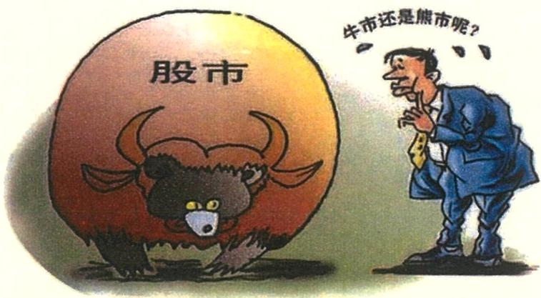

龙头券商股票开户：股票佣金万一免5（最低0.1元），支持同花顺登录。龙头期货公司开户：手续费为交易所+1分钱。开户加微信：W1K2ABC，QQ：1379979088，免费领投资课程关注微信公众号：蓝桥幻想

## 悟道·成长

## 如何防止卖飞大牛？

当一只个股盈利，仓位比较多的时候，可能是出于风控的考虑，或者是出于大盘因素的考虑，需要减仓，那么我会选择留下小部分仓位，以至于我的持仓成本变成负的，即使涨跌也对你的影响不大。

有人说小仓位有什么用呢，当每一份小仓位都能做成负成本的时候，你的收益率自然是了得的。

最后，卖飞并不是什么大事，重要的是使自己的操作随时能保持主动，而不是陷入被动之！控制回撤体系，每个人可以不一样，根据自己的风险偏好来进行调整，这里强调下几个原则，供大家参考

## 1、首要原则：绝不能把盈利的变成亏损的

大盈利不愿意走，看过账户15%的盈利，当回落到10%的时候不甘心，到3%的时候不管，到-2%的时候觉得会直线上去，最终在-10%割肉，这一路其实都是自身的“内心戏”，心理学上称之为“锚定效应”，心中总有侥幸。

## 悟道·成长

股票在进场的时候，可以有一些感性在里面，但是离场的时候，必须是讲究科学的，所谓的科学就是这条铁律。

我们要做的是摆脱这些侥幸和感性，多一份豁达，跳出我们的持仓来思考问题，这就是常说的“心中无顶底，手中无持仓”“看好买入，不看好卖出”而不是考虑你这个票上午赚了50万，现在即将变成0。

有人觉得这是自我安慰，有人觉得是我的境界，都有，有时候自我安慰不见得是什么坏事 心态稳定胜过一切，因为平稳的心态是稳定盈利的前提。

有人总想着自己要靠某只股翻身，想要几天翻倍，越是这样的心理，操作上越容易出同题，高位股盈利了30%不愿意走，非要在负利润的时候才走，其实，根本的还是心态的问题。

所以，这句话不是一句空话，有时候看不准，不确定的时候，不妨豁达的把剩下的利润给市场，留三分济世。

市场很奇怪，你以什么样的心态对待市场，市场就会给你什么样的反馈。

## 2、操作原则：仓位提前计划，知行合一。

盘中受大盘起落的影响，但凡是人，情绪都会波动的，情绪波动的时候，必然影响到我们的操作。有人说，我实在做不到知行合一，做好的计划，一到盘中就完全打乱。

龙头券商股票开户：股票佣金万一免5（最低0.1元），支持同花顺登录。龙头期货公司开户：手续费为交易所+1分钱。开户加微信：W1K2ABC，QQ：1379979088，免费领投资课程关注微信公众号：蓝桥幻想

## 悟道·成长

很多人估计是计划不够细致，看似有计划，其实没计划，仓位配比是多少？出现什么情况下有策略1，什么情况有策略2，如能应对自如，我想不合一的情况就会少些。

3、如大幅盈利的股，到了不确定的位置，那么可以把仓位降到一半，原来浮盈30%，就成了60%的浮盈比例，那比之前要安全很多，即使回撤也不会有大的回撤，空出来的资金也可寻找新的机会。

##

当然，任何的体系有利有弊，有人说这样会错过某些大牛，因为宽幅震荡，可能刚好打到你设定的出场位置，就上去了。

问我怎么办？我说此事古难全，市场本没有确定性的东西，我们做的就是概率。两害相权取其轻，两利相权取其重，我们选的是一条让我们舒服的路子，不让我们被动的路子。

## 对于短线选手而言，缺的永远不是机会！

经常看到关于如何克服贪婪和恐惧的讨论，但是这个观点的出发点仅在自身，难免局限。市场是持币者和持筹者的博弈，如果把格局放大到整个市场，用市场的情绪来指导自己的决策，大局观自然是高了一层。

如果你跑输了大盘甚至出现了亏损，那必须沉下心反思自己的操作了。否则，即使3000-4000点，和你的收益也没有太大的关系，有些毛病现在去纠正，还来得及，这都取决于你自己的意愿。

在行情回暖还出现亏损的，我想只有两个原因：追涨杀跌，满仓进出；或者是没有做好回撤控制。除了这两点想不出别的什么原因。

另外，就是没有做回撤控制，情绪大好的时候，不在意回撤，一旦情绪转弱，不甘心、不平衡、心存侥幸，明明当天的K线形态已经很差，明显的资金出逃，但依然侥幸安慰自己：是否主力在故意洗盘呢？

如果以上这两者做不好，账户收益率肯定是堪忧的，尽管很多时候我们卖飞了，或者看似没有赶上热点，没有拿到涨停板，但只要不是追涨杀跌、记得控制回撤，收益是不会差的。

## 悟道·成长

## 短线和中线

短线和中线的根本不同在于思考格局的不同，这种格局并不是眼界，而是两种不同范式的操作模式，我们此前说的方法大多针对短线，但是短线与中线并不冲突，把握好逻辑就好。

## 一、短线和中线的选择

无论短线还是中线，我的希望是，这都来源于我们自己的选择，而不是被动接受，风格可以相互转化，但不是被动的转化。

有人有这样的感慨，最失败的股民：炒股炒成股东，明明是想们想要的，暂且不管之后你是解套了，还是突然有一天来了个资产重组，那都是侥幸，我们之前的操作已经失败了。

短线交易强调的是：短、平、快，所以要点是抓住仅供的机会，和发起进攻的时机，看过中国女排的朋友应该能领会这句话的意思。短平快的最大挑战来源于，对手比你还快，抓住了更好的时机，一旦从进攻状态转成防守状态，是相当被动的。

所以短线交易者，我们讲究的是速度，买入的逻辑是看好股价的短期上行，这个逻辑还在就有持股的理由，如果不再看好，那么最好的结果也是及时离场，避免带给自己更大的被动！

## 悟道·成长

中线操作看中的是市场的趋势和个股的趋势，特别适合没时间盯盘的人，前提是你对市场的大方向和个股的方向有个基本准确的判断，不在乎短期的波动，只在乎上涨逻辑和趋势。

短线和中线并不对立，有时候可以看的中线做的是短线，有时候也因为做了短线，减仓以后收益极高，变成了中线，无论哪种方式，有一条是要避免的：那就是满仓。满仓意味着没有别的选择。

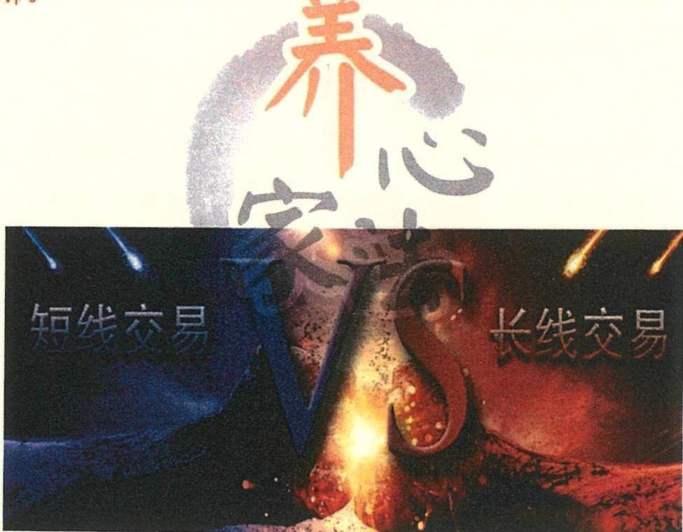

短线也好，中线也罢，操作背后是自身的思考逻辑，适合自己的还是取胜之道！

龙头券商股票开户：股票佣金万一免5（最低0.1元），支持同花顺登录。龙头期货公司开户：手续费为交易所+1分钱。开户加微信：W1K2ABC，QQ：1379979088，免费领投资课程关注微信公众号：蓝桥幻想

## 悟道·成长

## 心法：

很多人花大量的时间在大盘点位的预测上，其实，做短线的人，不要过多依赖预测大盘点数、顶底这些，而应多关注哪些板块、个股在涨，哪些在跌，那些先前涨的或者跌的，后来的表现又如何。

短线的基础是市场情绪，以及操作者的心态，把握了市场的情绪，掌控了自身的操作心态，那么盈利不会成为一个大问题，而只是多少和迟早的问题。

很多人花了大量的时间在大盘的判断和预测上，虽然这对于方向的把握有帮助，对做差价的朋友也会有较大的帮助，但是大盘的趋势，只要知道大概就可以了。

很多人在卖完筹码之后，只干一件事，在寻找各类跌下去的理由，或者看到一些语不惊人的文章而视为知己，心态出了问题，对自己的操作毫无益处。

短线交易者更应看中的是市场的情绪，只要情绪在，主流把握对了，盈利只是概率的问题，相反，有主流而不去做主流，在纠结于自己卖飞的个股，被套的个股，那么行情和你其实没啥关系。

龙头券商股票开户：股票佣金万一免5（最低0.1元），支持同花顺登录。龙头期货公司开户：手续费为交易所+1分钱。开户加微信：W1K2ABC，QQ：1379979088，免费领投资课程关注微信公众号：蓝桥幻想

## 悟道·成长

所以，短线交易者，最重要的是：

1、了解市场短线情绪，最简单的涨停家数，涨停分布，昨天涨停的个股今天的表现，大盘的涨幅等。

2、把自己的个格局放大些，让自己站在更高的高处看待市场。虽然我不反对做自己熟悉的个股，但是过分局限自己的个股容易造成自己的短视，而错过大的机会。

3、清楚的梳理当下的主流、热点，这轮行情的主流和热点，大的主流要反复做，主流中的龙头会有更多的机会，符合主流的个股，即使短期表现不佳，也会有轮动的机会。

4、判断为末，应变为本，预判是为了应变做准备的，应变才是立于不败之地的根本。市场最大的确定性就是不确定，分歧意味着机会，我们要用市场情绪的推演，反过来指导我们的操作，而不是我们的操作被市场情绪带着走。

判断对的人不见得能赚大钱，可能他买的板块不对，个股不对，仓位不对；判断错的人却可以赚大钱，因为他判断了市场的情绪，知道市场的主流，操作都围绕主流在操作。

龙头券商股票开户：股票佣金万一免5（最低0.1元），支持同花顺登录。龙头期货公司开户：手续费为交易所+1分钱。开户加微信：W1K2ABC，QQ：1379979088，免费领投资课程关注微信公众号：蓝桥幻想

## 悟道·成长

短线，则是门槛相对低的模式，因为无论你对这个市场的理解，买入和卖出总是比较简单的。这里有人因为过度交易把自己的资金全都送给了券商，也打乱了自己的心态。也有人做到了8年1万倍。所以，市场上从来不缺少传说，无论选择哪种模式，做精就好。

我平时的风格以短线为主，但也不见得是隔天就走，有时也会拿上十几天，只是那样的机会不多。短线交易分低吸，半路，打板三个模式，这三个模式比较好理解，不再展开！

短线交易者必须把握的一个要点情绪节奏、

即什么时候可以用打板模式，什么时候要尽量规避打板？

市场上的情绪节奏一般都有周期，举个例子，涨停板的高度，会从3板起步，逐步抬升，比如龙头止步9板，如果后面的第二个最多到了8板，意味着情绪的消退，再后来的龙头很可能是7板，6板，3板，甚至某一天极端情况，没有一个连板，那么这时候大概率就是新周期的开始了。

踏准了节奏，就能分辨出风险与机会的比率，进而决定进出的仓位和采用的模式。

## 悟道·成长

情绪上升的周期可以考虑打板，情绪衰退到底部的时候，可以考虑低吸，以及轻仓打板试错，你打的很可能就是新周期的开始，所谓物极必反。

当然，打板是一项专业度要求很高的动作，没有经过专业的训练不建议去参与，打板的风险并不只在于胜率，更重要的是你打板时所处的情绪周期。

我们要实现持续的、稳定的盈利，并不是追求胜率大于50%，而是至少要达到70%以上

赚钱效应（情绪） 节奏、技术、操作，回撤，这几个因素都是短線文易者該考騰的的加他組是收通曲線的手滑向上可

与其泛泛而谈，不如专注一个方向，多点出击，不如主攻一点。对于主流热点，操作策略是反复做，第一波赶上的话就做足。支流热点，操作策略是，在主流不倒的情况下，按照以主流为中心的逻辑逐步挖掘。

## 悟道·成长

## 关于思维体系

所谓思维体系，是指如何看待市场，判断机会与风险，把握市场机会与自我调整的思维方法集合。思维体系直接关乎我们的心态，稳定的心态是短线操作的前提，操作和判断决定我们的盈亏，我们的盈亏，决定我们下一个操作。

## 1、大局观

大局观是一种对盘面的感觉，开始的时候或许不明白，直接的说，就是尽可能让自己站在更高的高度来看待整个市场。比如大盘的上涨的动因，为何这轮上涨会出现在2020年，一来是周期的因素，二来是化解风险的因素，丰来是相关政策的预热因素，四来是长线龙头牛， 或许我们的理解不一定准确，但明白一些，将受益无穷。 土

细化到市场，不是整天追问：我买的这个票套了3年，为什么就是不涨？而应考虑这票现在的角度，上涨的逻辑是什么，这个行业为什么要涨，有什么优势，在行业里处于什么地位？等等，搞清楚这些，其实你自己也清楚这票为什么不涨了。

所以，我们可以忽略一些大盘点位的判断，多关注一些市场的情绪，比如之前是哪些板块在涨？上涨的逻辑是什么？上涨之后他们现在怎么样了？之前下跌的板块是哪些，现在又如何了？

思考的多了，慢慢就对大盘会有概念了，对大盘的大局把握的会更到位。

大局观，这是个懂的自然懂的范畴，如果还不明白，先尝试这么做吧。

## 2、思考领先一步

这个比较简单，但是做到的人不多，思考问题不局限于当下，而是更近一步。因为：这个市场盈利的永远是少数，如果你要想成为那部分少数，就得让自己的思考成为那部分少数，而不是人云亦云。

## 3、学习能力日积月累

思考能力，总结能力、执行能力发应能力、比别人强，比别人到位，这跟日复一日，年复一年的学习分不开的！

努说为拼博到感的

龙头券商股票开户：股票佣金万一免5（最低0.1元），支持同花顺登录。龙头期货公司开户：手续费为交易所+1分钱。开户加微信：W1K2ABC，QQ：1379979088，免费领投资课程关注微信公众号：蓝桥幻想

## 悟道·成长

## 潜伏的要点

潜伏，即在题材没有发酵，或者即将发酵之前，提前介入目标，以获取在发酵过程中的溢价。好的股票，依然需要市场题材的配合，我想这也是潜伏的意义所在。

1、思维领先一步，把着眼点放在“明天”，而不是现在，因为目光短浅容易被主力资金诱惑，而导致追高，把目光放长远，操作上也会平和一些。不少朋友应该深有体会。

2、潜伏的目标也会下跌，有预案就行，在我这里，操作不是赌博，赌徒心态是要不得的。小道的消息虽然是一种博弈，但是我们的操作不是这样，我们有自己的逻辑和章法。

3、最好的潜伏状态 “有确切消息更好，没消息也能涨”。潜伏的个股除了思维领先之外，还有消息面的刺激和预判，这条决定我们对风险收益的衡量，决定我们的仓位配置。

好的股票，也需要市场的配合，如果没有市场的配合也是好股票，这种标的就是我们潜伏的目标。潜伏是一种状态，天时、地利、人和的状态，所以，不为潜伏而潜伏，有机会了把握住就可以。

## 悟道·成长

当你还是小资金，几个点要注意：

## 1、心态上：志存高远，脚踏实地

志存高远，并非好高骛远，更不是追求短期暴富，而是我们的积极乐观的心态。因为只有这样的心态，你才能更好的理解这个市场，把握市场的节奏。我不喜欢怨天尤人，这个市场一定有一个铁律：你以什么样的心态对它，它就以什么样的回报作为回应。

只有志存高远，你才明白你自已要做什么，要去提升什么，要去改进什么。成功的路上并不艰难，但是真正坚持的人不多。很多人原本潜质很好，但是走着走着就掉队了。

脚踏实地，是真正从眼前做起，从小资金做起，不是觉得自己才30 万资金，就不当回事，既然选择股票，就不要把他等同于赌博。

## 2、方向上：学会分仓，控制回撤

短线交易很注重买入的时机，但是我们也无法准确判断一只个股的高低点，所以对于大资金来说，分仓是必须的。但是，即使

龙头券商股票开户：股票佣金万一免5（最低0.1元），支持同花顺登录。龙头期货公司开户：手续费为交易所+1分钱。开户加微信：W1K2ABC，QQ：1379979088，免费领投资课程关注微信公众号：蓝桥幻想

## 悟道·成长

你是小资金，也建议从分仓开始做起，养成这个习惯不会是什么坏事。

满仓操作的朋友，估计不少都有这样的经历，涨起来自然好，跌起来也很可怕，往往是一次下跌吞噬掉之前的所有利润。有人觉得小资金就是靠博，我并不认同，因为盈亏同源。不管你的资金大小，建议都从分仓做起。

分仓，并不是简单的50万买几只票，如果买入的逻辑是情绪奔1溃后的瞬间低点，其实我们都没把握买到低点，这时分仓就是分批建仓。但一个看好一个板块，可以分散介入个股。把握大的，可以多买些，把握小的，少买

分仓的核心：使我们的买人价尽可能的接近底价，买入的个股数量，能够大致体现我们的整体胜率水平，不至于在一只个股上栽倒。

控制回撤，很多人忽视的环节，或者说知道当不会去做的环节，但是你回头去看，你的每次大亏，很可能都是从盈利开始的，所以控制回撤体系确实要放到极端重要的位置。

回撤，不仅影响你的操作心态，更影响你的复利延续。

## 悟道·成长

## 3、操作上：预判买入确认加仓

对于题材的把握，我们都无法做到准确，也无法每次都是先人一步收到信息，手机各种财经资讯，有彻底发酵的，也有不发酵的，所以操作上，我们讲究：预判买入，确认再加仓。

核心：预判买入，不仅是为了先手，更是，买入之后你会持续去关注，确认加仓，指的是跟着市场的情绪走，发酵加仓，不发酵则不加！

## 4、永不止损，永不止盈

很多人不理解这句话，因为这话和平时看到的不太一样，核心是指：当你继续看好这只个股，那就依然有持股的理由，而不用止损止盈去束缚自己 当你不再看好这只个股，那就坚决卖出，我认为操作就应该是简草的：看好买入，不看好卖出。

不能让持仓成为我们的累赘，也不要让卖飞一只个股成为我们冲动交易的理由。如果说某只股票重仓被套，那一定是之前你没有遵守上面的几条。

当我们追求的热点发生变换的时候，调仓换股，不要觉得卖出是一种负担，卖出意味着更多的机会，哪怕有时候我们卖飞也是一样。

## 你的买卖节奏对吗？

龙头券商股票开户：股票佣金万一免5（最低0.1元），支持同花顺登录。龙头期货公司开户：手续费为交易所+1分钱。开户加微信：W1K2ABC，QQ：1379979088，免费领投资课程关注微信公众号：蓝桥幻想

## 悟道·成长

没有绝对的牛股，也很少有真正的垃圾，个股的好坏，很大程度上取决于我们的操作、买卖的节奏。而这个节奏，直接关乎我们每个人的账户收益。

很多人当然的以为，只要某一天赚钱了，就觉得这是正确的盈利方式，殊不知，赚钱也有行情和运气的成分，当你运气不再这么好，或者短线情绪发生变化，结果可能就不一样。

所以，我要求我们团队，越是在操作糟糕的时候，越是行情不好的时候，越要反思，总结，因为这时，我们才能真正发现自己的问题所在。

当市场情绪较差，或者行情走势对我们自己不利的时候，需要做客观的判断和冷静的观察，才不至于导致自己更大的被动。

当市场情绪不及我们的预期，这时候，我们买入个股的成本就要求更低，卖出个股的价格，会比原先更低。并且在这笔交易之前，最好能设计好预案。而不是：低位的时候觉得要继续跌，没敢买，而拉起的时候，觉得要大涨，分时线追高就进去了，于是成交单就定格在分时线的高位。这是主力资金想要的散户操作。

## 悟道·成长

仓位上去了，成本上去了，被套的更多了，自然就变得更加被动，买卖的节奏就完全被打坏了。操作者的情绪也会受到极大的影响，后面的操作也会跟着糟糕。

所以，这是我们所说的节奏，节奏踩对了，操作者是“舒服的”，赚钱是大概率的，相反，自己填空。

## 如何跟上“对的节奏”？

节奏是交易体系的一部分 每个人应该清楚自己的交易体系，比如低吸模式，半路拦截模式，打板模式，每个模式没有对错，但是每个模式都有不同的要领，越专注，犯错的概率越低。

固化自己的模式， 注自己的模式，给自己的模式定下框框，不断的去完善，这样才能对节奏的把握更加自如。我们讲的知行合一，倒不一定是情绪上的自觉，更是一系列框框体系下的选择而已。

节奏，希望每个人都能认真领会。

## 最重要的交易策略！

龙头券商股票开户：股票佣金万一免5（最低0.1元），支持同花顺登录。龙头期货公司开户：手续费为交易所+1分钱。开户加微信：W1K2ABC，QQ：1379979088，免费领投资课程关注微信公众号：蓝桥幻想

## 悟道·成长

这是最重要的交易策略，也是最容易被我们忽视的策略，特别是做短线的朋友，最大的问题不在于选股，也不在体系，而在于“管不住手”。所以，我一直把“等”作为是最重要的交易策略。

其实追涨也好，低吸也罢，半路拦截模式都可以，问题不在模式，而在于何种阶段使用，以及火候。而这些模式的前提：就是你的仓位控制，因为任何模式都会有风险，市场上唯一不变的就是变。

## 王

任何极端的行情下，都会有逆势的品种，但这并不是我们追求的目标，我们追求的是长期的，稳定的盘利。为何强调长期，因为很多人总想着一夜暴富，一把翻本，以至于屡屡受挫。

说这些的目的，并非炫耀，而是希望大家能够顺着思路去领会，去掌握市场情绪的变化，去对比持筹者和持币者的情绪变化，我想认真看过的人，至少会减少一些仓位。

当市场的情绪对我们不利的时候，我们更应该理性的看待风险，而不是一味的对抗，并不是因为昨天套了3个点，就扔那不管了，结果今天就变成13个点，从这个角度，估计也能理解我说的“永不止盈，永不止损”“看好买入，不看好卖出”的意义，因为我的理解，短线操作就应该是简单的。

所以，通过近期股市表现的行情，希望每个人都能去总结自己的近一阶段的得失，有总结才会有进步，决不能是一根阳线忘了所有的伤疤。对你有启发的文章，可以多读几遍，不要拘泥于遍数，领悟的是你自己的。

在任何体系里，都应该有一个最重要的策略：等。我们应该把90%的时间花在等待上，而只把 10%的时间花在操作上。

信念，是支撑我一直走下去，一直走到今天的精神支柱，脚踏实地、百折不挠，砥砺前行王

唐僧师徒，为什么偏偏是能力最小的唐僧是团队领导？佛主选中他，正是由于他的信念，最终取得真经，更多的也会靠着他带给团队的信念。

也有人说这句话有误导之嫌，会让有些人不明风险的人往市场里钻，会带坏一些人。我并不这么认为，我从不引导别人炒股，因为我很清楚炒股的盈亏比例和市场的残酷。

我想看我文章的人，应该都是已经入场的股民，我希望以我的经历，我的感悟能让大家少走一些弯路，给大家一些善意的提醒，分享一些我十几年来的心得。

## 悟道·成长

前段时间行情火爆的日子，有人觉得我的一月5%的目标太小了，根本不值得一提，很可能一天就能完成10%。行情到今天，大家应该明白每月5%的不容易。

居安要思危！顺风顺水的日子过多了，要多想以前困难的日子，城里的生活过惯了，也很有必要到农村体会种粮的艰辛。账户的收益高了，也得守得住才行，所谓一张一弛谓之道。

所以，我会在行情火热的时候，给大家泼冷水，也会在一片惨淡的时候，给大家打气。

每天的追涨杀跌，到底有多少是无用功，甚至是反作用。之前我说我要把90%的时间花在等待，把10%的时间花在交易上，因为股市不是一个按劳分配的地方，而是讲究时机和火候的地方。

只是有人看了，有人没看，有人仔细的看了，有人走马观花的看了，有人一周看一次，有人一天看五遍，过程不同，结果自然不同。

包括对文章的理解，千万不能成为培训课程一样：听的时候，感觉很好，气氛也很活跃，培训一结束，该如何，还是如何，没有任何长进，十几年宝贵经验，血与泪的实战较量，怀着一份感恩之心分享，希望对你的帮助是巨大的！

## 悟道·成长

股市这是个公平的地方，几乎没有门槛，谁都可以参与，但其实更是要求很高的地方，靠运气的多半撑不过多久，靠感觉的也不例外，唯一能长期生存的只有你没看到的，背后的努力。包括理念、方法、素养、体系。

市场很残酷，是个合法的财富转移工具，市场也很公平，因为各凭本事吃饭，本事藏在大家平时的努力和修行中。

既然你来到了这里，当对这里有足够的信念：感恩市场的信念，敬畏市场的信念，做到比90%的人更优秀的信念。我想这是一个优秀的交易者的前提。

如果你连过程都无法保 如何要求你的结果胜过他人？很多时候，逼着你走的，并不是前方梦想的光芒万丈，而是身后的万丈深渊！

每到周末，反思下自己，总结下自己，改进自己；看着熟睡的家人，想必每一个有担当的人，都希望通过自己的努力，让家人过的更好。这就是你最大的动力。

这也是我当年，多少个不眠之夜留给我的最深印象，也是我所说的“身后的万丈深渊”，曾经靠着这个动力，咬牙坚持着我的信念。现在也写给你们。

## 悟道·成长

## 大跌的应对

人，性本恶。恶，人之本性，因人性有恶，才有法度，天下人生而好利，才有财货土地之争夺；生而贪欲，才有盗贼暴力与杀戮；生而有奢望，才有声色犬马。人性之恶，必以律法而后正，以法治防范恶欲，以法治疏导人性，人性才能向善有序。

## 《大秦帝国》之商鞅

但凡做局的人，多半是利用了人性，人性如何？商鞅的论述中，可见一二。

商鞅主张法治，以律法而后正。 而我们做股票，其实也有这样的问题。疏导人内心，即，心法，养成一套属于自己的思维理论体系。防范恶欲，是指用我们的交易体系，防止我们心存侥幸，心存幻想。 クー云

大跌如何应对，其实要点不在应对，而在如何防范，但凡大跌之前一般都有先兆，比如赚钱效应的下降，市场的情绪不佳，高位滞涨。我的文章中，提示最多的还是关于风险和方向。

所以，问题的关键在于，如何在你做买入动作的时候，制定自己的持股逻辑，即因为短线技术买入？还是因为看好行业发展而买入？还是热点题材而买入？

## 悟道·成长

买和卖的逻辑自然是对应的，不同逻辑操作手法也是不一样的。  
都应该准备有不同的预案。

有的人买股靠感觉，看媒体，看到一个买一个，买入之后，完全不知道逻辑，心中设想如果大涨怎么办，涨停怎么办，而不去思考万一下跌怎么办。这样的操作，一旦遇上大跌自然是要吃亏的，也是不知所措的。

相反，好的体系应该是，如果上涨固然更好，如果下跌，则有相应的应对，比如中线持股的，有详尽的加仓逻辑，题材持股的，有根据龙头表现买卖的逻辑。大方向上有仓位控制的逻辑。这样，即使遇上大跌，也不至于恐慌

健忘，是我们经常犯的错，每次大跌和被动，都会有相同的因素在里面，甚至是大部分因素相同，而我们总是轻易觉得这次应该不一样。每次重仓一只高位股，总觉得会不一样，把交易体系，把控制回撤都忘到了脑后。事后看看，这其实是你经常犯的错。每次分时图一根直线拉起的时候进场，然后每次又在另一只分时图直线的时候割肉，然后重复这个过程。

龙头券商股票开户：股票佣金万一免5（最低0.1元），支持同花顺登录。龙头期货公司开户：手续费为交易所+1分钱。开户加微信：W1K2ABC，QQ：1379979088，免费领投资课程关注微信公众号：蓝桥幻想

## 悟道·成长

改变健忘的毛病，客观感受市场的情绪，多从自身原因找差距，你的操作才会越来越好。如果你把握了市场情绪，胜利不是问题，如果你的情绪被市场带着走，那韭菜的经历会再次上演。

说说我的交易体系的一部分：这个习惯

这个习惯，凡是看我文章的人，应该都很清楚，一直在强调：周末或者节假日之前，不是轻仓就是清仓。

有人觉得我太保守了，因为确实也有很多节假日回来上涨的行情，这都是交易体系该有的代价，任何的交易规则，都不能让我们捕捉到每一个胜利，但是如果能让我们规避一些潜在的风险，那就是极好的。

每一个体系，每一个理念都有使用的代价，本质是取舍，取得了安全，势必损失了部分潜在的收益，此事古难全。我们要做的，是我们账户的持续的、稳定的收益，如果大家都是这个目标，如遇上调整，即使有回撤，也不会大。

每一个交易体系的执行，都在于我们自己大脑清醒的时候，内心客观的坚定，任何体系都会受到质疑，但觉得对的，要坚定的去执行，体系的作用就是让我们抛去侥幸和幻想。

所以不必在意，因为用了控制回撤体系，结果止盈了之后，后来又涨停了，不用纠结“弱水三千只取一瓢，能赚一块，只赚七毛”之后，结果他还是涨了一块。交易完成，他和你没关系了，体系不是算命，无法给你精准的买卖点位，能给你的是一套持续稳定的向上曲线，尽管有时，他看起来很慢，长期来看，慢就是快。

看问题要抓住本质，真正吸取对自己有用的，多一份学习的心态，谦卑的姿态，时刻事理通达，自然心态更为平和，看事情自然更加透彻，做事自然更加有的放矢。你以什么心态对待市场，对待学习，他会给你一样的反馈！

## 经历过是为了更好的成长

为什么说希望大家能够经历过一个完整的牛熊，只有这样你才对市场有更深的理解，这个真的不是书本上学的，而是靠心中悟道。经历少的人，总会时不时觉得自己悟道了，经历熊市检验，原来小荷才露尖尖角。

不管你是新股民，还是老股民，如果没有成长，起点还是一样。经历过行情的轮回，经历过心态的崩塌，才能更好地理解市场，才能面不改色，坐怀不乱。

龙头券商股票开户：股票佣金万一免5（最低0.1元），支持同花顺登录。龙头期货公司开户：手续费为交易所+1分钱。开户加微信：W1K2ABC，QQ：1379979088，免费领投资课程关注微信公众号：蓝桥幻想

## 悟道·成长

有些操作上的事情，只有经历过，反思过，才会带来成长与进步，就像管住手这件事，没有经历过下跌的人，不知道管住手是多重要。

我早期的亏损，最多的都是来自频繁交易，为何频繁，因为“吃着碗里的，看着锅里的”，没有稳定的选股体系和买入体系，操作凭感觉，看着到处是机会，最终是败多胜少。

## 着急，多半是陷阱！

比如着急赚大钱，着急翻本，着急操作。因为心态着急，自然带坏我们的自己的判断，股票操作本身需要时刻保持清醒，任何的外界的压力，都可能让操作成为不可承受之重。

所以，这里再次强调，对于一般人不建议配资，不建议加杠杆，不建议负债，任何没有做最坏打算的人，在这个市场里多半是无法生存的。

也许你听闻2015年，凭借高杠杆暴富的很多，但是你没听过的，从从暴富到爆仓的人更多。杠杆本是金融的魅力之一，但是没有稳定盈利能力之前，不建议去赌，十赌九输，一点不为过。

## 悟道·成长

## 财，不入急门

这句话并非我的发明，是我们的老祖宗留给我们的，要时刻让自己保持谦逊、稳定的心态，多一份感恩，少一份抱怨。

每个参与市场交易的人，出发点都是想从市场里赚取金钱，一个想从这里赚钱，又天天抱怨市场的人，多半是不能如愿的。就像你去拜了财神，希望财神保佑，结果在财神面前对他不敬，一个道理。

这个并非玄学，因为你的心态决定你的判断，你的判断决定你的操作，就像追涨杀跌，多半是心态不稳的人。不同的心态，同一篇文章都会有不同的理解，当你心态积极，看到的内容将会大不同。

股市这样，做人也是如此，有心态平和，懂的感恩的人，才能发现更多的美好， 多像到專位的意顯。但行好事，不

## 追涨和抄底的火候

有人经常会问，追涨和抄底，到底该采用哪种模式？模式其实并没有优劣，问题也不在模式，而在对市场火候的把握，以及你自己专注的方向。

## 悟道·成长

那么，火候如何判断？

一般来说，强势市场环境中，比如之前我们2018年19年经历过的2500 到 3200的行情，买个的逻辑是因为赚钱效应下的资金不断进入，越是强势的板块，强势的标的，被后来资金选中的概率大，所以选强势标的，强势标的基本都需要追涨。

弱势阶段，就像我们说了大盘弱势要减仓，轻仓，买股的逻辑是因为市场亏钱效应的扩散导致恐慌盘的不断宣泄，如果一旦恐慌情绪宣泄殆尽，只要少量买盘就可以推动上涨，就像是急跌之后的深V，疯狂的砸盘之下，就会有大量的抄底资金，恐慌之中，一个标杆的崛起可能就能带来一个像样的反弹。

简单的说，行情好的时候多做强势股，市场情绪好，强势股有旦情绪周期向下走的时候，多等待，等待一个低吸的机会，恐慌砸盘的机会，这样的成功率更高。

## 筹码峰与抛压

当年秦公颁布求贤令，引来山东六国士子入秦，在经历3个月的实地踏勘后，很多人退缩了，有人觉得秦国穷，有人觉得秦国积弊很多，也有人不适应秦国的水土，很多人退缩了。但是留下来的人，大多都成了秦国的中流砥柱。

## 悟道·成长

在这个市场中，要么你选择离开，不碰这个市场。如果你要决定留下，就得有坚持的信心和勇气，越是行情艰难之时，越是心理害怕之时，越是要坚持之时，相反，所有人都在往里扎堆进的时候，是要留心离场的时候了。

市场的角度来说，有涨必有跌，涨跌都是常态，但是放到自己的账户上，很多人并不那么淡定了，跌了死扛，套了几个月，有一天终于回本，于是卖出，从而个股开启狂奔之路。其实这也很好的解释了筹码与压力位的关系。

经调整到位的，前期由于亏钱数应，很多资金选择了休息，一旦情绪修复，这些股的号召力随之而来。

反弹初期，由于大家的筹码都是高高在上，筹码峰抛压不存在，所以初期的反弹最具参与价值，拉升途中的抛压很少，这也能解释，为什么反弹初期的成交量都不会大。

一个板块的强度，通常是从集合竞价开始观察，如果没有明确的利好，而又直接涨停，这种板块是要值得注意的，如果集合竞价还不能确认，开盘后迅速出现助攻品种，前排秒板，那么就是对情绪的确认。这也是盯盘的意义。

龙头券商股票开户：股票佣金万一免5（最低0.1元），支持同花顺登录。龙头期货公司开户：手续费为交易所+1分钱。开户加微信：W1K2ABC，QQ：1379979088，免费领投资课程关注微信公众号：蓝桥幻想

## 悟道·成长

学过我们集合竞价战法的人都会去参与，如果是非常典型的弱转强，抢筹，又在低位，又无明显利好，那基本就是资金的抢筹了。9:23以后资金开始疯狂抢筹，到了后期，越来越多的资金参与了进来，斜率也就越来越大了。

而，你要抢筹前提是，昨晚脑子里有概念，这票在你的关注范围里，虽然有软件能够实现集合竞价异常的提醒，但是没有大脑的潜在思考，上还是需要勇气，需要素养的！

## 哪一类人在赚钱

行情不好多休息，行情不明减仓位，虽然每天的研究必不可少，但没有好的机会，更多的是放弃和等待。

经过多年的观察，市场上赚钱的是哪些人？大致是那些花80%的时间做研究，花20%时间来操作的人，所以，股票的科学更多的像是一个寻找买点的科学。

稳定赚钱的是哪些人？冷血、独立思考、冷静、沉得住气，这也是我们团队对成员素养的要求。相反，操作的大忌是什么？情绪话，感情化，焦虑、赌性十足，如果把股票当成赌博多半是亏损的。

## 要想赚钱，先看如何亏钱？

第一条：满仓，不是不可以满仓，但我选择满仓的时候，至少符合结果条件：市场情绪热情高涨，板块是主流板块，个股是其中龙头，我有先手优势，有利润在手，感觉少买100股都亏损的时候。一年不过4-5次。

而盲目的满仓，很容易陷入被动和恐慌，稍有回调拿不住。一次失手，可能导致下次情绪更为崩塌的满仓出手，形成恶性循环。

第二条：追涨杀跌，我说看好买 不看好卖出，有人说我很看好，于是就追高买了，这个有错吗？错在你的操作，错在你的判而你的追涨标的不在这里，很可能是被闷的。

第三条：逆市场情绪而动，市场情绪不佳，还要着急出手，每次觉得自己看上的会逆势，最终都成为逆势的“绿叶” 0

我用柏拉爱空指标跟踪情绪，用强势股跟踪早盘情绪，其实就是为了顺势而为。市场情绪不佳，即使板块机会再好，我更多的会选择轻仓或放弃。

龙头券商股票开户：股票佣金万一免5（最低0.1元），支持同花顺登录。龙头期货公司开户：手续费为交易所+1分钱。开户加微信：W1K2ABC，QQ：1379979088，免费领投资课程关注微信公众号：蓝桥幻想

## 悟道·成长

有人说，你说的我都知道，但是我依然管不住，那是修炼的问题，换个角度，你明明知道这样要给主力送钱，结果你还是这么做了，该怎么办？

1、自己电脑上贴个条，时刻告诉自己，常犯的错误是什么？所谓“三省吾身”

2、组建一个小团队，团队成员之间相互提醒，用外力来让你冷静。

3、保持一颗平常心，培养淡定的心态，降低自己的目标预期，不要因为错过一只个股而懊恼 你的任何成功或失败的经历，都有可能成为你后面操作的绊羁

股票是科学，更讲究是入场，因为入场决定你的出场，股票是艺术，讲究的是你对情绪的把控。

交易体系的作用在于用清醒的分析，代替头脑的发热，用客观的判断，取代市场的诱惑，使得买股有逻辑，持仓有底气，而不是“买了就后悔”。

曾经，我对自己的早期的亏损原因做过总结，高频交易是其中一条，即使是在熊市的2008年，满仓也是家常便饭。这其实是我的交易体系出了问题。市场不是多劳多得，学会择时，学会放弃，才是长久之计。

## 悟道·成长

弱水三千只取一瓢，能赚一块，只赚七毛。

有人说很认可，就是做不到，那就说明你只是觉得这句话挺顺，根本没有理解他的深层次的意义，心态不平和自然不能理解禅的深意。

几乎每天都有学员告诉我，我追了\*\*\*，今天没有管住手，原本已经盈利出场，结果看到拉升，又进去了。

每一次冲动，每一次分时拉起之后的追买，大多都是市场的陷阱，专为你设计。

股票买卖需要讲究定力 定力源自你自己的坚持，你自己认可

操作体系之外的操作，不干，市场从来不缺机会，你真的盘中觉得要干，那也是小仓位，超出体系部分的仓位控制，也应该是你的体系的一部分。

龙头券商股票开户：股票佣金万一免5（最低0.1元），支持同花顺登录。龙头期货公司开户：手续费为交易所+1分钱。开户加微信：W1K2ABC，QQ：1379979088，免费领投资课程关注微信公众号：蓝桥幻想

## 悟道·成长

## 一个量化交易的思路

在我们的市场中，很多人都偏向短线，从心理上说，短线可能能够快速的给出你判断的反馈，是盈利还是亏损？

从客观的角度上来说，市场上最赚钱的这部分人基本也是短线，比如你现在看到的龙虎榜的一些常客，但是亏损做多的人也是短线，为什么会出现这么大的分化？

## ￥

因为短线是真正考验判断与操作的，考验你的心智，情绪管控能力。也是我说的，如果你掌控了市场情绪，胜利将会接踵而来，相反，如果你的情绪被市场掌控， 失败终将挥之不去。

道理很多人都明白意是热不不子知行合一这块，前面已有文章专门阐述，今天我们思考的问题不在这里，而是给大家一个量化交易的思路。

这里并不是建议大家去做量化，因为很多人也不具备这个条件，但是他的一些成功方法，值得我们的短线交易者借鉴。

量化对冲，简单的说就是完全运用算法模型，同时建立多空两条路线，寻找可能的盈利机会，每次盈利都很小，但是换仓也很频繁，但是胜率会比较高，一般都在70%以上。

## 悟道·成长

反观我们的短线交易者，以及我自己之前的经历，我们的亏损往往不是来源买入就下跌，而是来源于盈利之后的膨胀，亏损之后的心态崩塌，说直接点，输给了自己，并不是技术。

量化对冲讲究频繁交易，见好就收，不会纠结我能赚0.5%还是10%，也不会因为错过而懊恼，也不会因为卖飞而纠结，其实我们的短线交易也是一样的，觉得之前，我觉得选股胜率其实没问题，问题最多的出在，盈利之后想着大涨而不愿减仓，亏损之后，心存幻想而不愿割肉，我们的大脑判断偏离了我们原有的能力范围。

所以，为什么说短线交易应该是简单的：看好买入，不看好卖出，这不是一句空话 市场上不缺乏机会也不是一句空话，弱玄虚，好的短线交易，就应该是，简单的，快速的，心中无顶底，手中无持仓，把胜率交给市场。

虽然你的大脑不是一组程序，但是有必要像程序一样思考，该减减，该加加，该割肉也得割肉，提高自己的选股胜率，积小胜为大胜，而不是指望一把翻倍，一夜暴富。我想这些，我们该学习下量化交易的思想体系。

龙头券商股票开户：股票佣金万一免5（最低0.1元），支持同花顺登录。龙头期货公司开户：手续费为交易所+1分钱。开户加微信：W1K2ABC，QQ：1379979088，免费领投资课程关注微信公众号：蓝桥幻想

## 悟道·成长

希望每个人都要有自己的交易体系和风格，而不是随心所欲，因为股市操作并不是太极，并不是无招胜有招，即使有也不会是常态。

何为交易体系，就是关于指导理念，选股，操作，仓位，回撤控制等一系列的集合

如何建立，就是根据以上的几个模块，根据自己的风格去补充，完善，补充完整了，也就成了自己的交易体系。

交易体系的意义在于，他能让我们在各种分时图的诱惑中保持定力，能让我们的判断更为客观和专业，让我们的大脑在操作中依然保持清醒。能让我们更加合理的判断入场的机会，而入场很大程度上决定出场。能让我们控制住自己的回撤，避免出现大的波动。

我以前的交易都是以短线为主，善于做短线的人，应该清楚自己的特点，寻找适合自己的方法，是抄底还是潜伏，还是半路，还是打板？每个方法的操作完全不一样。

## 悟道·成长

比如打板，打的首选是板块龙头，最多不超前三，潜伏，是推演行情的发酵方向，在没有发酵前已经买入等待拉升，抄底对市场情绪的把握非常高，也只针对前期龙头个股。每个方法都有不同的判断方法，而不是，哪个拉起追哪个，那样很容易造成自己的被动。

短线交易的本质是特定条件下，选股的机械化和概率化，即你的收益率取决于你的选股胜率，选股如果是对的，收益一定是要正的，如果不是，肯定是操作出了问题。

做好分析，选好标的，判断情绪，果断出手，买入机会，卖出风险，只做对的交易，胜负交给概率，有计划的操作胜过盘中的临时决定。关于方向和板块的问题，基本每天自己都要去推演！想必每一个认真的人，都会有收获。

建立、固化、完善自己的交易体系，是每一个短线选手都该做的事情，如果要在这里有所收获，这是必经之路。

唯一希望的就是我们的所有朋友，都能越来越进步，越来越成长，永远热泪盈眶，永远积极向上。脚踏实地，放下浮躁，当下的机会会很不错，所以，任何时候静下心学习都不会晚，任何的坚持都会有回报。

龙头券商股票开户：股票佣金万一免5（最低0.1元），支持同花顺登录。龙头期货公司开户：手续费为交易所+1分钱。开户加微信：W1K2ABC，QQ：1379979088，免费领投资课程关注微信公众号：蓝桥幻想

## 悟道·成长

## 理财的几个建议：

1、国债是低风险的产品，是以国家信用为担保的。

2、银行存款如果很多，尽量放在四大行，这也是国家信用背书的。

3、打破刚兑是趋势，所有的理财产品，先问清楚是银行自营还是代销，代销意味着和银行没关系。

4、收益如果想高点，银行、大券商的货币型基金，公募基金也是相对安全的。

5、不要贪图小便宜，追求P2P的几个点的利差，你看的是利差，人家盯着的是你的本金。

6、踏实工作，相信天上不会掉馅饼，如有可能，多学习，提高自己在股市中的盈利能力，资产配置能力。

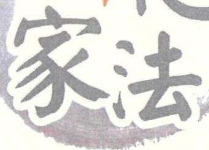

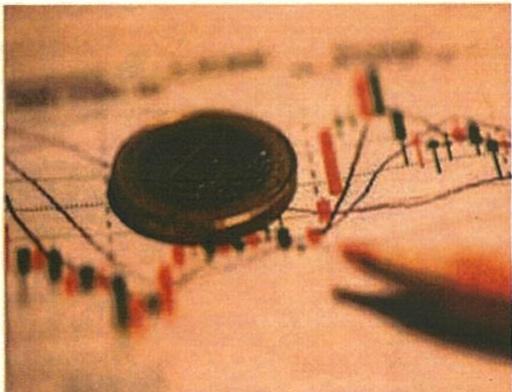

## 上最强的主流！

主流板块，是天时、地利、人和的产物，所以很多时候，来的早不如来的巧。

天时：政策刺激，

地利：大盘需要有板块出来领涨，

人和：人气足够，板块容量足够，又有足够的分辨度，

主流题材通常是涨幅大，跨度长，操作策略是如果能在第一时间赶上，那就做足，不轻易下车 如果第一波没赶上，那就等下一波，因为任何主流题材的上涨 都会有修整。

在市场主流的主升浪中，会有轮番的龙头站出来，所以，单从单个个股，无法把握板块的节奏，更多的需要看板块的整体强度。

## 体系为何失灵？

每当有大的回撤，总有人怀念我们的控制回撤体系，这个体系至少介绍过三遍，但，行情好的时候，很多人不记得他。

就像我们很多人的身体，只有当医生亮黄灯之后，才发现身体才是根本，而你，平时对他毫不在意，或是理论上知道，实际上不知道。

龙头券商股票开户：股票佣金万一免5（最低0.1元），支持同花顺登录。龙头期货公司开户：手续费为交易所+1分钱。开户加微信：W1K2ABC，QQ：1379979088，免费领投资课程关注微信公众号：蓝桥幻想

## 悟道·成长

我的交易体系分为5个部分，理念，模式，选股，仓位，回撤控制。其中中间三个都是进攻，回撤是防守的最后一道防线，而理念则是整个体系的润滑剂，让这五个部分更加顺畅。

任何的体系之所以被选择，是因为能在整体功能上发挥作用，同时，任何体系也有执行成本。所谓的执行成本，是因为看似失去一些机会。

比如回撤控制的其中一大原则“绝不能把盈利的做成亏损”很多人和我说，我刚止盈，他后来就涨停了，我该怎么办？

此事古难全，没有什么方法，能让你抓住所有的利润，又能规避所有的风险。很多人经常懊恼于此类“失去的机会”，同时也就失去了这个体系的保护，所以很多时候，但策略一旦制定，机械的操作可能更加适合。

我们的出发点是尽可能的让我们的操作概率化，让我们的胜率接近我们的选股胜率。而不至于让一个被动的操作导致更糟糕的后果。

龙头券商股票开户：股票佣金万一免5（最低0.1元），支持同花顺登录。龙头期货公司开户：手续费为交易所+1分钱。开户加微信：W1K2ABC，QQ：1379979088，免费领投资课程关注微信公众号：蓝桥幻想

## 悟道·成长

## 比如走势这样的：

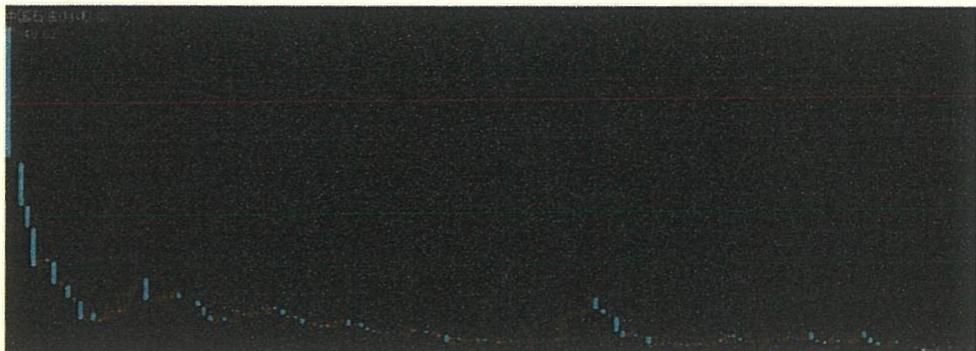

包括我说的“看好买入，不看好卖出”，其实也是一个意思，看好与否，需要方法，而根本则是，不要让自己陷入被动。不至于说从48块跌到24块，然后问该怎么办。

孙子兵法说：善战者，产于不败之地，而不失敌之败也。

如果我们能每一次都立于不败之地，那么剩下的就只有胜利。

交易系统的执行，需要信仰的支撑，理念的支持，才能做到知行合一。

这个市场，太多人想要“早知道”这个事情，因为几乎所有人都有过“辉煌”的曾经，但是市场上恰恰没有“早知道”这味药。

有位年轻的朋友，2014年，本金200万，加杠杆，赚到了4000多万，内心膨胀了，买了一辆保时捷911，想买西湖边的别墅，

龙头券商股票开户：股票佣金万一免5（最低0.1元），支持同花顺登录。龙头期货公司开户：手续费为交易所+1分钱。开户加微信：W1K2ABC，QQ：1379979088，免费领投资课程关注微信公众号：蓝桥幻想

## 悟道·成长

那时也勉强能买，但是看了一圈以后，觉得只有大一点才能配得上自己的“得意”。想着多赚2000万。

然后，经历了2015年的股灾，直接爆仓，911被拍卖，现在的资产还是负值。尽管我曾多次劝导，而他总是笑话我的中庸和保守。

风控意识并不是学出来的，更不是天生的，更多的来自交易经验，来自交给市场的学费。

这个市场上，无论谁都交过学费，即使神话中有天生素养的那些人，要么有不为人知的惨痛经历，要公这种经历还没有到。任何过去的经验和胜利，不能代表未来的稳定增长。

走得太顺的路，往往会让一个人的欲望膨胀，信心膨胀，膨胀过头就成了自负

缺乏对市场的敬畏，缺乏对自身的清醒认识，终究会被市场教训。更多的人，风控意识并不是来自你的学习，不是来自你的智商，更多的来自你交的智商税。

敬畏市场这个四个字，每个人都知道，相信每个人理解都不一样。

只有经历惨痛后的刻骨铭心的悔恨，才能带来时刻的风控意识，才能理解我说的“决不能把盈利的做成亏损的” “看好买入，不看好卖出”“永不止盈，永不止损”的意义所在。

如果说在风控意识，敬畏市场这条路上，一定要吃亏的话，那么吃亏一定要趁早，逆境走多了，经历的事情多了，才能培养出一流的风控意识。

风控意识是风控体系的第一步，也是你知行合一的第一步。

没有理念的认同，不会有行动上的同步，更谈不上知行合一。

当年的我，在牛市中 路顺风顺水，觉得是自己的“悟道”，殊不知，完全是市场的功劳。辞职炒股伊始，就赶上熊市，账户资产腰斩，生活压力巨大，每天过的都是和血吞牙的日子，也经历了无数不眠的夜晚，那是最刻骨铭心的一段日子。

正是有了那段刻骨铭心，才有了后来内心的平和，才有了我的风控体系的提升，这些风控体系，也很大程度上让我的资产没有大的回撤，即使是2015 年的股灾。

市场上不缺乏神话，也不缺乏传奇，但是更多的是许多人名的消失和沉沦。

## 悟道·成长

吃亏要趁早，总结要趁早，悟道要彻底，在热泪盈眶的同时，时刻保持对市场的敬畏之心。

## 心存敬畏，积极向上，热泪盈眶！才是我们该有的态度！

行情不好多学习，这句话大家应该深入人心，但是随之而来的一个问题：学点啥？

1、基本的知识，至少你得了解PE、PB，以及出现在软件上的各个指标代表的是啥，至少要有意识去看哪几个指标，去对比行业内的公司。

2、技术分析还是该学一些的，我虽不倡导技术，但是早期我也是花了很长一段时间研究技术分析，所以，很多思维其实潜移默化有意义。但是能在情绪分析的时候加上技术，胜率就会更胜一筹。

3、以上是基础，接下来就是最重要的“交易体系”，有无体系的区别在于，在同一个时间点，很多高手对于大盘的判断、对题材的判断，对个股的判断，也是不确定的，但是能在不确定下照样获取高收益，就是因为依靠体系。

4、有了体系，接下来就是不断的检验和修正。

## 成王败寇，历来如此！

对股市的感情很复杂，我从不劝人炒股，也经常劝人离场，最后发现我说的都是徒劳，于是后来不说了。我说我的经历，并不是告诉大家这个职业有多光明，因为胜率在这里，我只是想告诉大家，很多难走的路，既然选择了，如果你想走下去，唯一的出路，就是把他走好。

人对人的评价，多半是看标签的，如果当年马云没有成功，他就是骗子，可能还是个大骗子 因为当时只有两个员工的时候，他双手撑在纸板箱上，告诉两个员工，他的十年规划，后来哪两个员工确实都走了，因为觉得这个老板是个骗子。

很多人选择这条道，都是为了一夜暴富而来，都是为了不劳而获而来，都是因为听说别人赚了几倍而来，所以，刚来的人，往往不屑于我的心法，不屑于我的目标，因为我的目标只是每月5%。

遇上行情好，激进的人，确实很容易短期内翻倍，但是更大的问题是：如何守得住，如何实现稳定的收益？这个方法是否可复制?

## 一年赚3倍，3年赚1倍？哪个模式更好？

废话，自然是一年3倍，因为3年就是9倍，但是这个仅存在与数学计算上，1年赚3倍要靠运气，靠行情，靠很多无法复制的东西，而3年赚1倍，则是靠耐力与体系，只要后面的模式成熟了，那么以后都不是问题。

## 一个套利方法

事先声明，这只是一个套利方法 既然是方法，就有概率的问题，不会稳赚不赔，但是对你的整体收益会有帮助。包括后面给大家的术也一样，并不能照搬就能实现盈利，甚至一夜暴富，这个没有谁能做到， 但是你多学，多 家法 会对你的交易有帮助，对你的胜率有帮助。

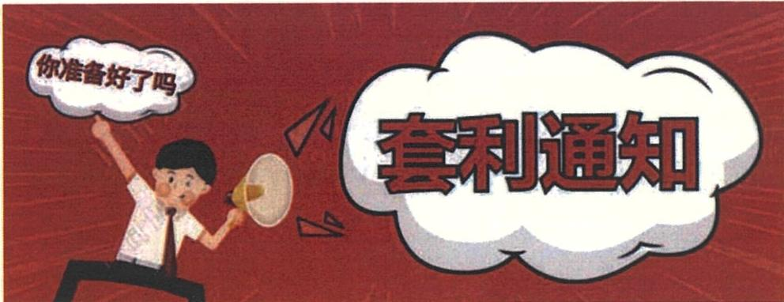

## 情绪极差日的弱转强

在至少是震荡市中，当市场上某一天，市场情绪极差，涨停板寥寥无几，自然涨停在15家以下，甚至是10家以下，这些个股第二天的存在弱转强的高概率性。

比如大盘，短线情绪极差，自然涨停没有几家家，创下近期的历史新低。

逻辑：在极其弱势的环境中，依然能够涨停的品种，一旦情绪转暖，自然也就成为资金的选择。就像是一个板块发酵，提前一天涨停的品种，被资金选中的概率非常高，可能并不是最早涨停，但跟随涨停的概率很大。

## 套利要点：

主做第二天的弱转强，有人问，为什么不去打第一天的板呢？那是因为情绪极差的日子，炸板率也会是极高，在收盘前，我们无法预知是否会炸板，因为很多炸板都是发生在尾盘。

所以，安全的操作是做第二天的弱转强，根据可能发酵的板块方向，观察集合竞价的走势，和龙头股的走势，决定是半路上车还是板上确认。

龙头券商股票开户：股票佣金万一免5（最低0.1元），支持同花顺登录。龙头期货公司开户：手续费为交易所+1分钱。开户加微信：W1K2ABC，QQ：1379979088，免费领投资课程关注微信公众号：蓝桥幻想

## 悟道·成长

这里有一点，这类操作的逻辑依然是选强，所以，不要去寻找竞价就直接不理想的品种。

这其实是打板方法的一种，给激进的朋友一些参考，做强的思路就是选强，做最强的那些，不一定是高标，但走势一定能要强。

我看他们在“术”中也有提到这个方法，并且给了一些案例，希望到时候能给大家一些帮助。

还是强调一点，没有经过打板训练，不要轻易去打板，任何方法都有局限性和概然性，多学、多思融会贯通，有自己的体系，才是真正的稳定盈利之道。

## 在恐惧里轮回？谁又不曾在贪婪里沉沦？

刚开始的时候，踌躇满志的入场，或许赶上好行情，赚得些小钱，觉得市场就是捡钱机器。于是，加大筹码，享受市场带来的快感。但是好景不长，遇上行情不好，账户直线缩水，各种不甘心，不平衡。

于是开始尝试各类战法，龙头战法，打板战法，龙回头战法，老鸭头战法，苦学技术分析，苦学巴菲特，就差没上孙子兵法了。每天频繁操作，然而，九次盈利盈利，不如一次亏损。

短线亏损累累，心灰意冷，眼见各类白马，各类牛股扶摇直上，每天1-2个点，半年下来居然100%，于是痛定思痛，决定入手中线。

买了中线股，3日不涨还算耐得住，第1月不涨反被套，书上说，中线必须拿的住，于是加仓，继续套。第2月继续，并且深套，看着各路短线大神又出了10板龙头，终于忍不住，割肉离场。

而这一割，本金再度 30%，越是心态的不平衡，越发激进操作，每天追涨杀跌，账户余额每天都在减少。过了2周，无意中看到主力监控里曾经满仓的中线股在加速拉升，此时不但已经收复失地，还有不少盈利。这时候的心情，你们都懂的！

心力交瘁，接下来就是分水岭，要么从此沉沦，要么铤而走险，为了回本走上加杠杆之路。心态极差加上杠杆的多重压力，结果可想而知。要么痛定思痛，幸得某位师长，某本书指点，走出阴霾。

## 悟道·成长

## 有人问，你为啥对我的事情知道的那么清楚？

因为这不仅仅是你的经历，更是我的经历，那是一段刻骨铭心的日子，也是即将奔溃的日子，是每天内心流血，嘴角含笑，半夜悄无声息流泪的日子。每天咬牙无助，感觉神都救不了的日子。

每天迷茫的学习，账户缩水的无助，饱含对家人的歉疚，时时对自己的怀疑，基本上就是一天的心情。

还有很多人也知道，那段时间我和奶粉的那些事情。

曾有位主持人说：如此艰难的日子，您能坚持太不容易了，您的坚持里透着不服输的韧劲。您的

被我中途打断了，我告诉他，哪来那么多的坚持和品格，全靠硬撑，因为我是顶梁柱，因为我有我的责任。

扯的有点远了，写这么多的目的，是想告诉大家，如果你的境遇也是类似，那么第一个该做的事情，就是停下来。就像车子出了问题，第一时间不是冒险冲上前面的上坡，而是先停下来。

有人说，我炒股20年，停下来还有用吗？当然有。只要你能开始，任何时候都不晚，只要你能改变，任何时候都不晚。

种一棵树乘凉，最佳时机是在20 年年前，如果没有，最好的时机就是现在。

停下来反思自己的操作，反思自己的交易体系，体系无非几大部分：理念、仓位、选股、操作、控制回撤。每一种玩法，都有不同的体系，不要做杂家，做专家，专注于一个或者两个手法就可以。

很多时候，刚开始亏点小钱是好事，因为利润来的太快，难免浮躁，难免膨胀，就像年初一些入市的朋友，看了我的文章，觉得大失所望，因为他们觉得月收益5%他一天就能达到，何必来看我这糟老头子的5%的文章，在他们眼里，月收益50%才是目标。

当时也有不少是月收益50%的，但问题是，现在还有多少？比如年收益60%，和月收益50%哪个好的问题，只有经历过才能看的明白，否则，怎么解释都是徒劳。行情整体往上时，各大指数都有不少的涨幅，但是有多少人是经历了一轮纸上富贵，从正 50%到负30%，甚至更多。

所以，慢下来不是坏事，偶尔失去机会也没关系，偶尔承担风险也没问题，只要你在自己的体系内，在属于自己的舒服节奏上。经历失败也不是问题，曾经亏损也没啥大不了！

龙头券商股票开户：股票佣金万一免5（最低0.1元），支持同花顺登录。龙头期货公司开户：手续费为交易所+1分钱。开户加微信：W1K2ABC，QQ：1379979088，免费领投资课程关注微信公众号：蓝桥幻想

## 悟道·成长

## 交易的本质

大涨的行情讲究胆量，谁的胆子大谁胜利，震荡的行情讲究节奏，做得好远远跑赢大盘，赚够整个波段，做的不好，内外打脸，比单边下跌更受伤。

这一切都是源于心态，心态源于什么？

源于内心的素养，源自对行情的判断，也源于你的仓位配比和操 作策略。

交易的本质是群体博弈，场内外资金的博弈。说的直白一些，就是时时的，场外的潜在买入者钱的数量和买入倾向，与场内筹码当后者大于前者就卖出。

说起来比较抽象，但是对于我们判断行情的走势还是有帮助的，至少很明确的告诉一点，你所直观感觉到的方向并不一定正确。

比如，在连续的小碎阳之后，市场一根放量大阳，所有的人觉得开启一波上涨的征程，而此时，更好的策略可能是卖出。而当市场上，出现一致性的止损的时候，短期可能反而是机会。

或许这段话不能让你成长，但至少让你在面对行情的时候更加淡定，大多数的人，都是涨了追涨，因为感觉形势一片大好，跌了杀跌，因为恐慌。

为什么一卖就涨，其实并非主力资金知道你的持仓，而是最后的杀跌往往是最凶残，也是最能打动人性的，当大多数的人出现止损的时候，往往离机会不远了。

所以，认清交易的本质，有助手更加深刻的理解行情，而不是别人追涨的时候你追涨，别人杀跌的时候也跟着杀跌。

有人问，你不是说过“别人贪婪时我更贪婪，别人恐慌时我更恐慌”，没错，但是这话是放在情绪的角度上来说，情绪好时，而当情绪退潮，我可能连账户都不会打开，宁愿选择休息。 更多的是从个股或者板块的微观角度。

不由得感叹，这个市场，最后的胜者，不一定是赚的最多的，而是活的最长的，低调才能在这个市场中长期生存，任何时候别膨胀。

## 想好目标再出手！

看似一句简单的话，但真正做到的人不多，不少人，包括以前的我，都是随心所欲，受不了盘中的分时急拉，也受不了分时的急速杀跌，追涨杀跌由此而来。

## 悟道·成长

每个做股票的人，都要搞清楚自己的特点和目标。

特点：你擅长做什么，你不擅长做什么？你不能做什么？

目标：月度目标是什么？每周目标是什么？日目标是什么？

特点决定你的介入方式，比如低吸、打板、半路，追涨，趋势。为何如此强调目标？因为有了清晰的目标，你才有更好的计划和执行，很多人抱怨明明知道 但就是做不到，执行无法合一，其实不仅是知行的问题，更多的是目标和理念的问题。

一个想着追求暴富的人，自然受不了分时的急速拉升，板块的异动，而忽视了基本的客观判断。

就像大家都学过的小猫钓鱼，看到漂亮的蝴蝶，蜻蜓，就追过去了，当你回来的时候，老猫已经钓了很多鱼。大家都从小学这个故事，但是不经意间，我们却依然在犯这样的错误。

炒股的另一个误区是，偏执于自己的“意念”，比如某只股票你接触了很久，做过很多功课，对他情有独钟，即使是在犀利的大涨之后，开始走下坡，你依然觉得哪一天会重新崛起。

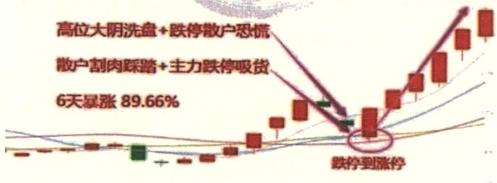

但是，很多个股有了成妖的经历之后，剩下大多是漫长的下跌，就像东方通信，人民网这类。

执念的另一个原因，或许因为你的股票被套，于是，卧倒不动，那么即使，大盘上涨也和你没什么关系了，每个人要清楚自己的特点，你如果做的是短线，那就是“看好买入，不看好卖出”，如果你做的是中线，那就是得分仓，分批。

做市场的跟随者没有问题，因为短线交易者，就是要寻求市场上最强的那些热点和个股，但是这一切的前提是你得有自己的计划，而不是，盘中因为“感觉”

## 如果你想职业炒股！

之前有多位朋友提到想职业炒股的问题，觉得还是有必要强调下一些东西。每次看到这样的问题，都会觉得很矛盾，从概率的角度，我不建议任何一个人走上职业的道路，但是，另一方面，我怕我的意见又让市场少了一位Asking，所以，我只陈述我的观点和建议，供大家参考。

从概率上来说，刨去牛市那几段仅有的日子，市场上的股民，大概率是亏损，比例估计在60-90%之间，但是几乎任何一个人，在踏入这个市场的时候， 都不觉得自己会成为亏损的那大多数，都觉得自己能成为剩下的10%。

所以，建议大家，辛苦赚的钱，对股票又没有专门研究的朋友，至少大部分的存款不应该来到这个市场，要来可以，拿你资产的30%以下玩玩就可以了，如果你连30%的资产都无法做到增值，如何保证100%的资产放进来会增值?

每个人都在寻求市场的“制胜之道”，市场上也有各种入门书籍，但是大多都是沽名钓誉之徒，并且很可能很多作者对市场完全缺乏理解。

这个市场博大精深，任何的方法、体系都会遇到瓶颈，不同的行情，不同的阶段需要不同的方法，所以导致没有统一的“教科书”，更多的，大家都在瞎子摸象，摸到什么就是什么。

很多人都会觉得金融机构很高端，高大上，至少门面很豪华，大楼都很高，有着极高的学历，但是这和市场并没多大关系，所以，不要指望进券商就能学到什么炒股秘籍？

这个市场的胜者，或者说 ，其实都是游击队，我身边的朋友大体都是如此。

这个市场，需要理解，需要领悟，如果对于初学者，学一些财务基础，技术分析还是有必要的，因为这能让你快速建立炒股的认知体系。 小云

剩下的就是学习和实践了，技术也好，理念也罢，最终的体系，都是源于你自己的理解，就像我的门徒，他们每个人的体系也不一样，因为大家有自己不同的理解和偏好。

## 悟道·成长

## 几条建议：

在悟道之前，保住你的本金，一旦失去本金，基本宣布告别这个市场。

多理解、多学习，把学到的变成自己的，各种方法都可以学，可以知道，但是用的时候选择一种就可以，另一种只能是辅助。

市场是最好的老师，任何一段的行情，都有存在的价值，任何时候都不能放弃市场，学会任何阶段都要去感悟市场，并且认真记下来。

在没有稳定盈利模式前，不要盲目专职，专职没你想的那么简单，刚开始玩的就更加不要有这个想法。

没有什么数学公式，一劳永逸的孙子兵法，市场每天在变，方法也得变，即使是门徒总结的“本”，也只能是其中某几个方面。

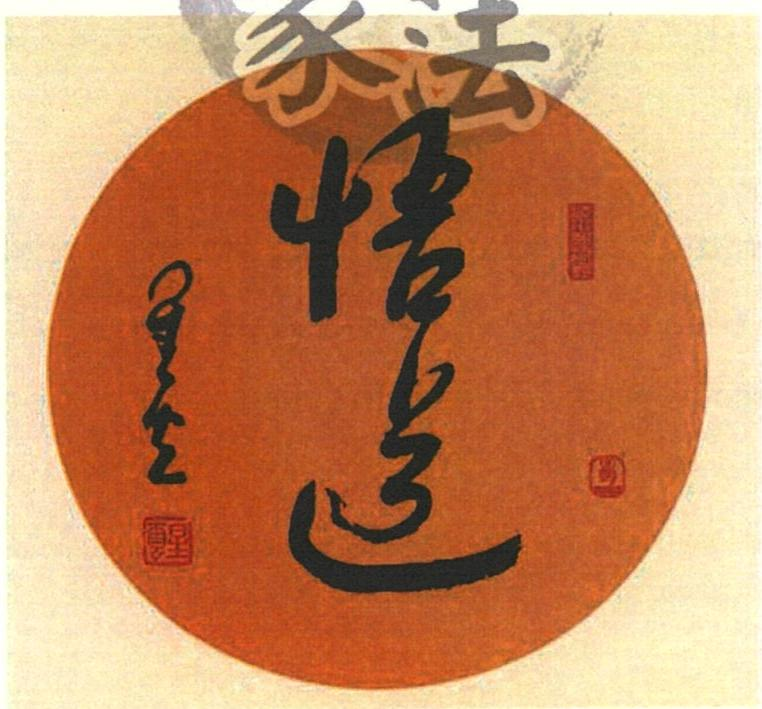

操作：减少路径依赖！

曾经有一年的经济学诺贝尔奖，颁给了“路径依赖”，是指我们以前做的一个不经意的小决定，事后，就成了事务发展的路径，简称路径依赖。

当然，当年的经济学家是用数学方法来证明的，经济学真是博大精深，这么简单的道理，也能用复杂的数学公式来证明。但刨去其他不说，当时他的这个观点还是给了我不少的启发。

在股票操作上，路径依赖是大忌，比如这样的情形？

你在2007年11月5日刚好踏入股市，什么都不懂的你，喜欢喝个大牛股，从4块涨到28块，那天刚好中石油上市，有望延续强势，于是什么都不懂的你，买了1000 股，中石油，价格48元。

你本没打算买它，只想体验下人生的首笔股票交易，但是你的整个投资路径因它而改变，几度补仓，几度绝望，最后在30 元的时候决定扔那不管，最终变成了现在的6元。

这就是典型的路径依赖，开始你的初衷并不是长期持有，但是因为被套之后的希望和绝望的煎熬，使得后面的投资计划，全部

## 悟道·成长

因他改变。当下的结果，其实都是因为当初的那笔大家热议的：中石油上市。

从此，你与富豪的距离越来越远：茅台当时78元，现在2000多元，中石油，当时48元，现在6元。

当时你喝的是茅台，现在只能喝二锅头。

所以，投资一定得有逻辑，买卖要和逻辑相对应，比如你买的成长，那就必须考虑估值与业绩，你买的超跌反弹，必然要与技术分析相对应，买和卖就应该是简单的，看好买入，不看好卖出。

根据逻辑所做的决策，任何时候都是对的，即使卖错了。任何一只股票，我们无法拿到整个波段，所以不要用短期的涨跌来判断对还是错。那样只会增加你自己的心理负担，导致你的判断出现偏差，这是操作的大忌。

如果因为一两次失败，放弃了自己的逻辑，那就纯粹是赌，向来赢面极低。

减少操作的路径依赖，任何时候尽可能的跳出持仓去看待市场，不因持仓而偏差，虽然刚开始很难，但尽量要这么干。因为这是长期活下去的基础。

## 当下赚钱的两类方法

当下的市场，一类股屡创新高，一类股屡创新低，如果看不透内在的逻辑，盈利就变得相当难了。

2020 年以来，指数还有不小的涨幅，但是很多人的盈利已经被抹去，甚至亏损严重，为何在上涨的时候，很难跑赢指数，下跌的时候，也大幅跑输?

当下市场上赚钱的人，大致为两类：

第一类：坚守价值，手持白马，蓝筹，趋势股，长期不动，或者日内差价。

类。 第二类：频繁跳跃，严格短线，追随热点，我的很多朋友应该是这 小云

第一类方法需要耐心，很多短线投资者耐不住，横盘3 个月，甚至回踩3个月，然后在短时间内形成一次上涨，随后继续横盘。所以这类方法需要的是耐得住性子，选好个股。

第二类方法是追求热点，上最强的热点和个股，严格止损，但是受短线情绪的影响非常大，常常伴随着大幅的回撤!

龙头券商股票开户：股票佣金万一免5（最低0.1元），支持同花顺登录。龙头期货公司开户：手续费为交易所+1分钱。开户加微信：W1K2ABC，QQ：1379979088，免费领投资课程关注微信公众号：蓝桥幻想

## 悟道·成长

## 亏损最多的是哪类人？

不清楚自己的定位，自己的模式，自己的操作逻辑。频繁切换模式，涨了去追涨，跌了去杀跌，不控制仓位，不认真选股，最终伤痕累累，跑输市场造成大幅亏损。

另一类是操作上的错位，比如找了个垃圾股去拿中线，找了个下跌途中的个股去做反弹。

做趋势的逻辑，是看好个股的稳步上行，也有良好的基本面，业绩，市场人气，交易活跃，这里更多的是右侧交易，等趋势先走出来。超短的逻辑是最强的热点，最强的个股，而不是找板块中涨幅最小的，因为强者恒强是常态，黑马逆袭其实并不多。

## 每一个追求方法的人！

我的总结一般以心法为主，因为在我看来，盈利的方法有多种，但是心法是能给各种方法的人，带来新的认知和提升。

然而，我越来越发现没有方法的局限！心法属于价值观的范畴，而我讲的术，则是方法论的体系。

## 悟道·成长

几乎每个在市场里的人，无不在苦苦寻求盈利方法，多想上苍赐给一本秘籍，然后所向披靡，实现财务自由。市场不缺乏传奇，不缺乏奇迹，每一个故事就能鼓动一班怀揣梦想的新人入场。

如果说经济学不是一门严谨的学科，因为任何一个经济学的理论，都存在与其截然相反的理论。那么股市，就更加是个泥潭，因为，无数的书本上的所谓“方法”，都将证明是无效的。

我刚入市的时候，以研习技术分析为主，花了很多的时间，没日没夜的把各大派的技术分析理论倒背如流，融会贯通，然而，市场终于还是给了我教训，账户一直在缩水，腰斩。

我知道，光靠技术分析行不通

很多人都知道我那段艰难的日子，也知道关于账户和奶粉的故事。

在我最艰难的时候，即将放弃的时候，是业内的两位朋友点醒了我，给了我继续下去的信心，真是从那时起，我开始转向一个更加悬的东西：情绪

龙头券商股票开户：股票佣金万一免5（最低0.1元），支持同花顺登录。龙头期货公司开户：手续费为交易所+1分钱。开户加微信：W1K2ABC，QQ：1379979088，免费领投资课程关注微信公众号：蓝桥幻想

## 悟道·成长

技术分析，有很多流派，也有很多书籍，情绪，据我所知，目前都没有。但是只要是短线打法，无一不涉及情绪，而情绪分很多，包括分时图的判断，盘口的判断，板块联动的判断。

发现很多人都很上进，但感觉无从下手，有的甚至完全走偏，所以，今天给苦苦寻找方法的人几个建议：

1、技术分析，必须得学，这个是每一个入场操作者的基础，技术分析可以很粗浅，比如均线、箱体， 也可以很深奥，比如可以写一本书的四度空间理论。还有一些，目前只能靠影印本才能买到的绝版书籍里面的方法。

2、技术分析，不能光学技术，更要学习每一个技术形态后面的逻辑，以及衍生出来的情绪判断。不能死读书只认形态，而要知道出现每个形态的原因和逻辑，如果能到这一层，大体就孺子可教了。

3、更深入的一些，是要学习盘口和分时图的判断，这个对于短线选手，至关重要，但是世面上现有的书籍，多半也是泛泛而谈，因为没有实战的经验，多半是事后的推演。

4、交易体系，我是我最注重的东西，也是每一个成功的交易者必须具备的因素，至少我身边的朋友是这样。方法可以不同，低吸、打板、半路、都不是问题，因为不同时期，本身会有不同的选择，但是都有自己的交易体系。

关于方法的问题，基本的方法，网上有很多，可以多学，但是不能简单的硬搬照抄。关于更深入的方法，一靠自身领悟，二靠他人指点，如果有人给你一套实战检验过的交易体系和一只大牛股,相信每一个清醒的人都会选择前者，即使付出巨大代价，因为前者可能会给你带来质的变化，他的价值远不是一只牛股所能给的。

而现实中，却未必，大家更关心的可能是代码，而不是思路。

你之前的选择，决定了你现在的账户状态，而你现在的选择，会进一步拉开一年后的账户差距。

静下心，沉住气，稳住阵脚，在行情没有来临之前，做好该做的准备。学东西，不仅是为了当下，更是为了明天！

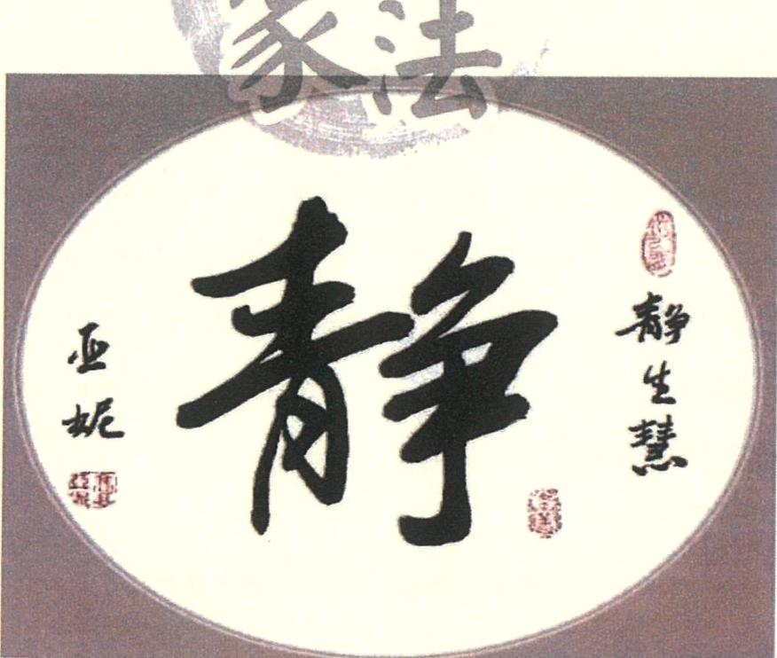

## 悟道·成长

## 为何要了解打板？

众所周知，我从来不建议各位去参与打板。并不是我反对打板，我的体系里，打板本身占据很大的比重，我的门徒多半也是打板为主。

之所以在这里，一直反对大家打板，是因为很多人完全没有章法，而打板，是很难提前提示的，因为板块的情绪只有在盘中才能真正体现。

相反，提示下一个板块的轮动，这个没啥问题，只要细心去察觉，还是能找到一些方向。

凡是参与低吸的人，我想至少收益是正的，但是，打板，还是建议每个人都要去学，这个看似矛盾，实则并不。

## 学习打板的意义主要是在以下几方面

1、涨停是市场上，情绪最集中的地方，只有涨停才能带动板块的情绪，所以，学习打板，能够更能把握市场的情绪在哪里。

2、有人说看“今日情绪”就可以了，没错，但是简单的几家涨停，并不能说明板块的真正强度，更重要的是，板块里面的高标，龙头，后期跟风的表现如何了。所以，学了打板，可以更能认识到板块的情绪扩散与消退。

经常有人打了跟风板之后说“打板\*\*错在哪里？”，虽然原因很多，但是基本是对板块的情绪、龙头的情绪把握不到位。

3、看得懂打板，看得懂龙头股的封板力度，看得懂龙头的情绪分歧，才能更好的把握分歧转一致的机会，很多时候的分歧转一致，很可能是低吸的机会。

说来说去，其实让大家学习打板，并不是为了让大家用打板去生存，这个因人而异，风险也相对较高。而如果你看得懂打板，你的低吸、你的操作就更有针对性了。

比如，低吸不会再没有方向，短线最忌讳的是“退而求其次”，某个板块涨了，你却找了个板块涨幅的最后一名，心理上觉得安全，但是很可能是涨的时候没他的份，跌的时候，不输给任何股。

张无忌为何能在短时间内学会乾坤大挪移？因为他有九阳神功为基础，有了九阳神功护体，学起乾坤大挪移，就简单了很多。这里的打板就像九阳神功，低吸类似乾坤大挪移。这个比喻不一定恰当，但是理是这个理。

打板，学打板，不一定是为了用打板，而是让你更深刻的理解这个市场，理解市场情绪，理解题材之间的联动关系，核心目的还是为了更好的让你去低吸，这毕竞是成本相对低的盈利方法。

龙头券商股票开户：股票佣金万一免5（最低0.1元），支持同花顺登录。龙头期货公司开户：手续费为交易所+1分钱。开户加微信：W1K2ABC，QQ：1379979088，免费领投资课程关注微信公众号：蓝桥幻想

## 悟道·成长

打板的术语很多，首板、二板、分歧板、缩量板，加速板，包括之前一直强调的短线高度周期，也是把涨停板作为参照的。所以学习这些会有助于大家的操作。很多的实战方法都是打板之后的延伸，因为涨停是情绪的最集中的体现，短线就是寻找市场上活跃度最高的个股作为标的。

但是，我还是那个建议，对于大多数人来说，看得懂即可，不建议大家去操作打板，但方法还是要学的，这是武学上层。

打板和超短，技术是次要的，重要的是短线情绪的判断。短线情绪，简单的理解，就是市场上最激进的那部分资金，是否愿意去参与高标，接力高标。

而他们的接力意愿从哪里来，意愿来自赚钱效应，当一个追涨的动作，能够获得正收益的时候，会刺激他们继续去做这样的事情，体现在盘面上，就是连板的个股多，封板率高，高标股的涨停板数量多。

而当市场上，龙头股的涨停板数量在降低，接力情绪就会随之下降。比如某个龙头股的高度是6板之后就被砸了，那么后面上来的个股，大家在5板的时候就会不愿意去接力，怕重蹈覆辙。情绪随之下降，降到4板，3板，甚至极端的时候，出现没有连板股。

这种时候不是绝望的时候，往往是出现新的高标的时候！

观察今天的市场，短线高度是否降低，目前降到几板，封板率在下降，炸板率非常高，如果接近50%，这样的环境下，打板的要谨慎参与，高位股更要谨慎。

所以做短线的人，特别是打板的人，必须每天记录长场内高标的高度，以及封板率，涨停家数，你会发现，这是一个循环。

## 下跌行情，你该做什么？

其实，很多人，包括很多专业机构，也无法准确判断大盘的精确走势。但是专业的和业余的有个最人区别是； 专业的都会有预案。

在行情上涨的时候，脑子里有跌的预案，如果一旦发生下跌就有应对方案。但市场情绪转弱的时候，也会有预案，什么位置加仓，加多少，加什么。其实，长远来看，涨跌是市场的常态，一直上涨不可持续，一直下跌也不可持续。

这是市场的情绪热度统计，箱体运动的迹象还是很明显的。

## 悟道·成长

为什么说平稳的心态是短线操作的前提，那些动不动满仓的，究其原因是什么？终究还是心态崩了。那些盘中割肉，去追另一只个股的人，在想什么？在想如何扳回之前的亏损。

所以，你是否走向成熟，是否能在这个市场长期生存，首先看你涨跌时候的状态。上涨的时候兴奋，看到上涨的股都是“别人家的”，满仓追涨。下跌的时候，满仓被套，这样注定只是一个结局：别人在赚钱，你在等解套

## 所以下跌的时候，该做什么？

做预案，清晰的预案，当行情出现什公情况的时候，我的仓位要控制在多少？当行情出现什么情况的时候，我的仓位必须保持在多少以下？哪怕你对某只个股再看好也是一样。

很多人不懂交易体系是什么？大概就是这样，有预案，有控制，有选股，有操作，有回撤控制。

当然，为什么很多人注定不会有交易体系，因为没有稳定的心态，所以，注定执行不了交易体系。

下跌的时候，场内的人是煎熬，场外的人是机会，重仓的人是茫然与绝望，轻仓的人是机会与希望。

所以下跌的时候，要记得行情上涨的时候，因为跌多了必涨，如果你满仓了，也就只剩一条路：等，获胜的概率是随机。如果你有仓位控制，那更应该做好该做的功课：哪些在涨，上涨之后怎么样了？哪些抗跌，哪些个股能够逆势？能够逆势的逻辑是什么

所以，下跌的时候，不要闲着，不要发呆，更不要骂娘，做该做的事情

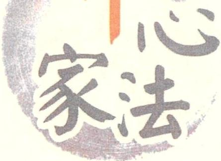

龙头券商股票开户：股票佣金万一免5（最低0.1元），支持同花顺登录。龙头期货公司开户：手续费为交易所+1分钱。开户加微信：W1K2ABC，QQ：1379979088，免费领投资课程关注微信公众号：蓝桥幻想

## 悟道·成长

## 如何判断机构介入

机构的投资，注重盘子中等偏上的，机构的投资其实是机械的，必须要有逻辑的支撑，没有逻辑的支撑，机构是不会参与的，毕竞那些都是成熟的金融精英组成的团队，思考问题，推导问题都要严格服从逻辑。

那么机构的逻辑从哪里来？机构并没有那么多的精力自己亲自调研，因为一个行业几十家 公司， 调研不过来。那么，很简单，其实和我们一样，直接从券商的研报里来。

所以，哪些票可能有机构的介入，很简单，券商研报重点介绍的方向（逻辑正宗）+走势趋势很好+盘子稍大（30-100亿）。另外一个就是龙虎榜的数据。

如果符合以上条件，加上有基本面的支撑，趋势走的很好，很可能就是有机构和资金合力参与的。

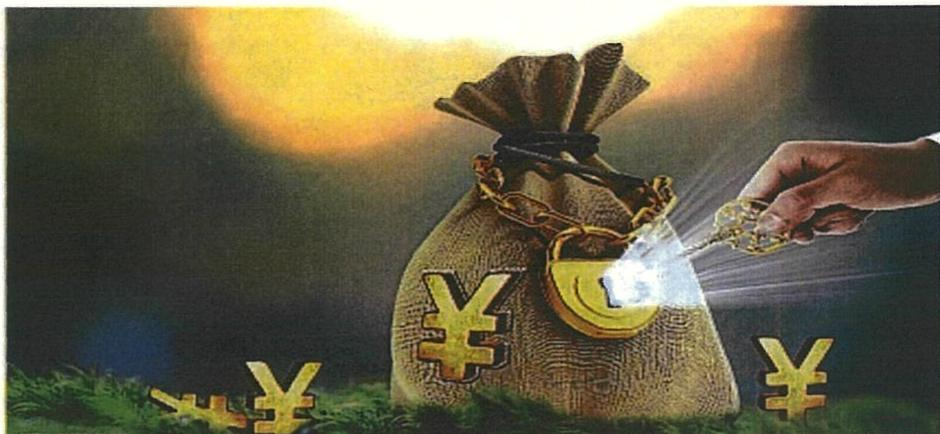

## 我与股市的十年！

有人问出了一个拷问灵魂的问题：时间里，股市涨了一点，你收获了什么？失去了什么？

十年的时间里，发生的变化太大了：最容易被人拿来比较的就是房价，十年间，房价涨幅：少则 3 倍，多则10倍。

这是逝去的十年，也是沉沦炒股的人不断被鄙视的十年，2009年，在经历了07-08年的牛熊之后，迎来一波反弹，但是那却成为未来几年的最高点，2014-15迎来一波疯牛，之后却是无尽的g深渊！

十年前，我刚刚尝试从08年的阴影里走出来，从账户腰斩的阴影中走出来，尝试建立自己的操作体系，2009年，是第一次让我建立信心的年份。经历了07的膨胀，08年的腰斩，09年才逐步找到自己的方法。

十年间，当时的小孩已经长大，但是当年每天计算亏损多少罐奶粉，依然历历在目。所以我很理解大家的一些境遇和心情，因为我曾经也是和大家一样的遭遇，甚至比很多人“更惨”。

如果让我再做一次选择，我不会选择这条路。但是上了贼船，没有那么轻易下去，初入市场的我们，总是有各种不服气，不服

## 悟道·成长

输，直到被市场教训得没半点脾气，心痛也能安然掩饰，大跌依然能够挤出笑容，看起来没心没肺，并不是没有伤痛，而是都在内心深处。

当然，回头来看，如果说十年间有什么大的感悟，那就是：每次经历都会成为自己的财富，每次学习，都能增长自己的见识，如果暂时用不上，也会在不经意的时候帮上你的大忙。

如果你已经深处这个市场，那么唯一的路：就是通过自己的努力走好他，不断的进步，不断的学习，不断的积极向上，不断地稳定自己的心态，完善自己的情绪，从小目标做起，而不是抱着一夜暴富的美梦。

凡事预则立不预则废，不是等到机会来了，才去做准备，而是时刻准备着才能更早的看到机会。不是指数十年不涨，我们就过的心安理得，我们要做的目标是：除去股灾，每月都有5%的利润，很多人不屑这5%，谁数学好，可以结算下月5%滚动10年是多少倍。

所以资产增长的关键不在某月收益率的高低，更重要是复利，是回撤，控制回撤，即使不赚钱，也要控制风险，很多人不理解我说的“绝对不能把盈利做成亏损”的意义，觉得很多个股，都会有强势洗盘，洗盘之后都创了新高。

没错，问题是，也有多少个股，在跌回你的成本之后，一路向下，盈利不走，小损不甘，大损下不了手，最后变成巨大的回撤和被动。在我看来，稳定盈利远比不盈利更重要，但很多人想不明白这一点，想不明白自然也执行不到位。

十年时间，指数没动，大家的账户自己明白，革命尚未成功，同志仍需努力。我不散布什么成功学，我们只需踏踏实实做好自己的事。十年已经过去，风水也会轮流转， 一十年，从把握当下开始。

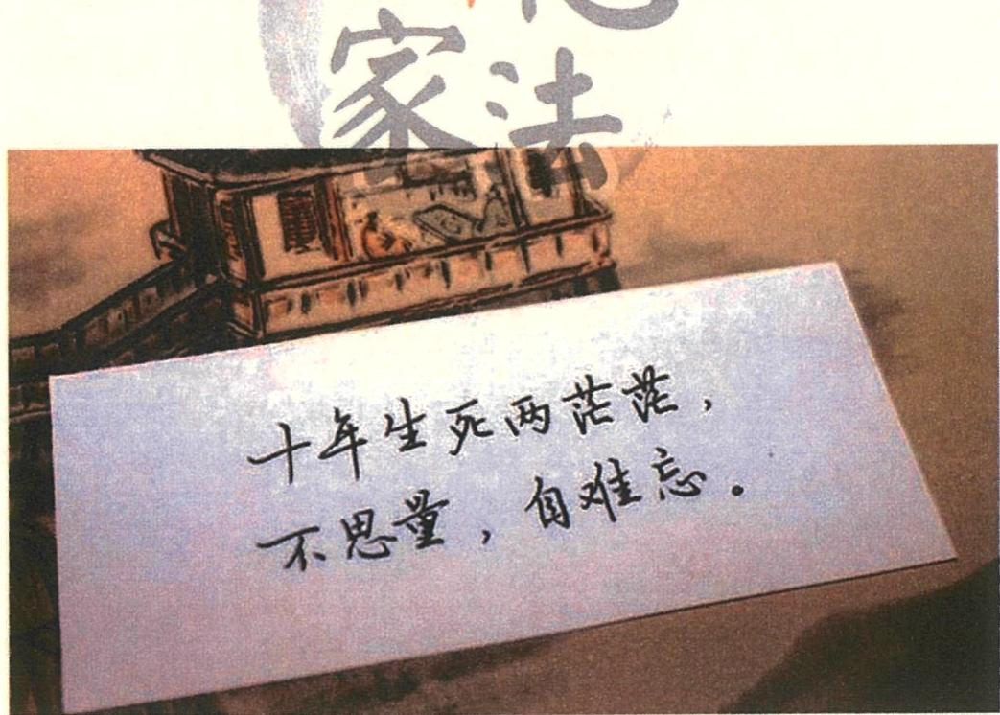

## 交易是一场修行！

## 交易如棋

棋盘上博弈的是棋子，实际上较量的双方的内心。市场里，博弈的是人心，是情绪，更是自己内心的欲望和贪念。棋盘上没有永远的赢者，市场上没有永远的胜者，所谓的胜者，更多的是“剩者”。因为“剩者”终究成为“胜者”。

市场上的刀光剑影见的多 了，往往容易忽略了交易的本质，交易的本质并不是披荆斩棘，所向无敌，而是把握机会，精准出击。

交易没有永远的赢家，每一笔交易在打出去之前，都是充满不确定性的，每一个背负交易的人，都活的战战兢兢，禹禹前行。全没有章法。

每一个没有找到方法的人，既怕又爱，既期待又担忧，在场一日、纠结一日、痛苦一日、希望一日，恐惧一日。谁不曾在这样的日子里恐惧里轮回。

交易如修行，得时刻保持自己内心的定力，清楚自己擅长什么，知道什么，操作方法是什么，体系是什么？而不是一山看着一山高，山外青山楼外楼。

定力的另一方面，来自于内心，慢涨拿的住，操作也很完美，一旦遇上大涨，心态开始爆炸，觉得自己悟道了。或者当你遭遇了一笔交易的失败之后，心态崩塌了，你的赌性占了上风。

所谓的交易交易体系，无非是用一系列的方法组合，比如开仓规则、控制回撤规则、仓位管理规则等方法，把你内心的肆意挥洒变成机械的重复。从数学的角度来说，就是路径最优原则。

交易的方法和赌法，完全不一样，赌，重要的是随机，看的是运气，最终决定的是概率。 交易做的是你自己有足够的选择权，你愿意站在哪边? 小云

市场本是一个合法的资产转移工具，在几乎没有门槛的市场里，各种类型的人们进行着合法的财富转移，你是转入的那一方，还是转出的那一方，完全取决于你自身的素养和认知。

没有门槛恰恰成为最高的门槛，你的付出，你的学习，你所经历的苦，你所经历的痛，最终都会成为你交易当中的一部分，沉淀下来，决定你的操作习惯，操作风格，操作手法。

不同的是，有的人，交易手法越来越完善，越来越纯粹，也有的人，经历了漫长的经历，交易依然随心所欲，没有章法，即使侥幸盈利，最终还是还给市场。

最后，“剩者”就成为了为数不多的那部分“胜者”

从迷茫到痛苦，从痛苦到寂寞，从寂寞到无敌，这条路确实很艰难，如果你认定走这条路，那就时刻提醒自己不忘修行，不忘学习。他山之石可以攻玉，可能一个不经意的机会，会带来质的改变。当年迷茫的我，也是偶然间得到了实战派的指引，才使得自己的修行上了一个台阶。

每一个背负输赢禹禹前行的灵魂，在场一日，纠结一日，痛苦一日，希望一日，恐惧一 谁不曾在恐惧里轮回？谁又不曾在贪婪里沉沦? 小云

最终的胜者，或者说剩者，所谓的悟道无非是，看山还是山，看水还是水，返璞归真，回归本源，阅尽千帆，洗尽铅华，找回属于自己的初心。

## 写在最后

每个看似轻松的人，他身后都背负着不为人知的努力。这个市场很公平，谁都能进来，几乎没有门槛。这个市场也很残酷，总是一部分人收割另一部分，要么是收割者，要么是被收割者，你总要选择一个角色。

支撑你一直走下去的，无论是前方梦想的光芒万丈，还是身后的万丈深渊，少一些浮躁， 一份坚定，对待市场，我们时刻热泪盈眶，对待自己，我们永远积极向上，坚定走好每一步，才能让我们走的更远。

祝每一个看过《养家心法》的股民都有大大的收获，带着一份感恩毫无保留分享，每字每句都是这十几年股市血与泪的总结，希望助你悟道，大获丰收！

如有不明QQ：3176316478助力成长！

感恩是我们在股市成长的法码！

悟道·成长

《不负此生》与大家共勉！

每一段相遇都是一种缘分

包括你和股市

也包括我们

并非每一段相遇都会一帆风顺

成功的路上有人掉队

有人放弃

也有天依然坚持

坚持了的人不一定都成功了

成功的人一定是当初一直坚持的人

找准自己的目标

付出实际的行动

找到自己的问题

做出积极的改进

知行合一

脚踏实地

放平心态

积小胜为大赢

真正勇敢的人

不是不落泪的人

龙头券商股票开户：股票佣金万一免5（最低0.1元)，支持同花顺登录。龙头期货公司开户：手续费为交易所+1分钱。开户加微信：W1K2ABC，QQ：1379979088，免费领投资课程关注微信公众号：蓝桥幻想

而是含泪继续奔跑的人  
哪怕路上一路坎坷  
吾辈也当加倍努力  
愿你的付出  
不负此生！  
回归市场:  
平稳的心态是操作的根本  
能赚一块的只赚七毛  
我们只做市场的跟随者  
买入机会，卖出风险  
更加理智的去看待市场  
不断完善自己的交易体系  
你的努力  
终将带来操作上的变化  
带来账户上的变化  
与所有朋友共勉！

